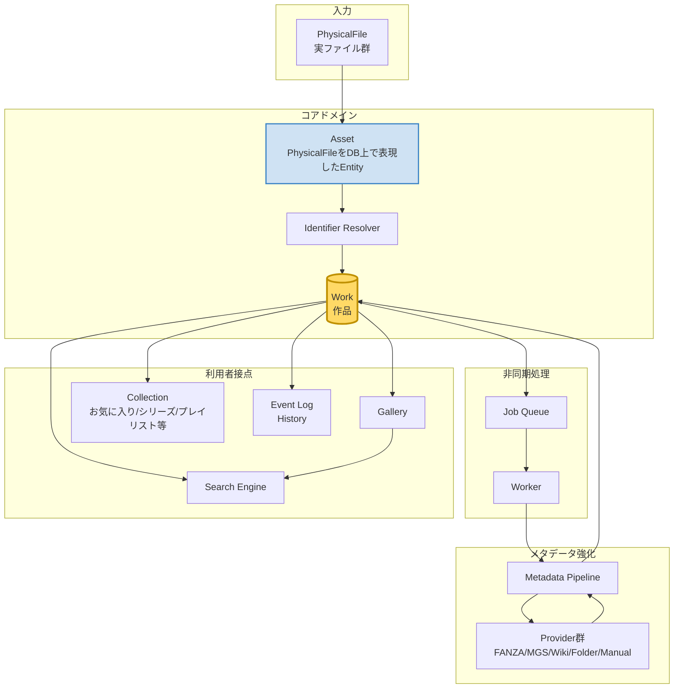
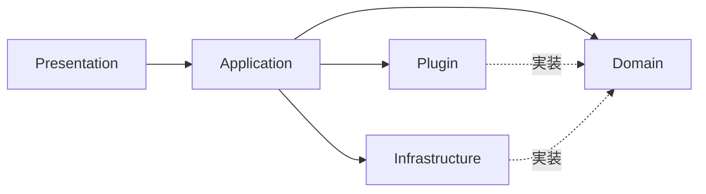
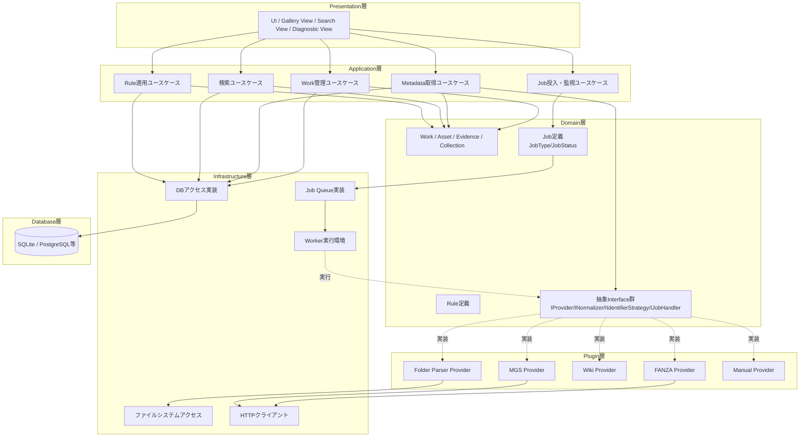
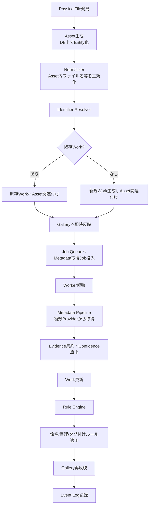
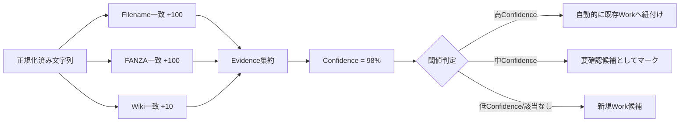
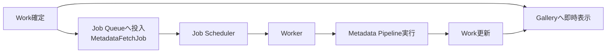
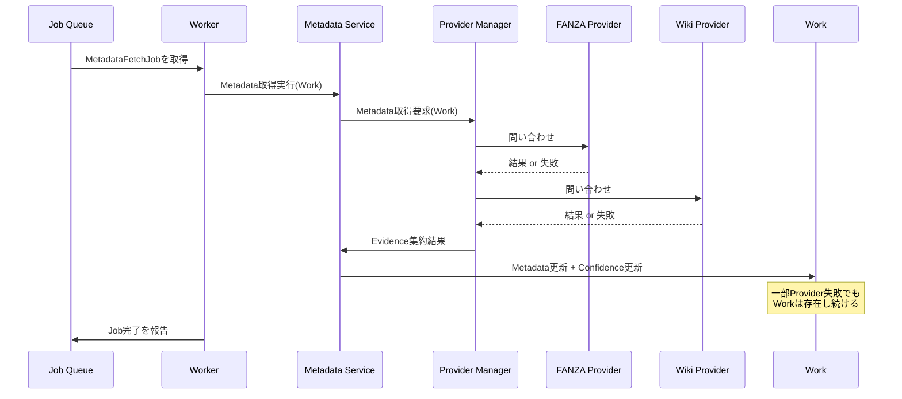
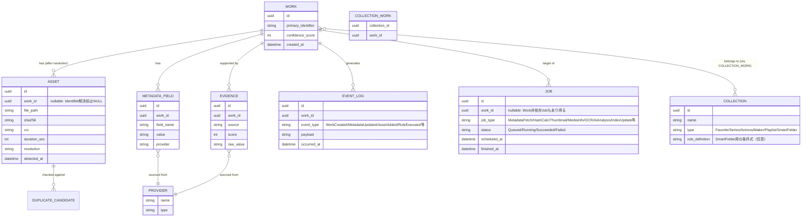
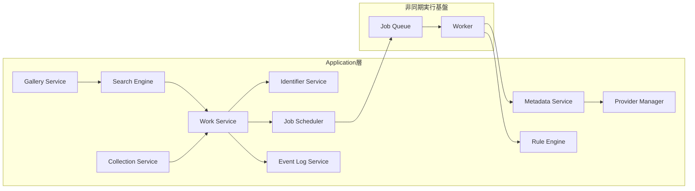
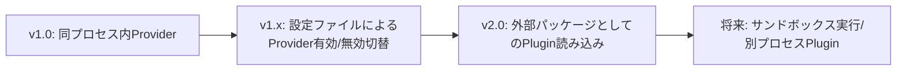

# WISE v2 Architecture.md (v1.1)

## 0. 本書の位置づけ

本書はWISE v2のアーキテクチャ設計書である。実装コードは含まない。設計レビューを受けることを前提とし、各セクションの末尾または第9章にて弱点・懸念点・改善案を記載する。

**v1.1での変更点：** v1.0レビューを受け、以下を追記・修正した（章立ては変更していない）。
1. AssetとPhysicalFileの関係を明確化（AssetはPhysicalFileをDB上で表現したEntityであり、Identifier解決後にWorkへ関連付けられる）
2. Metadata Pipelineが非同期処理（Job Queue／Worker経由）であることを明記
3. Job System（Job Scheduler／Worker／Job Queue）をコアコンポーネントへ追加
4. HistoryをEvent Log（Domain Eventの保存）として再定義
5. Collection概念（お気に入り・シリーズ・女優・メーカー・プレイリスト・スマートフォルダ等）を追加
6. Search EngineをApplication層のサービスとして整理し、GalleryはSearch Engineを利用する側であることを明確化

---

# 1. アーキテクチャ概要

## 1.1 システム全体像

WISEはスクレイピングソフトではなく、**メディアファイルを管理・検索・閲覧・整理するライブラリアプリケーション**である。対象は商業AV・同人AV・FC2コンテンツマーケット・同人誌であるが、将来的に他メディア（書籍、音楽、動画全般など）へ拡張できることを前提に設計する。

スクレイピングは「ライブラリを充実させるための一手段」であり、システムの中心ではない。中心にあるのは **Work（作品）** という概念であり、その周囲にMetadata Pipeline、Rule Engine、Gallery、Search Engine、Collectionが配置される。

なお、PhysicalFileは検出後すぐにAsset（DB上のEntity）として登録され、Identifier Resolverによる解決を経てWorkへ関連付けられる。Metadata取得はWork確定後すぐにGalleryへ反映される一方、実際の取得処理はJob Queueを介した非同期処理として行われる（詳細は1.2節・4章参照）。

## 1.2 設計思想

最重要思想は **「DBが唯一の真実（Source of Truth）」** である。ファイル名やフォルダ構成は手がかりに過ぎず、最終的な判断基準は常にDBである。

この思想から導かれる結論は次の4点である。

1. **Metadataが取得できなくてもWorkは存在する。**
   「スクレイピングできたから登録」ではなく「まず登録し、Metadataを育てる」という順序を取る。
2. **登録（Workの生成）とMetadata取得（Enrichment）は明確に分離されたプロセスである。**
   片方が失敗しても他方は機能し続ける。
3. **PhysicalFileは検出された時点でAssetとしてDBに登録され、その後Identifier Resolverの結果によってWorkへ関連付けられる。**
   AssetはWorkの子概念として「最初から」存在するのではなく、PhysicalFileをDB上で表現した独立のEntityである。Work関連付けは、Asset生成後に行われるライフサイクル上の一段階に過ぎない（詳細は4章参照）。
4. **Metadata取得はWork生成と同期しない。**
   Workが確定した時点で即座にGalleryへ表示され、Metadata取得はJob Queueを介したバックグラウンド処理（非同期）として後追いで実行される。これにより、Metadata取得の遅延・失敗がWorkの即時利用可能性を妨げない（詳細は2.5節・4.5節参照）。

## 1.3 なぜこの構成なのか

- ファイルベース管理（フォルダ構造に意味を持たせる方式）は、リネームや移動、重複ファイルの存在に弱く、長期運用で破綻しやすい。WISEはDB中心管理によりこれを回避する。
- スクレイピング精度を最優先にすると「メタデータが取れない作品はライブラリに入らない」という事故が起きやすい。WISEはWorkの存在とMetadataの充実度を分離することでこれを回避する。
- Provider（メタデータ取得元）を増やし続けることが既定路線であるため、Plugin指向・Provider抽象化を設計の根幹に据える。

---

# 2. 設計原則

## 2.1 Source of Truth原則

DBがすべての判断基準。ファイルシステムは「DBが指す先」に過ぎない。ファイルが見つからない場合もWorkのレコード自体は消えず、「リンク切れ」として扱う。

## 2.2 Work中心原則

すべての機能（検索・閲覧・履歴・タグ・重複管理）はWorkを起点に設計する。Metadata・Evidence・Collectionは、Workに従属する子概念として扱う。

一方でAssetは例外である。AssetはPhysicalFileをDB上で表現したEntityであり、生成時点ではWorkに従属していない。Identifier Resolverによる解決を経て初めてWorkへ関連付けられる（詳細は4章参照）。この区別は、「Metadataが無くてもWorkは成立する」と同様に「Workが確定する前からAssetは存在できる」という設計上重要な非対称性を反映している。

## 2.3 SOLID原則の適用

| 原則 | WISEでの適用 |
|---|---|
| Single Responsibility | Identifier Resolver、Metadata Pipeline、Rule Engineはそれぞれ単一責務に限定し、混在させない |
| Open/Closed | Providerは抽象Interfaceに対して実装を追加するのみで、既存コードを変更せず拡張できる |
| Liskov Substitution | 全Providerは共通のIProviderを満たし、呼び出し側はProvider種別を意識しない |
| Interface Segregation | IMetadataProvider／INormalizer／IIdentifierStrategyなど、用途別に小さなInterfaceへ分割する |
| Dependency Inversion | Domain層はInfrastructure層の実装を知らない。常にInterfaceを介して依存する |

## 2.4 Plugin指向

Provider（メタデータ取得元）およびRule（命名規則・整理規則）はPlugin形式で追加できることを前提とする。v1.0では物理的にPlugin実行環境（別プロセス・サンドボックス）までは構築しないが、**Interfaceの形をPlugin前提で設計する**（詳細は第6章）。

## 2.5 イベント駆動の採否

WISE v2では **部分的イベント駆動** を採用する。

- 採用する範囲：Work登録、Metadata更新、Rule適用、Asset重複検出などの「状態変化」はDomain Event（`WorkCreated`、`MetadataUpdated`、`AssetAdded`、`RuleExecuted`等）として発行し、Event Log（4.8節参照）・Gallery Serviceなどがこれを購読する。
- 採用しない範囲：ユーザー操作への同期的な応答（検索、閲覧）は通常の同期呼び出しとする。

理由：完全イベント駆動はv1.0の複雑度に対して過剰であるが、「何が起きたかを後から追えること」が要件であるため、状態変化の記録にはイベントモデルが適している。

さらに、Metadata取得・Hash計算・サムネイル生成など時間のかかる処理は、Domain Event発行とは別に **Job System**（Job Scheduler／Worker／Job Queue。詳細は5章参照）を介した非同期実行とする。Domain Eventは「何が起きたか」を記録する仕組みであり、Job Systemは「時間のかかる処理をいつ・どう実行するか」を制御する仕組みであり、責務を分離する。例えばWork生成時に`WorkCreated`イベントが発行され、それを契機にMetadata取得JobがJob Queueへ投入される、という連携を想定する。

## 2.6 依存方向

依存は常に外側から内側（Domain）へ向かう。Domain層は他のどの層にも依存しない。Infrastructure・PluginはDomainで定義されたInterfaceを実装する形で接続される（Dependency Inversion）。

## 2.7 責務分離

- **判断（Resolve/Decide）** と **実行（Execute/Persist）** を分離する。例：Identifier Resolverは「どのWorkか」を判断するだけで、DB書き込みはWork Serviceが行う。
- **取得（Fetch）** と **統合（Merge）** を分離する。Providerは生データを返すだけで、複数Providerの情報をどう統合するかはMetadata Pipelineの責務とする。

---

# 3. レイヤー構成

## 3.1 Presentation層

UI表示とユーザー操作の受付のみを担当する。Gallery表示、検索画面、Diagnostic画面（Confidenceの推論過程確認）を含む。ビジネスロジックは一切持たない。Application層が返したDTO（表示用データ）をそのまま描画する。

## 3.2 Application層

ユースケースのオーケストレーションを担当する。「Workを登録する」「Metadataを取得する」「検索する」といった一連の処理の順序を制御するが、ドメインルールそのものは持たない。Domain層のオブジェクト・サービスを呼び出して処理を組み立てる。

## 3.3 Domain層

WISEの核。Work、Asset、Evidence、Collection、Confidence計算ロジック、Normalizerのルール、Rule Engineのルール表現、Job定義（JobType・JobStatus等）など、ビジネスルールそのものを保持する。外部のDBやネットワークの存在を知らない。InfrastructureやPluginへの依存はIIdentifierStrategy、IProvider、INormalizer、IJobHandlerなどのInterfaceとしてDomain層内に定義し、実装は外側に置く（Dependency Inversion）。

なお、Job定義（「どんな種類のJobが存在するか」「Jobの状態遷移」）はDomain層の責務だが、Job Queueへの実際の投入・実行（Worker）はInfrastructure層の責務である（3.4節参照）。

## 3.4 Infrastructure層

DBアクセス、ファイルシステムアクセス、HTTPクライアントなどの技術的実装を担当する。Domain層のRepository Interfaceを実装する。

また、Job Queueの実装（永続化されたキュー）とWorker実行環境（キューからJobを取り出し、IJobHandlerの実装を呼び出す実行基盤）もInfrastructure層に置く。Workerが実際にどの処理（Metadata取得・Hash計算・サムネイル生成等）を行うかはDomain層で定義されたJob定義とPlugin層のProvider実装に従う。Infrastructure層自体は「キューに何が入っているか」「いつ実行するか」のみを管理し、処理内容そのものは関知しない。

## 3.5 Plugin層

Metadata Providerおよび将来的なRule Pluginを配置する。Domain層が定義したIProvider Interfaceを実装する形で追加する。v1.0では同一プロセス内のモジュールとして実装するが、将来的な分離（別プロセス／別パッケージ化）に備え、**Plugin層はDomain層・Infrastructure層と直接結合しない**設計とする。

## 3.6 Database層

DBスキーマそのもの。Work、Asset、Evidence、MetadataField、Rule、Collection、Job、EventLogなどのテーブル構成を持つ（詳細ER図は4.9節参照）。

---

# 4. システムフロー

本フローの要点は、**Work確定（H）とMetadata取得（I以降）が同期しない**ことである。Workが確定した時点で即座にGalleryに表示され、Metadata取得はJob Queueを介したバックグラウンド処理として後追いで実行される。

## 4.1 PhysicalFile検出とAsset生成

ファイルシステムをスキャンし、新規・変更・削除されたファイルを検出する。検出されたPhysicalFileは、検出直後にAssetとしてDBへ登録される。

**Assetは「PhysicalFileをDB上で表現したEntity」である。** Workの子概念として後から作られるのではなく、PhysicalFile検出と同時に独立して生成される。この時点ではまだどのWorkにも関連付けられていない（Workとの関連は4.4節のIdentifier Resolver結果によって決まる）。

Assetが持つ情報は、ファイルパス・サイズ・SHA256等の物理的属性が中心であり、作品としての意味付け（どのWorkに属するか）はこの段階では未確定である。

## 4.2 Normalizer

Asset（4.1節）が持つファイル名・フォルダ名から不要文字列（`【セール中】`、`4K`、`copy`、`sample`、`hhd800.com`等）を除去し、識別子表記を正規化する（例：`FC2-123456` → `FC2-PPV-123456`）。

Normalizerは **Identifier Resolverより前段** に置く。これにより、Resolverは「揺れのある生データ」ではなく「正規化済み候補文字列」のみを扱えばよくなり、責務が単純化される。

正規化ルールはDomain層内でルールセットとして定義し、将来的にユーザー定義ルールやPlugin化も可能な形にする。

## 4.3 Identifier Resolver

正規化済みのAsset情報（ファイル名等）から「このAssetはどのWorkに属するか」を判断する。単純一致ではなく、複数のEvidence（手がかり）を積み上げてConfidenceスコアを算出する。

推論過程（どのEvidenceが何点加点されたか）はDiagnostic画面から確認できるように、Evidenceの内訳をそのまま保存する（スコアのみでなく根拠も保持）。

## 4.4 Work関連付け（既存Workへの紐付け／新規Work生成）

Identifier Resolverの結果に基づき、生成済みのAssetを既存Workへ関連付ける、または新規Workを生成してそのAssetを関連付ける。

ここで重要なのは、**Workを生成してからAssetを作るのではなく、先に存在するAssetをWorkへ関連付ける（または関連付け先としてWorkを新規生成する）** という順序である。Metadataが一切取得できない場合でも、この時点でWorkは確定して存在し、確定したWorkは即座にGalleryへ反映される（Metadata取得は後追いの非同期処理。4.5節参照）。

## 4.5 Metadata Pipeline（非同期処理）

Metadata取得はWork生成と同期しない。Workが確定し、Galleryへ即時反映された後、Metadata取得処理は**Job Queueへ投入されるJob**として扱われる。

Worker起動後、複数のProvider（FANZA、MGS、Wiki、Folder Parser、Manual等）からメタデータを取得し、Evidenceとして集約する。取得元は固定しない。1つのProviderが失敗・該当なしでも、他のProviderの結果でWorkのMetadataは育っていく。

なお、Metadata取得以外にも、Hash再計算・サムネイル生成・MediaInfo取得・OCR・AI解析・Index更新など時間のかかる処理は同様にJob Systemを介して非同期実行する（詳細は5章のJob System参照）。これにより、UI操作（Galleryの即時表示や検索）がバックグラウンド処理の完了を待たずに行える。

## 4.6 Rule Engine

確定したMetadataとConfidenceに基づき、命名規則・フォルダ整理・タグ付けなどのルールを適用する。ルールはユーザー定義可能とし、将来的にPlugin化を想定する。

## 4.7 Gallery

Metadataの有無にかかわらず、すべてのWorkを表示対象とする。Metadataが薄い作品は「情報不足」として可視化されるが、ライブラリから除外されない。

Galleryは自前で検索条件を解釈・処理しない。一覧表示・絞り込み・並び替えが必要な場合は **Search Engine（Application層）を利用する側** として振る舞う（詳細は5章参照）。

## 4.8 Event Log（History）

Work登録、Metadata更新、Rule適用、Asset関連付けなどはDomain Event（`WorkCreated`、`MetadataUpdated`、`AssetAdded`、`RuleExecuted`等）として発行され、**Event Log** に記録される。

「History」という名称はユーザー向けの**閲覧機能**を指すものとして位置付け、実体としてはDomain Eventを蓄積するEvent Logである。すなわちHistoryはEvent Logに対する一種のビューであり、新たなロジックを持たない（詳細は5章のEvent Log参照）。

## 4.9 ER図（概念レベル）

**ER図の補足：**
- `ASSET.work_id`はNULL許容とする。これはAssetがWork関連付け前（Identifier Resolver実行前）にも存在し得ることを表現するためである（4.1節・4.4節参照）。
- `EVENT_LOG`（旧`HISTORY_EVENT`）はDomain Eventの保存先であり、`event_type`にイベント名、`payload`に詳細情報を保持する。
- `JOB`はJob Systemが扱う非同期処理の実行単位を表す（5章参照）。
- `COLLECTION`と`COLLECTION_WORK`はCollection概念（5章・8章参照）のDB上の土台であり、お気に入り・シリーズ・女優・メーカー・プレイリスト・スマートフォルダを同一の仕組みで表現する。`type`によって種別を区別し、`rule_definition`はスマートフォルダのような動的条件抽出を将来サポートするための拡張フィールドである。

---

# 5. コアコンポーネント

| コンポーネント | 責務 | 持たないもの |
|---|---|---|
| **Work Service** | Workの生成・更新・統合（Merge）・ライフサイクル管理の中心。AssetのWork関連付け処理もここで実行する。他サービスのオーケストレーション窓口 | 個別のIdentifier判断ロジックやMetadata取得処理そのもの |
| **Identifier Service** | Normalizer適用後のAsset情報からEvidenceを集め、Confidenceを算出し、Work Serviceに「どのWorkに対応するか」を回答する | DB書き込み、Provider通信 |
| **Metadata Service** | Provider Managerを介して取得した結果を集約し、Work単位のMetadataとして整理する。Workとは非同期で連携し、Job Scheduler経由でWorkerから呼び出される | 個別ProviderのAPI実装詳細、Jobのスケジューリング自体 |
| **Provider Manager** | 登録済みProviderの管理・呼び出し・タイムアウト/失敗のハンドリング。Provider追加時の唯一の登録窓口 | Metadataの意味解釈（取得結果をどう使うかはMetadata Serviceの責務） |
| **Rule Engine** | 命名規則・整理規則・タグ付けルールの評価と適用 | Metadata取得、Confidence算出 |
| **Job Scheduler** | Metadata取得・Hash計算・サムネイル生成・MediaInfo取得・OCR・AI解析・Index更新など時間のかかる処理を統一的にJobとして受け付け、Job Queueへ投入する。優先度・再試行方針の決定もここで行う | Job本体の処理内容（各処理の実装はWorker経由で各Serviceが担う） |
| **Job Queue / Worker** | Job Queueは投入されたJobの永続的な保持、WorkerはキューからJobを取り出し対応するハンドラ（Metadata Service等）を呼び出す実行基盤 | ビジネスルールの判断（あくまで実行基盤） |
| **Event Log Service** | `WorkCreated`／`MetadataUpdated`／`AssetAdded`／`RuleExecuted`等のDomain Eventを記録する。**History機能はこのEvent Logに対する閲覧機能として位置付ける** | イベント発行のトリガー判断（各サービスがイベントを発行する側） |
| **Collection Service** | お気に入り・シリーズ・女優・メーカー・プレイリスト・スマートフォルダなど、Workをグルーピングする概念（Collection）の作成・更新・所属管理を担う | Work本体のライフサイクル管理（Work Serviceの責務） |
| **Gallery Service** | Work一覧の表示用データ生成（Metadata有無に関わらず全Workを対象）。一覧の絞り込み・並び替えが必要な場合はSearch Engineを呼び出す側であり、検索条件の解釈自体は行わない | 検索条件の解釈・インデックス管理（Search Engineの責務） |
| **Search Engine** | インデックスに基づく高速検索を提供するApplication層のサービス。Gallery Serviceを含む複数の呼び出し元から利用される | Work本体の整合性管理 |

各サービスはDomain層のRepository Interfaceを介してのみDBへアクセスし、Infrastructure層の実装詳細を知らない。

### Job Systemについて

Job Scheduler／Job Queue／Workerの3要素で十分に抽象化する（v1.0時点ではこの程度の粒度で良く、詳細なリトライ戦略・優先度制御等はDatabase.md以降で詳細化する）。Metadata取得に限らず、Hash計算・サムネイル生成・MediaInfo取得・OCR・AI解析・Index更新など「時間のかかる処理」全般をこの統一的な仕組みで扱う。これにより、将来処理の種類が増えても、Job Scheduler／Job Queue／Workerという枠組み自体は変更せずに済む（Open/Closed原則）。

### Collectionについて

Collectionは「Workをグルーピングする」という単一の概念で、お気に入り・シリーズ・女優・メーカー・プレイリスト・スマートフォルダといった一見異なる機能を統一的に表現する。差異は`type`属性と、スマートフォルダのような動的条件を持つ場合の`rule_definition`のみであり、Work本体やAssetのスキーマには影響を与えない。Database.md設計時には、CollectionとWorkの中間テーブル（COLLECTION_WORK）を基本としつつ、スマートフォルダのみ動的クエリで所属Workを算出する、という二系統の運用を想定する。

---

# 6. 将来拡張

## 6.1 Plugin化（Provider / Rule）

v1.0時点でIProvider・IRulePlugin等のInterfaceをDomain層に定義し、実体は同プロセス内モジュールとして実装する。将来的に以下の段階的拡張を想定する。

## 6.2 クラウド同期

Work／Metadataのスキーマを同期可能な形（一意ID・更新タイムスタンプベース）に保つことで、将来的な差分同期機能を追加しやすくする。Asset本体（実ファイル）の同期は対象外とし、メタデータ同期のみをスコープとする。

## 6.3 AIタグ生成

Metadata Providerの一種として「AI Tagging Provider」を追加する形で実現する。画像・動画解析結果をEvidenceの一種として既存のConfidence機構に統合できる。

## 6.4 全文検索

Search Engineの内部実装を入れ替え可能にしておく（Interface越しの依存）ことで、将来的に全文検索エンジン（例：転置インデックス系ライブラリ）への切替を可能にする。

## 6.5 他メディア対応

WorkとAssetの関係は「作品とそれを構成するファイル群」という抽象であり、AV・同人誌に限定されない。MediaType属性をWorkに持たせ、Normalizer・Identifier戦略・Rule EngineをMediaType別にStrategyパターンで切替可能にすることで、書籍・音楽等への拡張を見込む。

---

# 7. 採用しない設計

| 不採用の設計案 | メリット | デメリット | 不採用理由 |
|---|---|---|---|
| **ファイル名・フォルダ構造をSource of Truthとする方式** | 実装が単純、DBが壊れてもファイルを見れば復元しやすい | リネーム・移動・重複に弱く、長期運用で破綻しやすい。最重要思想と矛盾する | DBをSource of Truthとする方針と根本的に矛盾するため不採用 |
| **完全イベント駆動アーキテクチャ（CQRS + Event Sourcing）** | 状態変化の完全な追跡、将来の分散化に強い | v1.0の規模に対して実装・運用コストが過大。デバッグの複雑化 | History要件を満たすには部分的イベント発行で十分。過剰設計を避けるため不採用 |
| **マイクロサービス分割（Provider別に別サービス化）** | Provider単位でのスケーリング・障害分離 | 単一ユーザー向けローカルアプリの規模に対して運用コストが過大 | デスクトップ／ローカル用途が中心であるため不採用。将来クラウド版を検討する場合に再評価 |
| **スクレイピング結果を取得できたものだけを正としてWork登録するモデル（スクレイピング駆動登録）** | 実装がシンプル、誤登録が起きにくい | Metadataが取れない作品が登録されず、ライブラリの網羅性が損なわれる | 「まず登録し、Metadataを育てる」という最重要思想に反するため不採用 |
| **単純文字列一致のみによるIdentifier解決（Confidenceなし）** | 実装が容易 | 表記揺れや誤一致に弱く、誤Work統合のリスクが高い | Evidence積み上げ方式による精度・説明可能性を優先し不採用 |
| **重複判定をWork単位で行う方式** | 実装がシンプル | 同一Work内の複数Asset（FC2の分割動画等）を誤って重複扱いする恐れがある | 重複は実ファイル単位の概念であるため、Asset単位判定を採用し本方式は不採用 |
| **Metadata取得をWork生成と同期実行する方式** | 実装がシンプルで、Work生成完了時にはMetadataも確定している | Provider応答が遅い・失敗する場合、Work登録自体（Galleryへの反映）がブロックされる。複数ファイルの一括登録時に全体が遅延するリスクが高い | 「まず登録し、Metadataを育てる」という思想と、Galleryへの即時反映という要件に反するため不採用。Job Queueを介した非同期処理を採用した |

---

# 8. v1.0の範囲

## 8.1 MVP（v1.0）に含めるもの

- PhysicalFile検出（フォルダスキャン）とAsset生成（DB上のEntity化）
- Normalizer（基本的な不要文字列除去・識別子正規化）
- Identifier Resolver（Evidence積み上げ方式のConfidence算出、Diagnostic画面）
- Work関連付け（既存Workへの紐付け／新規Work生成）の基本フロー
- Job System（Job Scheduler／Job Queue／Worker。Metadata取得Jobのみで良い。Hash計算・サムネイル生成等への拡張はv2以降）
- Metadata Pipeline（非同期処理。Provider 2〜3種程度：例 FANZA、Folder Parser、Manual）
- Provider Manager（Provider追加可能なInterface設計のみ。Plugin外部読み込みは含まない）
- Rule Engine（基本的な命名・フォルダ整理ルール）
- Gallery（Metadata有無に関わらず全Work表示。Search Engineを介した基本的な絞り込みのみ）
- Search Engine（Work・Metadataに対する基本検索、インデックスベース）
- Event Log（Work登録・Metadata更新の基本イベント記録、Historyとしての閲覧画面）
- Collection（お気に入り・シリーズ等、Collection―Work中間テーブルによる基本的なグルーピングのみ。スマートフォルダはv2以降）
- Asset重複判定（SHA256・サイズによる基本判定）

## 8.2 v2以降へ回すもの

- Plugin外部パッケージ化（サンドボックス実行・別プロセス化含む）
- クラウド同期
- AIタグ生成Provider（Job種別としてのAI解析Jobを含む）
- 全文検索エンジンへの切替
- 他メディア（書籍・音楽等）への正式対応
- Work Merge（複数Work統合）の高度化（手動Merge UI含む完全実装）
- 重複判定の高度化（再生時間・解像度・ビットレートを用いた多面的判定）
- Rule Engineのユーザー定義Plugin化
- Job種別の拡張（Hash再計算・サムネイル生成・MediaInfo取得・OCR・Index更新等への対応）
- Collectionのスマートフォルダ（動的条件によるWork抽出）対応

## 8.3 v1.0優先度の根拠

要件にある通り、v1.0で重視すべきは「スクレイピング精度」ではなく「高速検索」「ライブラリ管理」「Explorerを開かず作品へアクセスできること」である。そのため上記MVPは、Metadata精度を高める機能（AIタグ等）よりも、Work生成・Gallery表示・検索という基本ループの完成を優先する構成としている。

---

# 9. この設計の弱点・将来的な懸念点・改善案

## 9.1 Confidenceスコアの基準が静的・属人的になりやすい

**弱点：** 「Filename +100」「Wiki +10」のような加点ルールは、運用開始後に「思ったより誤判定が多い／少ない」といった調整が必要になりやすく、初期のスコア設計が属人的になりがちである。

**懸念点：** スコアを後から調整すると、過去に確定したWork統合結果との整合性が取れなくなる可能性がある。

**改善案：** Evidenceの加点ルール自体をDB上の設定値（コードに埋め込まない）として管理し、バージョン管理する。スコアリングロジックの変更履歴とWork確定時のスコアバージョンを記録しておくことで、後から「どのルールバージョンで確定したか」を追跡可能にする。

## 9.2 Work MergeのUXとデータ整合性

**弱点：** 本書ではWork Mergeを「将来的に考慮」としているが、Merge時にAsset・Evidence・Event Log・Metadataをどう統合するか（片方を正として残すか、両方の履歴を保持するか）の詳細設計がまだない。

**懸念点：** Merge機能を後付けで実装する場合、既存のWork ID参照（検索インデックス、外部リンク等）が破壊される可能性がある。

**改善案：** v1.0時点でWorkに「統合先Work ID（merged_into）」のような形式だけ用意しておき、実際のMerge処理ロジックはv2以降で実装する。これにより後方互換性を保ったままMerge機能を追加できる。

## 9.3 Provider障害時の挙動が未定義

**弱点：** Provider Managerが「失敗のハンドリング」を担うとされているが、タイムアウト・レート制限・サイト構造変更時の具体的なリトライ戦略や、Provider単位の有効/無効切替のUIが本書では定義されていない。

**懸念点：** 特定Providerの仕様変更によってMetadata Pipeline全体が遅延・停止するリスクがある。

**改善案：** Provider呼び出しにCircuit Breakerパターンを導入し、一定回数失敗したProviderは一時的にスキップする。また、Provider単位の成功率・最終成功時刻をDiagnostic画面で可視化する。

## 9.4 Normalizerルールの保守性

**弱点：** 不要文字列除去ルール（`【セール中】`、`hhd800.com`等）は配布元やサイトのトレンドにより継続的に増え続ける性質があり、ハードコードすると保守負担が増す。

**懸念点：** ルールがコードに密結合すると、ユーザー自身が新しい不要文字列パターンを追加できず、毎回アプリ更新が必要になる。

**改善案：** Normalizerルールを正規表現ベースの設定データとして外部化し、ユーザーが追加・編集できるようにする（v1.0でも軽量な形で対応可能）。

## 9.5 重複判定（Asset単位）の段階的厳密化における誤統合リスク

**弱点：** v1.0ではSHA256・サイズのみで重複判定するが、これは「完全に同一のファイル」しか検出できない。再エンコードされた同一作品の動画（解像度・ビットレートが異なる）は検出されない。

**懸念点：** 将来再生時間・解像度等を用いた高度な重複判定を追加する際、判定基準を緩めすぎると誤って異なる作品を重複と判定するリスクがある。

**改善案：** 重複判定もConfidence的な発想を導入し、「SHA256完全一致＝確定重複」「再生時間±1秒かつ解像度一致＝高確度候補（ユーザー確認を促す）」のように段階的な確度を持たせる。Identifier Resolverと同様の「Evidence積み上げ＋人間の最終確認」という設計思想をAsset重複判定にも適用することで、設計全体の一貫性も保てる。

## 9.6 全体所感

本設計はWork中心・Source of Truth・Confidence・Plugin指向という思想が一貫しており、メタデータ取得元の増減やメディア種別の拡張に対する耐性は高い。一方で、Confidenceスコアの運用ルール、Work Mergeの詳細、Provider障害対応など「運用フェーズで初めて問題になる」領域の詳細設計がv1.0では薄い。これらはMVPの範囲外として割り切る判断は妥当だが、v1.0設計時点で将来の拡張点（merged_into、ルール外部化、Provider成功率記録など）への「フック」だけ用意しておくことを推奨する。
