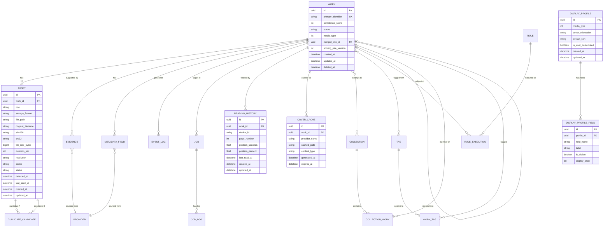
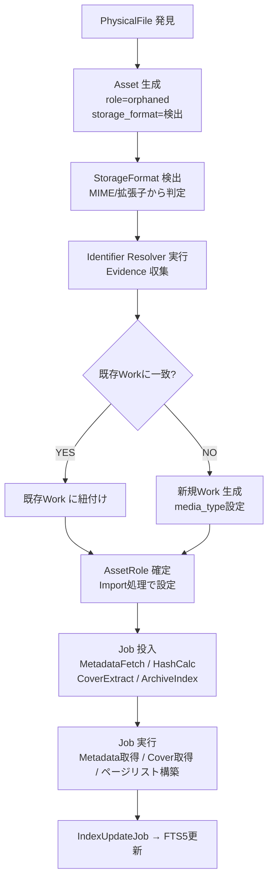

# WISE v2 Database.md (v2.0)

> **本書はv1.0からv2.0への更新である。**  
> 変更の主目的：AssetRole・StorageFormat追加（FB①③）、ReadingHistoryテーブル追加（FB②）、ASSETテーブルへのrole/storage_format追加（FB①③）、FTS5全文検索（FB⑦）、Collectionクロスメディア対応（FB⑥）、DISPLAY_PROFILEテーブル追加（FB⑤⑩）、COVER_CACHEテーブル追加（FB④）。

前提資料：**Architecture.md v2.0**、**Domain.md v2.0**

---

# 1. DB設計思想

## 1.1 Source of Truth

> DBがすべての判断基準。ファイルシステムは「DBが指す先」に過ぎない。（Architecture.md v2.0 1.2節）

この思想から導かれるDB設計上の決定：

| 思想 | DB上での表現 |
|---|---|
| ファイルが消えてもWorkのレコードは消えない | `ASSET.file_path` はNULL許容。Work自体は削除しない |
| ファイル名は手がかりに過ぎない | 真の同一性判断は `ASSET.sha256` と `WORK.primary_identifier` |
| DBに存在しないWorkはWISEでは存在しない | ファイルスキャン結果はDB登録完了をもって有効 |
| 全操作の根拠はDBに残る | `EVENT_LOG` がすべての状態変化の監査証跡 |

**削除方針：** WISEはWork・Assetを原則物理削除しない。ファイルが見つからない場合は `ASSET.status = 'missing'` とし、ユーザーが明示的に削除を指示した場合のみSoft Delete（`deleted_at` に日時を記録）。

## 1.2 Work中心設計

```
Work
├── Asset（role: Video/Archive/Image/CoverPortrait/...）
├── Evidence（Identifier解決の根拠）
├── MetadataField（作品情報の各フィールド）
├── Job（非同期処理の実行単位）
├── EventLog（状態変化履歴）
├── ReadingHistory（読書/視聴進捗 — 独立エンティティ）
└── CollectionWork → Collection（Author/Circle/Series/Maker/...）
```

## 1.3 v2新規テーブル一覧

| テーブル | 追加理由 |
|---|---|
| `READING_HISTORY` | ReaderPositionをWorkから分離（FB②） |
| `COVER_CACHE` | ICoverProvider結果をキャッシュ（FB④） |
| `DISPLAY_PROFILE` | MediaDisplayProfile設定を永続化（FB⑤⑩） |
| `DISPLAY_PROFILE_FIELD` | フィールドON/OFF設定（FB⑩） |
| `METADATA_FTS` | FTS5仮想テーブル（FB⑦） |

## 1.4 v2既存テーブル変更一覧

| テーブル | 変更内容 |
|---|---|
| `ASSET` | `role`（AssetRole）・`storage_format`（StorageFormat）カラム追加（FB①③） |
| `COLLECTION` | `type` にAuthor/Circle/Person/Series/Maker追加（FB⑥） |

---

# 2. ドメインモデル（Entity一覧）

| Entity | テーブル名 | 新規/変更 | 概要 |
|---|---|---|---|
| Work | `WORK` | — | 作品（WISEの中心概念） |
| Asset | `ASSET` | **変更** | PhysicalFileのDB上の表現 + Role/StorageFormat |
| MetadataField | `METADATA_FIELD` | — | 作品の各情報フィールド（EAV） |
| Evidence | `EVIDENCE` | — | Identifier解決の根拠 |
| Provider | `PROVIDER` | — | Metadata/Identifier取得元の定義 |
| Collection | `COLLECTION` | **変更** | Workのグルーピング（クロスメディア対応） |
| CollectionWork | `COLLECTION_WORK` | — | CollectionとWorkの中間テーブル |
| Rule | `RULE` | — | 命名・整理・タグ付けルールの定義 |
| RuleExecution | `RULE_EXECUTION` | — | Ruleの適用履歴 |
| EventLog | `EVENT_LOG` | — | Domain Eventの記録 |
| Job | `JOB` | — | 非同期処理の実行単位 |
| JobLog | `JOB_LOG` | — | Jobの実行履歴 |
| ReadingHistory | `READING_HISTORY` | **新規** | 読書/視聴進捗（デバイス別） |
| CoverCache | `COVER_CACHE` | **新規** | ICoverProvider取得結果キャッシュ |
| DisplayProfile | `DISPLAY_PROFILE` | **新規** | MediaDisplayProfile設定 |
| DisplayProfileField | `DISPLAY_PROFILE_FIELD` | **新規** | フィールドON/OFF詳細 |
| DuplicateCandidate | `DUPLICATE_CANDIDATE` | — | Asset重複判定の候補ペア |
| NormalizerRule | `NORMALIZER_RULE` | — | ファイル名正規化ルール |
| Tag | `TAG` | — | Workに付与するタグ |
| WorkTag | `WORK_TAG` | — | WorkとTagの中間テーブル |

---

# 3. ER図



---

# 4. テーブル設計

## 4.1 WORK（変更なし — v1.0と同一）

> v1.0の設計を維持。`media_type` はTEXT → INTEGER（MediaType enum値）に型を統一することを推奨。

| カラム | 型 | 説明 |
|---|---|---|
| `id` | UUID PK | 内部一意識別子 |
| `primary_identifier` | TEXT UK | 正規化済み主識別子（例：`FANZA-ABP-123`） |
| `confidence_score` | INTEGER | Identifier ResolverのConfidenceスコア（0-100） |
| `status` | TEXT | `active` / `missing` / `deleted` / `merged` |
| `media_type` | INTEGER | MediaType enum値（1=Video, 2=Comic, 3=Book, ...） |
| `merged_into_id` | UUID FK→WORK | Work Merge時の統合先（NULLは非統合） |
| `scoring_rule_version` | INTEGER | Confidenceスコアリングルールバージョン |
| `created_at` | DATETIME | Work初回生成日時 |
| `updated_at` | DATETIME | 最終更新日時 |
| `deleted_at` | DATETIME | Soft Delete日時（NULLは未削除） |

**Index：**
- `(primary_identifier)` UNIQUE
- `(status)` — Gallery active絞り込み
- `(media_type)` — MediaTypeフィルタ
- `(created_at DESC)` — 新着順
- `(confidence_score)` — 低Confidence一覧

---

## 4.2 ASSET（v2変更：role・storage_format追加）

> **変更内容：** v1.0の `container` カラムを `storage_format` に整理統合。`role` カラム追加。

| カラム | 型 | Nullable | 変更 | 説明 |
|---|---|---|---|---|
| `id` | UUID PK | NO | — | 内部一意識別子 |
| `work_id` | UUID FK→WORK | **YES** | — | Identifier解決前はNULL（Orphaned状態） |
| `role` | TEXT | NO | **追加** | AssetRole（video/archive/cover_portrait/...） |
| `storage_format` | TEXT | NO | **追加** | StorageFormat（single_file/archive/folder/pdf/epub） |
| `file_path` | TEXT | YES | — | 現在のファイルパス（消失時はNULL） |
| `original_filename` | TEXT | NO | — | 検出時のオリジナルファイル名（不変） |
| `sha256` | TEXT | YES | — | SHA256ハッシュ（HashCalcJob完了後） |
| `crc32` | TEXT | YES | — | CRC32（補助的重複判定） |
| `file_size_bytes` | BIGINT | NO | — | バイト単位サイズ |
| `duration_sec` | INTEGER | YES | — | 動画の再生時間（秒）。Video以外はNULL |
| `resolution` | TEXT | YES | — | 解像度（例：`1920x1080`） |
| `codec` | TEXT | YES | — | 映像コーデック |
| `status` | TEXT | NO | — | `active` / `missing` / `orphaned` / `deleted` |
| `detected_at` | DATETIME | NO | — | ファイル最初の検出日時 |
| `last_seen_at` | DATETIME | NO | — | ファイルの最終確認日時 |
| `created_at` | DATETIME | NO | — | レコード生成日時 |
| `updated_at` | DATETIME | NO | — | 最終更新日時 |

**Index：**
- `(sha256)` — 重複判定の主要経路
- `(work_id)` — Work別Asset取得
- `(work_id, role)` — Role別Asset取得（例：CoverPortraitのみ）
- `(work_id)` PARTIAL WHERE `work_id IS NULL` — Orphaned Asset一覧
- `(status)` — ステータス別フィルタ
- `(storage_format)` — StorageFormat別取得（IArchiveReader選択）

**設計根拠：**
- `role` は `video`, `archive`, `cover_portrait` 等のスネークケースTEXT値
- `storage_format` は `single_file`, `archive`, `folder`, `pdf`, `epub` のTEXT値
- 既存の `container` カラム（`MP4`等）は `storage_format` に統合（移行スクリプトで対応）

---

## 4.3 READING_HISTORY（新規）

**役割：** ユーザーの読書/視聴進捗をデバイス別に管理。WorkエンティティにReaderPositionを持たせない設計（FB②）の実体。

| カラム | 型 | Nullable | 説明 |
|---|---|---|---|
| `id` | UUID PK | NO | 内部一意識別子 |
| `work_id` | UUID FK→WORK | NO | 対象Work |
| `device_id` | TEXT | NO | デバイス識別子（localStorageのUUID等） |
| `page_number` | INTEGER | YES | 現在ページ（Comic/Book。NULL for Video） |
| `position_seconds` | REAL | YES | 再生位置（秒）（Video。NULL for Comic/Book） |
| `position_percent` | REAL | YES | 進捗パーセンテージ（0.0-1.0）全MediaType共通 |
| `last_read_at` | DATETIME | NO | 最終閲覧/再生日時 |
| `created_at` | DATETIME | NO | レコード最初生成日時 |
| `updated_at` | DATETIME | NO | 最終更新日時 |

**Unique制約：** `(work_id, device_id)` — 同一Work×同一Deviceは1レコードのみ（UPSERT）

**Index：**
- `(work_id, device_id)` UNIQUE — UPSERT用
- `(work_id)` — Work別進捗取得（最終閲覧日算出等）
- `(device_id, last_read_at DESC)` — デバイス別最近閲覧順

**設計根拠（FB②）：**
- ReadingHistoryをWorkテーブルに含めない理由：
  1. デバイスが複数存在する場合に1:1では対応不可
  2. 更新頻度が高いがWorkのライフサイクルと無関係
  3. 将来のクラウド同期でdevice_idを使ったConflict Resolutionが必要
  4. 進捗のリセット・削除がWork自体に影響を与えるべきでない

---

## 4.4 COVER_CACHE（新規）

**役割：** ICoverProviderによって取得・生成されたカバー画像のキャッシュ。CoverExtractJobの重複実行防止とカバー提供の高速化（FB④）。

| カラム | 型 | Nullable | 説明 |
|---|---|---|---|
| `id` | UUID PK | NO | 内部一意識別子 |
| `work_id` | UUID FK→WORK | NO | 対象Work |
| `provider_name` | TEXT | NO | 使用したICoverProvider実装名 |
| `cached_path` | TEXT | NO | ローカルキャッシュファイルパス |
| `content_type` | TEXT | NO | MIMEタイプ（`image/jpeg`等） |
| `generated_at` | DATETIME | NO | 生成日時 |
| `expires_at` | DATETIME | YES | キャッシュ有効期限（NULLは無期限） |

**Unique制約：** `(work_id, provider_name)` — 同一Work×同一Providerは最新1レコードのみ

**Index：**
- `(work_id)` — Work別カバー取得
- `(expires_at)` PARTIAL WHERE `expires_at IS NOT NULL` — キャッシュ有効期限確認

---

## 4.5 DISPLAY_PROFILE / DISPLAY_PROFILE_FIELD（新規）

**役割：** MediaDisplayProfileの永続化。MediaType別のGallery/Detail表示設定を管理する（FB⑤⑩）。

### DISPLAY_PROFILE

| カラム | 型 | Nullable | 説明 |
|---|---|---|---|
| `id` | UUID PK | NO | 内部一意識別子 |
| `media_type` | INTEGER | NO | MediaType enum値（1=Video, 2=Comic, ...） |
| `cover_orientation` | TEXT | NO | `portrait` / `landscape` |
| `default_sort` | TEXT | NO | デフォルトソート（例：`created_at DESC`） |
| `is_user_customized` | BOOLEAN | NO | false=デフォルト, true=ユーザーカスタマイズ |
| `created_at` | DATETIME | NO | 生成日時 |
| `updated_at` | DATETIME | NO | 最終更新日時 |

**Unique制約：** `(media_type)` UNIQUE — MediaType毎に1つのProfile

### DISPLAY_PROFILE_FIELD

| カラム | 型 | Nullable | 説明 |
|---|---|---|---|
| `id` | UUID PK | NO | 内部一意識別子 |
| `profile_id` | UUID FK→DISPLAY_PROFILE | NO | 所属Profile |
| `field_name` | TEXT | NO | フィールド名（`title`/`actress`/`author`等） |
| `label` | TEXT | NO | 表示ラベル（日本語/英語） |
| `is_visible` | BOOLEAN | NO | 表示ON/OFF |
| `display_order` | INTEGER | NO | 表示順 |

**Unique制約：** `(profile_id, field_name)` UNIQUE

**設計根拠（FB⑩）：**
- `is_user_customized = false` のProfileはシステムデフォルト（コード更新で再初期化可）
- `is_user_customized = true` のProfileはユーザーが変更したもので、コード更新時に自動上書きしない
- Gallery UIはDISPLAY_PROFILEを参照してフィールドを決定し、MediaTypeのif/elseを含まない

---

## 4.6 METADATA_FIELD（変更なし — v1.0と同一）

EAVパターン。全フィールドを `(work_id, field_name, value)` のペアで管理。詳細はv1.0準拠。

**v2追加：コミック固有フィールド名の標準化**

| field_name | 説明 | 主なMediaType |
|---|---|---|
| `title` | 作品タイトル | All |
| `actress` | 女優名 | Video |
| `author` | 作者名 | Comic, Book |
| `circle` | サークル名 | Comic |
| `maker` | メーカー名 | Video |
| `publisher` | 出版社 | Book |
| `director` | 監督 | Video |
| `release_date` | 発売日（YYYY-MM-DD） | All |
| `genre` | ジャンル | All |
| `description` | あらすじ/説明 | All |
| `page_count` | ページ数 | Comic, Book |
| `language` | 言語 | Comic, Book |
| `series` | シリーズ名 | All |
| `volume` | 巻数 | Comic, Book |
| `cover_url` | カバー画像URL（縦） | All |
| `cover_landscape_url` | カバー画像URL（横） | Video |
| `sample_image_urls` | サンプル画像URL一覧（JSON配列） | Video, Comic |
| `isbn` | ISBN | Book |
| `dlsite_id` | DLサイトRJ番号 | Comic |

---

## 4.7 COLLECTION（v2変更：typeにAuthor/Circle/Person追加）

> v1.0の基本構造を維持。`type` カラムの許容値を拡張。

**type一覧（v2更新）：**

| type | 意味 | クロスメディア | v2追加 |
|---|---|---|---|
| `Favorite` | お気に入り | ✓ | — |
| `Playlist` | 手動プレイリスト | ✓ | — |
| `SmartFolder` | 動的抽出 | ✓ | — |
| `Series` | シリーズ | ✓ | — |
| `Maker` | メーカー・出版社 | ✓ | — |
| `Author` | 作者（Video女優/Comic作家横断） | ✓ | **新規** |
| `Circle` | サークル（主にComic/Doujin） | ✓ | **新規** |
| `Person` | 出演者・作家・監督などの人物概念 | ✓ | **新規** |

---

## 4.8 FTS5仮想テーブル（新規）

**役割：** SQLite FTS5を使用したMetadata全文検索インデックス（FB⑦）。

```sql
-- FTS5仮想テーブル（概念定義）
CREATE VIRTUAL TABLE METADATA_FTS USING fts5(
    work_id UNINDEXED,
    field_name UNINDEXED,
    value,
    content='METADATA_FIELD',
    content_rowid='rowid'
);
```

**設計原則（FB⑦）：**
- MediaTypeに依存しない全MetadataFieldを検索対象とする
- 「ComicだけFTS検索できる」制限は設けない
- `IndexUpdateJob` が `MetadataUpdated` イベントをトリガーにFTS5インデックスを更新
- FTS5はコンテンツテーブルモードを使用し、METADATA_FIELDとの二重管理を回避

**検索クエリパターン：**
```sql
-- キーワード「水原梨花」で全MediaTypeを横断検索
SELECT DISTINCT w.*
FROM WORK w
JOIN METADATA_FTS fts ON fts.work_id = w.id
WHERE METADATA_FTS MATCH '水原梨花'
  AND w.status = 'active'
ORDER BY w.created_at DESC;
```

---

## 5. Index設計（v1.0からの追加分）

| テーブル | Indexカラム | 種別 | 採用理由 |
|---|---|---|---|
| ASSET | `(work_id, role)` | 複合 | Role別Asset取得（CoverPortrait取得等） |
| ASSET | `(storage_format)` | 通常 | IArchiveReader選択 |
| READING_HISTORY | `(work_id, device_id)` | UNIQUE | UPSERT高速化 |
| READING_HISTORY | `(device_id, last_read_at DESC)` | 複合 | デバイス別閲覧履歴 |
| READING_HISTORY | `(work_id)` | 通常 | Work別進捗取得 |
| COVER_CACHE | `(work_id, provider_name)` | UNIQUE | カバーキャッシュ重複防止 |
| DISPLAY_PROFILE | `(media_type)` | UNIQUE | MediaType別Profile取得 |
| DISPLAY_PROFILE_FIELD | `(profile_id, display_order)` | 複合 | フィールド順取得 |

---

## 6. ライフサイクル（v2更新）

### Entity生成順（DB視点）



---

## 7. 将来拡張への対応

### 7.1 media_typeの拡張

`WORK.media_type` はINTEGER（enum値）。新メディア種別追加はenumへの追加とDISPLAY_PROFILEのINSERTのみ。スキーマ変更不要。

### 7.2 AssetRole/StorageFormatの拡張

TEXT値（スネークケース文字列）なので、新しいRole/Format追加はアプリコードの変更のみ。スキーマ変更不要。

### 7.3 ReadingHistoryのデバイス横断最新進捗

```sql
-- Work一覧取得時に最終閲覧日を取得するクエリパターン
SELECT w.*, MAX(rh.last_read_at) AS last_read_at
FROM WORK w
LEFT JOIN READING_HISTORY rh ON rh.work_id = w.id
WHERE w.status = 'active'
GROUP BY w.id
ORDER BY last_read_at DESC NULLS LAST;
```

### 7.4 DisplayProfileのリセット

```sql
-- ユーザーが設定をデフォルトに戻す場合
UPDATE DISPLAY_PROFILE SET is_user_customized = false WHERE media_type = :mediaType;
-- 次のAPI呼び出し時にデフォルトProfile（コード定義）で再初期化
```

---

## 8. 採用しなかった設計と理由

### 8.1 ReadingHistoryをWORKテーブルのカラムとして持つ設計

**却下理由（FB②）：**
- デバイス複数対応が不可能（1:1制約）
- 更新頻度とWorkのライフサイクルが無関係
- 将来のクラウド同期時にConflict Resolutionが困難

### 8.2 AssetTypeカラム（type: 'video' / 'image' / 'archive'等）

**却下理由（FB①）：**
- AssetのTypeではなく、WorkにおけるAssetの「役割（Role）」が重要
- TypeはAsset自体の物理的属性（StorageFormatで十分）

### 8.3 MediaType別のFTS5テーブル（VIDEO_FTS, COMIC_FTS等）

**却下理由（FB⑦）：**
- 検索はMediaTypeで制限しない（全MetadataFieldを横断）
- テーブル分離は管理コストが高くPlugin追加に弱い

---

## 9. 設計上の弱点・懸念点（v2更新）

### 9.1 READING_HISTORYの高頻度UPDATE

**懸念：** ビューワーがページ移動のたびにUPSERTを実行するとSQLiteがロックされる  
**対策：** フロントエンド側でdebounce（5秒間隔）を設け、アプリ内はlocalStorageでリアルタイム保持。ページ移動時・ウィンドウクローズ時のみDBにflush。

### 9.2 FTS5とMETADATA_FIELDの同期ズレ

**懸念：** IndexUpdateJobが遅延した場合、FTS5の内容がDB（METADATA_FIELD）と一時的に不一致になる  
**対策：** FTS5はEventual Consistencyで許容。ユーザーへの表示は「インデックス更新中」アイコンで通知。

### 9.3 StorageFormat=Folderの画像ファイル管理

**懸念：** 1000枚の画像を含むフォルダのページリストをキャッシュ管理するか都度生成するか  
**対策：** `ArchiveIndexJob` でページリストをJSON形式でキャッシュ（COVER_CACHEサイドカーまたは専用フィールド）。初回は生成コストを許容し、以降はキャッシュを参照。

---

*WISE v2 Database.md v2.0 — 2026-06-30*
