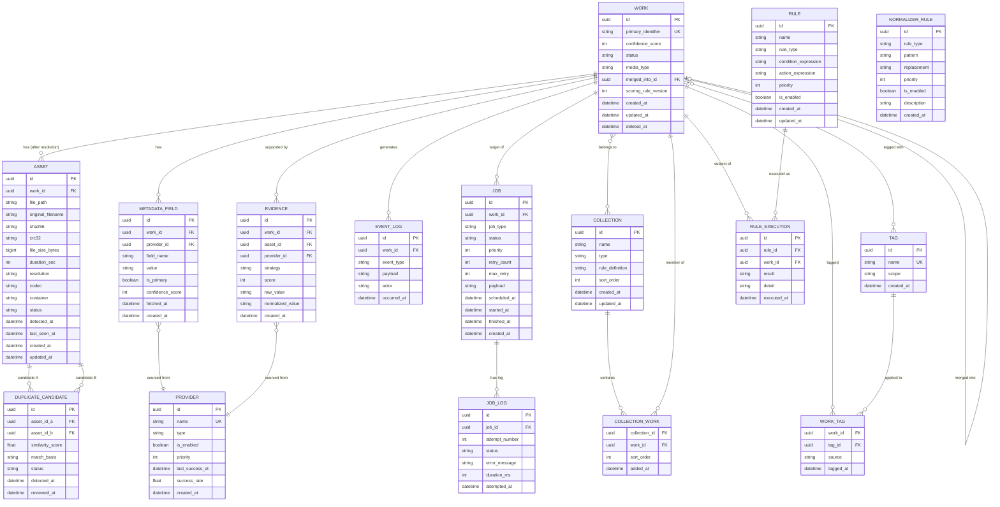
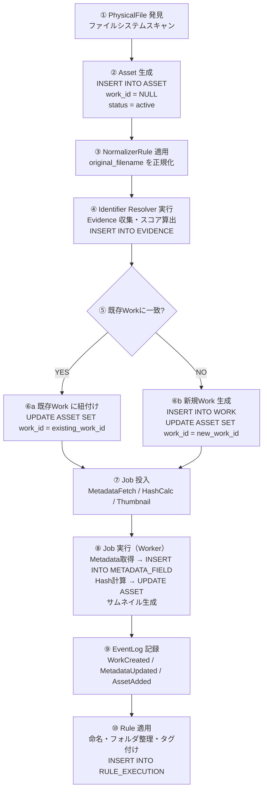
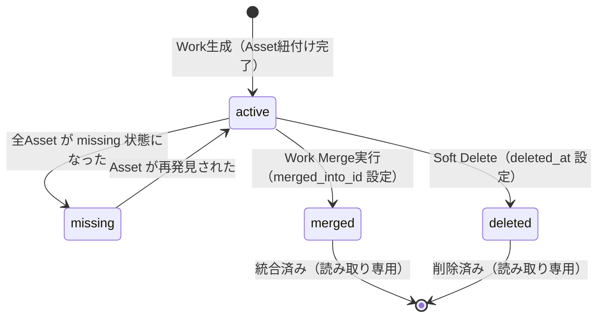
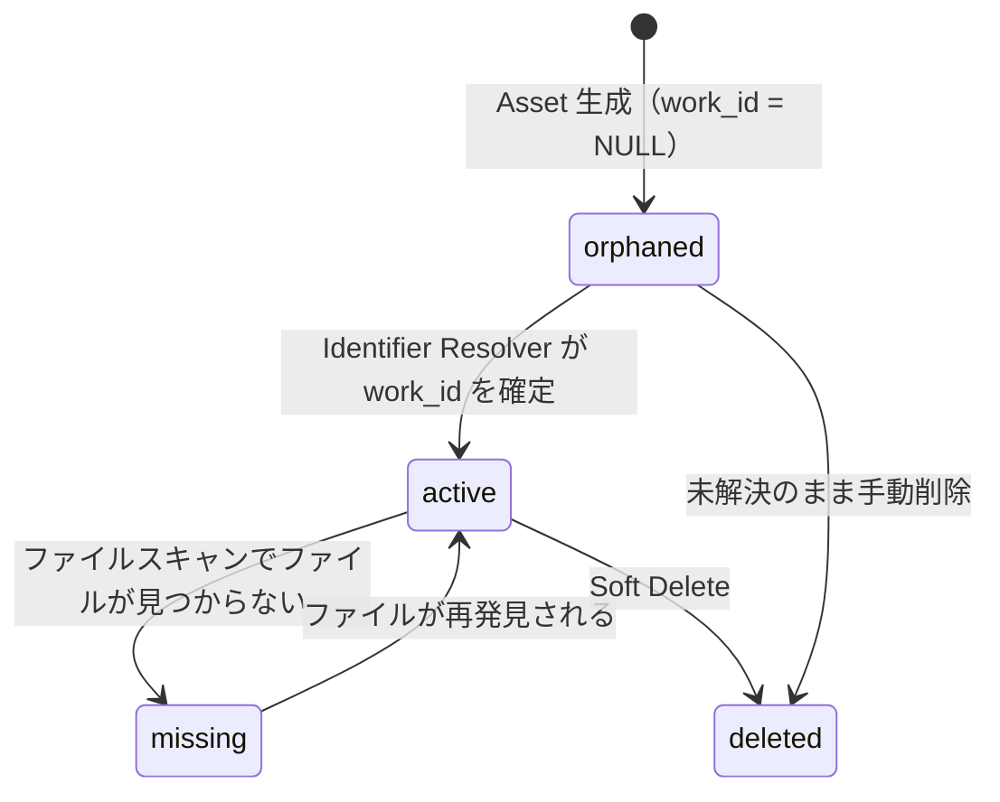
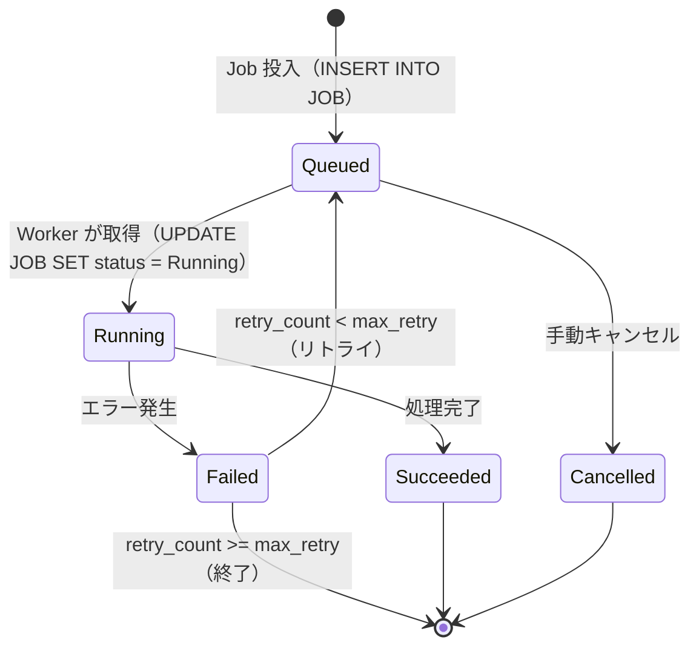

# WISE v2 Database.md (v1.0)

## 0. 本書の位置づけ

本書はWISE v2のデータベース設計書である。前提資料として **Architecture.md v1.1** を参照し、そこで定義された設計思想・設計原則・コンポーネント構成との矛盾を排除している。

本書の目的は「テーブル一覧を記述すること」ではない。各Entityがなぜ存在するのか・どの責務を持つのか・どこと関連するのか・将来どのように拡張できるのかを、実装担当者が迷わないレベルで説明することを目的とする。

DDL（CREATE TABLE文）は含まない。Entity Framework・SQLite・PostgreSQL いずれの実装においても、本書だけを根拠として設計を再現できるレベルを目指す。

**本書で扱う範囲：**

- DB設計思想（Architecture.md との接続）
- ドメインモデル（Entity一覧と責務）
- ER図（完全版）
- テーブル設計（各テーブルの詳細仕様）
- リレーション設計（なぜ1:Nなのか、なぜN:Mなのか）
- Index設計（採用理由込み）
- ライフサイクル（DB視点）
- 将来拡張への対応
- 採用しなかった設計と理由
- v1.0実装範囲と v2以降への仕切り
- 設計上の弱点・懸念点・改善案
- Architecture.md へのフィードバック

---

# 1. DB設計思想

## 1.1 Source of Truth

Architecture.md 1.2節の最重要思想を、DB設計として具体化する。

> DBがすべての判断基準。ファイルシステムは「DBが指す先」に過ぎない。

この思想から導かれるDB設計上の決定は以下の通りである。

| 思想 | DB上での表現 |
|---|---|
| ファイルが消えてもWorkのレコードは消えない | `ASSET.file_path` はNULL許容とし、「リンク切れ」状態を表現する。Work自体は削除しない |
| ファイル名は手がかりに過ぎない | `ASSET.file_path` や `ASSET.original_filename` はあくまで参考カラム。真の同一性判断は `ASSET.sha256` と `WORK.primary_identifier` による |
| DBに存在しないWorkはWISE上では存在しない | ファイルシステムのスキャン結果はDBへの登録完了をもって初めて有効になる |
| 全操作の根拠はDBに残る | `EVENT_LOG` がすべての状態変化を記録する唯一の監査証跡である |

**削除方針：** WISEはWork・Assetを原則として物理削除しない。ファイルが見つからない場合は `ASSET.status = 'missing'` とし、ユーザーが明示的に「このWorkを削除する」と指示した場合のみ Soft Delete（`deleted_at` に日時を記録）を行う。物理削除は管理者操作（データベース圧縮）の文脈でのみ許容する。

## 1.2 Work中心設計

Architecture.md 2.2節の「Work中心原則」をDB構造として実現する。

すべてのビジネス上の概念（Metadata、Evidence、Collection、EventLog、Job）はWorkに関連付けられる。WorkはWISEの宇宙における重力の中心である。

```
Work
├── Asset（PhysicalFileの表現。Work確定前は未関連）
├── Evidence（Identifier解決の根拠）
├── MetadataField（作品情報の各フィールド）
├── Job（Workを対象とする非同期処理）
├── EventLog（Workの状態変化履歴）
└── CollectionWork（Collectionへの所属）
```

ただし、AssetだけはWork確定前にも独立して存在する（後述）。

## 1.3 AssetとWorkの関係

**「AssetはPhysicalFileをDB上で表現したEntityである」** (Architecture.md 1.2節, 2.2節, 4.1節)

AssetはWork登録後に追加されるのではなく、PhysicalFile検出と同時に独立して生成される。`ASSET.work_id` はNULL許容であり、この NULL は「Identifier Resolver がまだ実行されていない」または「解決に失敗した（新規Workに割り当て待ち）」状態を意味する。

```
PhysicalFile 発見
    ↓
Asset 生成（work_id = NULL）
    ↓
Identifier Resolver 実行
    ↓
work_id が確定して設定される
```

これにより「Workがなければファイルを登録できない」という設計の罠を回避する。

## 1.4 MetadataとWorkの関係

Metadataは「Workを説明する情報の集合」であり、Work自体の存在とは非同期で育つ。

- Workは Metadata なしで確定できる（Architecture.md 1.2節 点1）
- Metadata取得はJob Queueを介した非同期処理であり、Work生成と同期しない（Architecture.md 4.5節）
- MetadataFieldはProvider別に管理され、複数Providerの情報が競合した場合は `confidence_score` と `priority` によって解決する

DBレイヤーで `WORK` テーブル自体に `title` や `actress` のようなカラムを持たせない。Workに関する全ての作品情報は `METADATA_FIELD` テーブルに分離する（理由は第9章にて説明）。

## 1.5 CollectionとWorkの関係

Collection は「Workをグルーピングする概念」であり（Architecture.md 5章）、Workには影響を与えない。

- お気に入り・シリーズ・女優・メーカー・プレイリスト・スマートフォルダをすべて同一の `COLLECTION` テーブルで表現する
- CollectionとWorkの関係は N:M（中間テーブル `COLLECTION_WORK` による）
- スマートフォルダは `COLLECTION.rule_definition` に条件式を持ち、`COLLECTION_WORK` への物理的な行を持たない（動的クエリで算出）

## 1.6 Event LogとWorkの関係

Event Log は「何が起きたかを後から追える」ための監査証跡である（Architecture.md 2.5節, 4.8節）。

- `WorkCreated`、`MetadataUpdated`、`AssetAdded`、`RuleExecuted` など、全ての状態変化をイベントとして記録する
- Event Log はWorkの外側からWorkを観察するテーブルであり、Workのデータを変更しない
- History（ユーザー向け閲覧機能）はEvent Logに対するViewとして実装し、Event Log自体は変更しない

## 1.7 JobとWorkの関係

Job は「時間のかかる処理の実行単位」であり（Architecture.md 5章）、WorkのLifecycleとは独立して存在する。

- `JOB.work_id` はNULL許容。Work非依存のJob（全体再スキャン・DB最適化など）も存在し得る
- JobはWorkに1:Nで関連する（同一WorkにMetadata取得Jobが複数回投入されることがある）
- Jobの状態（Queued/Running/Succeeded/Failed）は `JOB.status` で管理し、履歴は別途 `JOB_LOG` で保持する

## 1.8 ProviderとWorkの関係

Provider は「Metadataを取得する外部ソース」の定義であり（Architecture.md 3章, 5章）、DBには「どのProviderから取得したMetadataか」という出所情報として記録される。

- `METADATA_FIELD.provider_id` が取得元Providerを指す
- `EVIDENCE.provider_id` がIdentifier解決時の根拠を提供したProviderを指す
- ProviderはDBに定義を持つが、実装はPlugin層に存在する

---

# 2. ドメインモデル

## Entity一覧

| Entity | テーブル名 | 概要 |
|---|---|---|
| Work | `WORK` | 作品。WISEの中心概念 |
| Asset | `ASSET` | PhysicalFileのDB上の表現 |
| MetadataField | `METADATA_FIELD` | 作品の各情報フィールド |
| Evidence | `EVIDENCE` | Identifier解決の根拠 |
| Provider | `PROVIDER` | Metadata/Identifier取得元の定義 |
| Collection | `COLLECTION` | Workをグルーピングする概念 |
| CollectionWork | `COLLECTION_WORK` | CollectionとWorkの中間テーブル |
| Rule | `RULE` | 命名・整理・タグ付けルールの定義 |
| RuleExecution | `RULE_EXECUTION` | Ruleの適用履歴 |
| EventLog | `EVENT_LOG` | Domain Eventの記録（監査証跡） |
| Job | `JOB` | 非同期処理の実行単位 |
| JobLog | `JOB_LOG` | Jobの実行履歴・ログ |
| DuplicateCandidate | `DUPLICATE_CANDIDATE` | Asset重複判定の候補ペア |
| NormalizerRule | `NORMALIZER_RULE` | ファイル名正規化ルール |
| Tag | `TAG` | Workに付与するタグ |
| WorkTag | `WORK_TAG` | WorkとTagの中間テーブル |

## 各Entityの責務

### Work

**なぜ必要か：** WISEにおける「作品」という概念を表現する唯一のEntity。すべての検索・閲覧・整理・履歴管理はWorkを起点とする。

**責務：**
- 作品の一意な識別子（primary_identifier）を保持する
- Identifier Resolverが算出したConfidenceスコアを保持する
- Metadata、Evidence、Job、EventLog、Collectionの関連先となる
- 将来的なWork Merge（作品統合）の入り口（merged_into_id）を持つ

**持たないもの：** 作品情報（タイトル・女優・メーカー等）は MetadataField が持つ。WorkはMetadataFieldの「見出し」に過ぎない。

---

### Asset

**なぜ必要か：** PhysicalFile（実ファイル）はファイルシステム上の実体であり、DB管理の外にある。AssetはこれをDB上のEntityとして表現するための概念である。「DBが唯一の真実」という設計思想を、物理ファイルに対して実現するために必須。

**責務：**
- ファイルパス・ファイルサイズ・SHA256・CRC等の物理属性を保持する
- 動画の場合は duration_sec・resolution・codec などの MediaInfo を保持する
- Work確定前の状態（work_id = NULL）を表現できる
- 「リンク切れ（ファイルが見つからない）」状態（status = 'missing'）を表現できる
- 重複候補（DuplicateCandidate）の当事者となる

**持たないもの：** 作品としての意味付け（タイトル・女優等）はMetadataFieldが持つ。Assetは物理的属性のみ。

---

### MetadataField

**なぜ必要か：** 作品情報は単一の決定値ではなく、複数のProviderから取得した複数の候補値が競合する性質を持つ。これを固定スキーマカラムで表現すると、Provider追加のたびにスキーマ変更が発生する。

**責務：**
- Work一つに対して、field_name（例：`title`、`actress`、`maker`）と value のペアを複数保持する
- 各フィールドの取得元Provider・取得日時・Confidenceスコアを保持する
- 複数Providerから同一フィールドの異なる値が取得された場合、全候補を保持したうえで `is_primary` フラグで「採用値」を区別する

**持たないもの：** Providerのビジネスロジック（どのProviderを優先するか）はアプリケーション層の責務。

---

### Evidence

**なぜ必要か：** Identifier Resolverは「このAssetはどのWorkか」を単純一致ではなくConfidenceスコアで判断する（Architecture.md 4.3節）。このスコアの根拠（どのEvidenceが何点加算されたか）をDB上に保存することで、Diagnostic画面での推論過程確認が可能になる。

**責務：**
- Identifier解決時に収集した各証拠（ファイル名一致、FANZA一致、Wiki一致等）を行単位で保持する
- 各Evidenceのscore（加点）とraw_value（根拠文字列）を保持する
- どのProviderがこのEvidenceを提供したかを記録する

**持たないもの：** Confidence算出ロジックはアプリケーション層（Identifier Service）の責務。

---

### Provider

**なぜ必要か：** MetadataFieldやEvidenceは「どこから取得したか」が重要な情報である。Provider定義をDBに持つことで、Provider追加・無効化・成功率監視をDB操作で管理できる。

**責務：**
- Provider名・種別（scraping/local/manual/ai）・有効/無効フラグを保持する
- 優先度（priority）を保持し、MetadataFieldの `is_primary` 判断に使用する
- Provider統計（最終成功日時・成功率等）の記録先となる

**持たないもの：** Provider実装（API呼び出しロジック等）はPlugin層の責務。

---

### Collection

**なぜ必要か：** お気に入り・シリーズ・女優・メーカー・プレイリスト・スマートフォルダというユーザー向けのグルーピング概念を、単一のテーブル設計で統一的に扱うため（Architecture.md 5章）。

**責務：**
- グループの名前・種別（type）を保持する
- スマートフォルダの場合は動的抽出条件（rule_definition）を保持する
- 並び順・アイコン等のUI補助情報を保持する

**持たないもの：** Workそのものの情報（Workの情報変更はWorkおよびMetadataFieldの責務）。

---

### CollectionWork

**なぜ必要か：** CollectionとWorkはN:Mの関係（1つのWorkが複数Collectionに属し得る、1つのCollectionが複数Workを含む）。中間テーブルとして機能する。

**責務：**
- CollectionとWorkの関連を保持する
- 並び順（sort_order）を保持する（手動プレイリスト等で順序が意味を持つ場合）

---

### Rule

**なぜ必要か：** 命名規則・フォルダ整理・タグ付けルールはユーザー定義可能な設定値であり（Architecture.md 4.6節・9.4節）、コードへのハードコードを避けてDB管理することで、将来のPlugin化・外部化が容易になる。

**責務：**
- ルールの種別（naming/folder/tag）・優先度・条件式・適用内容を保持する
- ルールの有効/無効フラグを保持する

---

### RuleExecution

**なぜ必要か：** Ruleが適用されたことをEventLogに記録するだけでは「どのRuleが何に適用されたか」の詳細が埋もれてしまう。RuleExecutionは Rule適用の粒度でその結果を記録する。

**責務：**
- いつ・どのRuleが・どのWorkに・どんな結果をもたらしたかを記録する
- Rule変更時の影響範囲把握に使用する

---

### EventLog

**なぜ必要か：** Architecture.md 2.5節・4.8節が定めるイベント駆動の「状態変化の記録」として必須。History機能の実体でもある。

**責務：**
- Domain Event（WorkCreated/MetadataUpdated/AssetAdded/RuleExecuted等）を行単位で保持する
- イベントが影響したWork IDを参照する（nullable）
- event_type・payload・occurred_at を保持し、後から監査・閲覧できるようにする

**持たないもの：** イベントの発行ロジック（各サービスの責務）。EventLogは受け取って記録するだけ。

---

### Job

**なぜ必要か：** Architecture.md 5章が定める「時間のかかる処理の統一的な実行単位」として必須。DBに永続化されたJobキューとして機能する。

**責務：**
- job_type（MetadataFetch/HashCalc/Thumbnail/MediaInfo/OCR/AIAnalysis/IndexUpdate等）・status・優先度を保持する
- 対象Workを参照する（nullable。Work非依存Jobもある）
- スケジュール日時・実行開始日時・完了日時を保持する
- リトライ回数・最大リトライ数を保持する

---

### JobLog

**なぜ必要か：** Jobの実行履歴（各実行の成否・エラーメッセージ・所要時間）を Job本体から分離して保持する。Jobテーブルは「現在の状態」、JobLogテーブルは「実行の履歴」として責務を分離する。

**責務：**
- Jobの各実行（attempt）の結果を行単位で記録する
- エラーメッセージ・スタックトレース等のデバッグ情報を保持する

---

### DuplicateCandidate

**なぜ必要か：** Asset重複判定の結果（「このAssetとあのAssetは重複の可能性がある」）を保持するEntity。重複判定はAsset単位で行われる（Architecture.md 7章）。

**責務：**
- 重複候補ペア（asset_id_a, asset_id_b）と類似度スコアを保持する
- 重複の根拠（sha256一致・再生時間一致等）を保持する
- ユーザーが確認した結果（confirmed/rejected）を保持する

---

### NormalizerRule

**なぜ必要か：** Architecture.md 9.4節の改善案で指摘されている通り、正規化ルール（不要文字列除去・識別子表記統一）をコードにハードコードすると保守負担が増す。DBに外部化することでユーザー定義を可能にする。

**責務：**
- 正規化ルールの種別（remove_pattern/replace_pattern）・正規表現・置換文字列を保持する
- 優先度・有効フラグを保持する

---

### Tag

**なぜ必要か：** ユーザーが自由に付与できるタグをMetadataFieldとは独立して管理する。MetadataFieldのProviderが提供するジャンル等とは分離することで、ユーザー定義タグとProvider提供タグの混在を防ぐ。

**責務：**
- タグ名・スコープ（user_defined/provider等）を保持する

---

### WorkTag

**なぜ必要か：** WorkとTagはN:Mの関係。中間テーブルとして機能する。

**責務：**
- WorkとTagの関連・付与日時・付与元（手動/Provider/AI等）を保持する

---

# 3. ER図

完全なER図をMermaidで示す。中間テーブルを含む。



---

# 4. テーブル設計

## 4.1 WORK

### 役割
作品（Work）という概念のDB上の表現。WISEのすべての機能がこのテーブルを起点として動作する。Metadataの内容はここには存在せず、作品の同一性を示すIDと状態管理情報のみを保持する。

### カラム詳細

| カラム | 型 | PK/FK/UK | Nullable | 説明 |
|---|---|---|---|---|
| `id` | UUID | PK | NO | 内部一意識別子。DB内の参照に使用 |
| `primary_identifier` | TEXT | UK | NO | 正規化済みの主識別子（例：`FANZA-ABP-123`）。Identifier Resolverが確定した最終値 |
| `confidence_score` | INTEGER | - | NO | Identifier Resolverが算出したConfidenceスコア（0-100）|
| `status` | TEXT | - | NO | `active` / `missing`（全Asset紛失）/ `deleted`（Soft Delete）/ `merged`（統合済み） |
| `media_type` | TEXT | - | NO | `av` / `doujin` / `book` / `music` 等。将来拡張のためのStrategyキー |
| `merged_into_id` | UUID | FK→WORK | YES | Work Merge時に統合先WorkのIDを設定。NULLは非統合 |
| `scoring_rule_version` | INTEGER | - | NO | 確定時のConfidenceスコアリングルールバージョン（Architecture.md 9.1節の改善案） |
| `created_at` | DATETIME | - | NO | Work初回生成日時 |
| `updated_at` | DATETIME | - | NO | 最終更新日時 |
| `deleted_at` | DATETIME | - | YES | Soft Delete日時。NULLは未削除 |

### Index
- `(primary_identifier)` UNIQUE — 識別子検索の主要経路
- `(status)` — Gallery表示時のactive絞り込み
- `(media_type)` — メディア種別フィルタ
- `(created_at DESC)` — 新着順表示
- `(confidence_score)` — 低Confidence作品の一覧表示

### Cascade
- WORK削除時（Soft Delete）はASSET・METADATA_FIELD・EVIDENCEのSoft Deleteを連鎖させない。子テーブルはwork_idで参照するため、Workが削除されても子レコードは保持する（監査証跡として）

### 保持理由
WISEが「作品」という概念をDBで表現するための最小限のEntity。Workがなければ何も始まらない。

---

## 4.2 ASSET

### 役割
PhysicalFile（実ファイル）のDB上の表現。PhysicalFile検出と同時に生成され、Identifier Resolverの結果によってWorkに関連付けられる。

### カラム詳細

| カラム | 型 | PK/FK/UK | Nullable | 説明 |
|---|---|---|---|---|
| `id` | UUID | PK | NO | 内部一意識別子 |
| `work_id` | UUID | FK→WORK | **YES** | Identifier解決前はNULL。解決後に設定 |
| `file_path` | TEXT | - | YES | 現在のファイルパス。ファイル消失時はNULL |
| `original_filename` | TEXT | - | NO | 検出時のオリジナルファイル名（正規化前）。変更不可 |
| `sha256` | TEXT | - | YES | SHA256ハッシュ。計算前はNULL（Job完了後に設定）|
| `crc32` | TEXT | - | YES | CRC32（補助的な重複判定用）|
| `file_size_bytes` | BIGINT | - | NO | バイト単位のファイルサイズ |
| `duration_sec` | INTEGER | - | YES | 動画の再生時間（秒）。動画以外はNULL |
| `resolution` | TEXT | - | YES | 解像度（例：`1920x1080`）|
| `codec` | TEXT | - | YES | 映像コーデック（例：`H.264`）|
| `container` | TEXT | - | YES | コンテナフォーマット（例：`MP4`）|
| `status` | TEXT | - | NO | `active` / `missing`（ファイル消失）/ `orphaned`（work未関連）/ `deleted` |
| `detected_at` | DATETIME | - | NO | ファイル最初の検出日時 |
| `last_seen_at` | DATETIME | - | NO | ファイルの最終確認日時 |
| `created_at` | DATETIME | - | NO | レコード生成日時 |
| `updated_at` | DATETIME | - | NO | 最終更新日時 |

### Index
- `(sha256)` — 重複判定の主要経路
- `(work_id)` — Work別Assetリスト取得
- `(work_id)` WHERE `work_id IS NULL` — Orphaned Asset（未解決）の一覧取得
- `(status)` — ステータス別フィルタ
- `(file_size_bytes)` — サイズ重複の事前絞り込み

### Cascade
- WORKの削除連鎖は行わない（Assetはwork_id=NULLで存在可能なため）

### 保持理由
「DBが唯一の真実」を物理ファイルに適用するためのEntity。これがなければWISEはファイルシステムに依存した管理に退行する。

---

## 4.3 METADATA_FIELD

### 役割
Workに関する作品情報（タイトル・女優・メーカー・ジャンル・発売日等）を、Provider別・フィールド別に保持するEntity。Workテーブルには作品情報を持たせず、すべてここで管理する。

### カラム詳細

| カラム | 型 | PK/FK/UK | Nullable | 説明 |
|---|---|---|---|---|
| `id` | UUID | PK | NO | 内部一意識別子 |
| `work_id` | UUID | FK→WORK | NO | 対象Work |
| `provider_id` | UUID | FK→PROVIDER | NO | 取得元Provider |
| `field_name` | TEXT | - | NO | フィールド名（`title`/`actress`/`maker`/`genre`/`release_date`/`description`等）|
| `value` | TEXT | - | NO | フィールドの値 |
| `is_primary` | BOOLEAN | - | NO | この値を採用値とするかのフラグ（同一field_nameで複数行存在する場合に使用）|
| `confidence_score` | INTEGER | - | YES | このフィールド値に対するConfidence（0-100）|
| `fetched_at` | DATETIME | - | NO | Provider取得日時 |
| `created_at` | DATETIME | - | NO | レコード生成日時 |

### Index
- `(work_id, field_name)` — Work別フィールド取得
- `(work_id, field_name, is_primary)` — 採用値の高速取得
- `(field_name, value)` — Metadata検索（女優名・メーカー名検索等）
- `(provider_id)` — Provider別フィールド管理

### Unique制約
- `(work_id, provider_id, field_name)` UNIQUE — 同一WorkへのProvider別フィールドの重複防止

### 保持理由
複数Providerから競合するMetadataが来ることを前提とした設計。固定カラムで作品情報を持たせると、Provider追加のたびにスキーマ変更が必要になる。

---

## 4.4 EVIDENCE

### 役割
Identifier Resolverが「このAssetはどのWorkに属するか」を判断した際の根拠（Evidence）を保持するEntity。推論過程をDiagnostic画面で可視化するために必須。

### カラム詳細

| カラム | 型 | PK/FK/UK | Nullable | 説明 |
|---|---|---|---|---|
| `id` | UUID | PK | NO | 内部一意識別子 |
| `work_id` | UUID | FK→WORK | NO | 紐付け先Work |
| `asset_id` | UUID | FK→ASSET | YES | 根拠となったAsset（Work単位Evidenceの場合はNULL）|
| `provider_id` | UUID | FK→PROVIDER | YES | Evidenceを提供したProvider |
| `strategy` | TEXT | - | NO | 識別戦略（`filename_match`/`fanza_id`/`wiki_match`/`hash_match`等）|
| `score` | INTEGER | - | NO | この Evidenceの加点値 |
| `raw_value` | TEXT | - | NO | 一致の根拠となった生の文字列 |
| `normalized_value` | TEXT | - | YES | 正規化後の値 |
| `created_at` | DATETIME | - | NO | Evidence収集日時 |

### Index
- `(work_id)` — Work別Evidence一覧取得（Diagnostic画面）
- `(work_id, strategy)` — 戦略別Evidenceフィルタ

### 保持理由
「なぜこのWorkと判定されたか」をユーザーに説明するために不可欠。スコアだけ記録してもDiagnostic画面は成立しない。

---

## 4.5 PROVIDER

### 役割
Metadataを取得するProvider（FANZA・MGS・Wiki・Folder Parser・Manual・AI等）の定義をDBで管理するEntity。

### カラム詳細

| カラム | 型 | PK/FK/UK | Nullable | 説明 |
|---|---|---|---|---|
| `id` | UUID | PK | NO | 内部一意識別子 |
| `name` | TEXT | UK | NO | Provider名（例：`fanza`/`mgs`/`wiki_ja`/`folder_parser`/`manual`）|
| `type` | TEXT | - | NO | `scraping`/`local`/`manual`/`ai` |
| `is_enabled` | BOOLEAN | - | NO | 有効/無効フラグ |
| `priority` | INTEGER | - | NO | MetadataField採用値判定時の優先度 |
| `last_success_at` | DATETIME | - | YES | 最終成功日時（Circuit Breaker用）|
| `success_rate` | REAL | - | YES | 直近n回の成功率（Diagnostic画面用）|
| `created_at` | DATETIME | - | NO | レコード生成日時 |

### Index
- `(name)` UNIQUE — Provider名による高速参照
- `(is_enabled)` — 有効Provider一覧取得

### 保持理由
Provider管理をコードのみで行うと、Provider追加・無効化・優先度変更のたびにアプリ更新が必要になる。DBで管理することで運用時の柔軟な制御が可能になる。

---

## 4.6 COLLECTION

### 役割
お気に入り・シリーズ・女優・メーカー・プレイリスト・スマートフォルダという「Workのグルーピング概念」を統一して表現するEntity。

### カラム詳細

| カラム | 型 | PK/FK/UK | Nullable | 説明 |
|---|---|---|---|---|
| `id` | UUID | PK | NO | 内部一意識別子 |
| `name` | TEXT | - | NO | Collection名 |
| `type` | TEXT | - | NO | `Favorite`/`Series`/`Actress`/`Maker`/`Playlist`/`SmartFolder` |
| `rule_definition` | TEXT | - | YES | SmartFolder用の動的抽出条件式（JSON/DSL）。他のtypeはNULL |
| `sort_order` | INTEGER | - | YES | UI上の並び順 |
| `created_at` | DATETIME | - | NO | 生成日時 |
| `updated_at` | DATETIME | - | NO | 最終更新日時 |

### Index
- `(type)` — 種別別Collection一覧
- `(name)` — Collection名検索

### 保持理由
お気に入りとシリーズを別テーブルにすると、将来のCollection種別追加のたびにスキーマ変更が必要になる。`type`カラムによる統一管理が拡張性に優れる。

---

## 4.7 COLLECTION_WORK

### 役割
CollectionとWorkのN:M中間テーブル。

### カラム詳細

| カラム | 型 | PK/FK/UK | Nullable | 説明 |
|---|---|---|---|---|
| `collection_id` | UUID | FK→COLLECTION | NO | - |
| `work_id` | UUID | FK→WORK | NO | - |
| `sort_order` | INTEGER | - | YES | Playlist等で順序が意味を持つ場合に使用 |
| `added_at` | DATETIME | - | NO | Collectionへの追加日時 |

### PK
複合PK: `(collection_id, work_id)`

### Index
- `(collection_id)` — Collection内Work一覧（Gallery表示）
- `(work_id)` — Work所属Collection一覧

### 保持理由
CollectionとWorkはN:Mの関係（1作品が複数Collectionに属し得る）。中間テーブルなしでは表現できない。

---

## 4.8 RULE

### 役割
命名・フォルダ整理・タグ付けルールをDB管理するEntity（Architecture.md 4.6節・9.4節）。

### カラム詳細

| カラム | 型 | PK/FK/UK | Nullable | 説明 |
|---|---|---|---|---|
| `id` | UUID | PK | NO | 内部一意識別子 |
| `name` | TEXT | - | NO | ルール名（ユーザー定義）|
| `rule_type` | TEXT | - | NO | `naming`/`folder`/`tag` |
| `condition_expression` | TEXT | - | YES | 適用条件（例：media_type='av' AND confidence_score > 80）|
| `action_expression` | TEXT | - | NO | 適用アクション（rename/move/tag）の定義 |
| `priority` | INTEGER | - | NO | 同種ルールの優先順位 |
| `is_enabled` | BOOLEAN | - | NO | 有効フラグ |
| `created_at` | DATETIME | - | NO | 生成日時 |
| `updated_at` | DATETIME | - | NO | 最終更新日時 |

### Index
- `(rule_type, is_enabled)` — 有効ルールの種別別取得
- `(priority)` — 優先度順適用

### 保持理由
ルールのコードハードコードを避け、ユーザー定義・将来のPlugin化に対応するため。

---

## 4.9 RULE_EXECUTION

### 役割
Ruleの適用履歴を記録するEntity。

### カラム詳細

| カラム | 型 | PK/FK/UK | Nullable | 説明 |
|---|---|---|---|---|
| `id` | UUID | PK | NO | 内部一意識別子 |
| `rule_id` | UUID | FK→RULE | NO | 適用されたRule |
| `work_id` | UUID | FK→WORK | NO | 適用対象Work |
| `result` | TEXT | - | NO | `applied`/`skipped`/`error` |
| `detail` | TEXT | - | YES | 詳細（適用前後の値・エラーメッセージ等）|
| `executed_at` | DATETIME | - | NO | 実行日時 |

### Index
- `(work_id)` — Work別適用履歴
- `(rule_id)` — Rule別適用状況

---

## 4.10 EVENT_LOG

### 役割
WISEで発生したすべてのDomain Event（状態変化）を記録する監査証跡テーブル。History機能の実体。

### カラム詳細

| カラム | 型 | PK/FK/UK | Nullable | 説明 |
|---|---|---|---|---|
| `id` | UUID | PK | NO | 内部一意識別子 |
| `work_id` | UUID | FK→WORK | **YES** | 関連Work。Work非依存イベント（全体スキャン等）はNULL |
| `event_type` | TEXT | - | NO | `WorkCreated`/`MetadataUpdated`/`AssetAdded`/`RuleExecuted`/`AssetMissing`/`JobCompleted`等 |
| `payload` | TEXT | - | YES | イベント詳細（JSON）。変更前後の値等 |
| `actor` | TEXT | - | NO | イベント発行者（`system`/`user`/`fanza`/`worker`等）|
| `occurred_at` | DATETIME | - | NO | イベント発生日時 |

### Index
- `(work_id, occurred_at DESC)` — Work別イベント履歴（History表示）
- `(event_type)` — イベント種別フィルタ
- `(occurred_at DESC)` — 全体タイムライン表示
- `(actor)` — Actor別フィルタ

### Cascade
- 削除しない。Event Logは監査証跡であり、Workが削除されても保持する

### 保持理由
「何が・いつ・なぜ起きたか」を後から追跡するために不可欠。Historyユーザー機能の基盤でもある。

---

## 4.11 JOB

### 役割
時間のかかる非同期処理（Metadata取得・Hash計算・サムネイル生成等）の実行単位をDB上で永続管理するテーブル。Job QueueのDB実装。

### カラム詳細

| カラム | 型 | PK/FK/UK | Nullable | 説明 |
|---|---|---|---|---|
| `id` | UUID | PK | NO | 内部一意識別子 |
| `work_id` | UUID | FK→WORK | **YES** | 対象Work。Work非依存JobはNULL |
| `job_type` | TEXT | - | NO | `MetadataFetch`/`HashCalc`/`Thumbnail`/`MediaInfo`/`OCR`/`AIAnalysis`/`IndexUpdate` |
| `status` | TEXT | - | NO | `Queued`/`Running`/`Succeeded`/`Failed`/`Cancelled` |
| `priority` | INTEGER | - | NO | 高いほど優先実行（デフォルト：50）|
| `retry_count` | INTEGER | - | NO | 現在のリトライ回数 |
| `max_retry` | INTEGER | - | NO | 最大リトライ回数 |
| `payload` | TEXT | - | YES | Job実行パラメータ（JSON）|
| `scheduled_at` | DATETIME | - | NO | 実行予定日時 |
| `started_at` | DATETIME | - | YES | 実行開始日時 |
| `finished_at` | DATETIME | - | YES | 実行完了日時 |
| `created_at` | DATETIME | - | NO | Job投入日時 |

### Index
- `(status, priority DESC, scheduled_at)` — Worker取得用（実行待ちJob取得の主要経路）
- `(work_id)` — Work別Job状況確認
- `(job_type, status)` — 種別別Job状況監視
- `(status)` WHERE `status = 'Running'` — タイムアウト監視

### 保持理由
Job Queueをインメモリのみで管理するとアプリ再起動時にジョブが消失する。DB永続化により、再起動後も未完了Jobを再実行できる。

---

## 4.12 JOB_LOG

### 役割
Jobの各実行試行（attempt）の結果を記録するテーブル。JOBテーブルは現在の状態、JOB_LOGは過去の実行履歴として責務を分離。

### カラム詳細

| カラム | 型 | PK/FK/UK | Nullable | 説明 |
|---|---|---|---|---|
| `id` | UUID | PK | NO | 内部一意識別子 |
| `job_id` | UUID | FK→JOB | NO | 対象Job |
| `attempt_number` | INTEGER | - | NO | 試行番号（1始まり）|
| `status` | TEXT | - | NO | `Succeeded`/`Failed` |
| `error_message` | TEXT | - | YES | エラーメッセージ |
| `duration_ms` | INTEGER | - | YES | 実行時間（ミリ秒）|
| `attempted_at` | DATETIME | - | NO | 実行日時 |

### Index
- `(job_id)` — Job別実行履歴

---

## 4.13 DUPLICATE_CANDIDATE

### 役割
Asset重複判定の候補ペアを保持するテーブル（Architecture.md 7章・9.5節）。

### カラム詳細

| カラム | 型 | PK/FK/UK | Nullable | 説明 |
|---|---|---|---|---|
| `id` | UUID | PK | NO | 内部一意識別子 |
| `asset_id_a` | UUID | FK→ASSET | NO | 重複候補A |
| `asset_id_b` | UUID | FK→ASSET | NO | 重複候補B |
| `similarity_score` | REAL | - | NO | 類似度スコア（0.0-1.0）|
| `match_basis` | TEXT | - | NO | 根拠（`sha256`/`size_duration`/`resolution`等）|
| `status` | TEXT | - | NO | `pending`/`confirmed`/`rejected` |
| `detected_at` | DATETIME | - | NO | 検出日時 |
| `reviewed_at` | DATETIME | - | YES | ユーザー確認日時 |

### Unique制約
- `(asset_id_a, asset_id_b)` UNIQUE — 同一ペアの重複防止（a < b の順序で正規化して挿入する）

### Index
- `(status)` WHERE `status = 'pending'` — 未確認重複候補一覧

---

## 4.14 NORMALIZER_RULE

### 役割
ファイル名・識別子の正規化ルールをDB管理するテーブル（Architecture.md 9.4節の改善案）。

### カラム詳細

| カラム | 型 | PK/FK/UK | Nullable | 説明 |
|---|---|---|---|---|
| `id` | UUID | PK | NO | 内部一意識別子 |
| `rule_type` | TEXT | - | NO | `remove_pattern`（除去）/ `replace_pattern`（置換）|
| `pattern` | TEXT | - | NO | 正規表現パターン |
| `replacement` | TEXT | - | YES | 置換文字列（remove_patternはNULL）|
| `priority` | INTEGER | - | NO | 適用優先度（低い値から先に適用）|
| `is_enabled` | BOOLEAN | - | NO | 有効フラグ |
| `description` | TEXT | - | YES | ルールの説明（例：「AVサイト配布タグの除去」）|
| `created_at` | DATETIME | - | NO | 生成日時 |

### Index
- `(is_enabled, priority)` — 有効ルールの優先度順取得

---

## 4.15 TAG / WORK_TAG

### TAG 役割
ユーザー定義タグおよびProvider提供タグを管理するテーブル。MetadataFieldのジャンル情報とは分離する。

| カラム | 型 | PK/FK/UK | Nullable | 説明 |
|---|---|---|---|---|
| `id` | UUID | PK | NO | 内部一意識別子 |
| `name` | TEXT | UK | NO | タグ名（正規化済み）|
| `scope` | TEXT | - | NO | `user_defined`/`provider`/`ai` |
| `created_at` | DATETIME | - | NO | 生成日時 |

### WORK_TAG 役割
WorkとTagのN:M中間テーブル。

| カラム | 型 | PK/FK/UK | Nullable | 説明 |
|---|---|---|---|---|
| `work_id` | UUID | FK→WORK | NO | - |
| `tag_id` | UUID | FK→TAG | NO | - |
| `source` | TEXT | - | NO | `manual`/`provider`/`ai` |
| `tagged_at` | DATETIME | - | NO | タグ付与日時 |

### PK
WORK_TAG: 複合PK `(work_id, tag_id)`

### Index
- TAG: `(name)` UNIQUE
- WORK_TAG: `(tag_id)` — タグ別Work一覧
- WORK_TAG: `(work_id)` — Work別タグ一覧

---

# 5. リレーション設計

## 5.1 WorkとAssetの関係（1:N）

**なぜ1:Nか：** 1つのWorkに複数のAssetが紐付くのは現実の要件を反映している。例として：
- FC2コンテンツの分割動画（`FC2-123456-1.mp4`、`FC2-123456-2.mp4`）は同一Workの複数Asset
- 異なる解像度・ビットレートの同一作品（4K版と標準版）が両方ある場合も同一Workの複数Asset
- サンプル動画と本編動画が同一Workに属する場合も同様

**AssetがNULL work_idを持つ意味：** Identifier Resolver実行前、または解決失敗時のAssetは`work_id = NULL`の状態で存在する。これはWISEの非対称性を表現する重要な設計である（Architecture.md 2.2節）。

**逆方向の参照を持たない理由：** WorkはどのAssetが存在するかを能動的に管理しない。Assetが「どのWorkに属するか」を知るのみで、WorkはAssetを直接リストアップする責務を持たない（Lazy Loadingをシンプルにする設計上の選択）。

## 5.2 WorkとMetadataFieldの関係（1:N）

**なぜ1:Nか：** 1つのWorkに対してfield_name `actress` だけで複数行あり得る（FANZA提供とWiki提供で異なる表記の女優名が来るケース）。さらに `title`・`maker`・`genre`・`release_date`等の複数フィールドがProviderごとに存在する。固定カラムでは絶対に表現できない。

**is_primaryの意味：** 複数行が同一フィールドを持つ場合、`is_primary=true`が1行あり、これが「現在の採用値」を示す。Providerの優先度変更やユーザーの手動上書きにより、`is_primary`フラグは更新される。

## 5.3 WorkとEvidenceの関係（1:N）

**なぜ1:Nか：** Identifier Resolverは複数のEvidence（ファイル名一致・FANZA一致・Wiki一致等）を積み上げてConfidenceを算出する。各Evidenceを行単位で保持することで、Diagnostic画面での推論過程可視化が可能になる。

## 5.4 WorkとCollectionの関係（N:M）

**なぜN:Mか：** 1つのWorkが複数のCollectionに属し得る。例：
- 「お気に入り」かつ「シリーズABC」に同時所属
- 複数のプレイリストに同時収録

1つのCollectionが複数のWorkを含む（定義上自明）。

**中間テーブル（COLLECTION_WORK）が必要な理由：** N:Mリレーションは中間テーブルなしではRDBで表現できない。`sort_order`・`added_at`という追加属性もあるため、中間テーブルが意味を持つ。

**スマートフォルダの例外：** typeが`SmartFolder`のCollectionは`COLLECTION_WORK`に行を持たない。`rule_definition`に基づいた動的クエリでWorkを抽出する。静的なCollectionと動的なSmartFolderを同一テーブルで表現できるのは、N:Mを中間テーブルで分離した設計の恩恵である。

## 5.5 WorkとEventLogの関係（1:N）

**なぜ1:Nか：** 1つのWorkが複数の状態変化イベントを生成する（WorkCreated→MetadataUpdated→AssetAdded→RuleExecuted→...）。Event Logは「Workの時系列履歴」である。

**work_idがNULLの理由：** Work非依存のシステムイベント（全体スキャン開始・DB最適化等）も同一テーブルで管理するため。

## 5.6 WorkとJobの関係（1:N）

**なぜ1:Nか：** 1つのWorkに対して同種のJobが複数回投入されることがある。例：
- MetadataFetchJobが失敗後にリトライとして再投入
- 後日新しいProviderが追加されたためMetadataFetchJobを再実行

work_idがNULLのJobも存在する（Work非依存のシステム処理）。

## 5.7 WorkとTagの関係（N:M）

**なぜN:Mか：** 1つのWorkが複数Tagを持ち（女優タグ・ジャンルタグ等）、1つのTagが複数Workに付与される（同一女優タグが複数作品に存在）。

---

# 6. Index設計

## 6.1 Index一覧

| テーブル | Indexカラム | 種別 | 採用理由 |
|---|---|---|---|
| WORK | `(primary_identifier)` | UNIQUE | Identifier Resolverの主要検索経路。毎回のファイル検出時にHITする |
| WORK | `(status)` | 通常 | Gallery表示でactive絞り込みが常時発生 |
| WORK | `(media_type)` | 通常 | メディア種別フィルタ。将来拡張で重要度増 |
| WORK | `(created_at DESC)` | 通常 | 新着順表示 |
| WORK | `(confidence_score)` | 通常 | 低Confidence作品の管理・レビュー画面 |
| ASSET | `(sha256)` | 通常 | 重複判定の主要経路。HashCalcJob完了後に使用 |
| ASSET | `(work_id)` | 通常 | Work別Asset取得 |
| ASSET | `(work_id) PARTIAL where NULL` | 部分 | Orphaned Asset一覧の高速取得 |
| ASSET | `(status)` | 通常 | ステータス別フィルタ |
| ASSET | `(file_size_bytes)` | 通常 | 重複判定前の事前サイズ絞り込み |
| METADATA_FIELD | `(work_id, field_name)` | 複合 | Work別フィールド一覧取得の主要経路 |
| METADATA_FIELD | `(work_id, field_name, is_primary)` | 複合 | 採用値の高速取得（Gallery表示で多用）|
| METADATA_FIELD | `(field_name, value)` | 複合 | 女優名・メーカー名による横断検索 |
| METADATA_FIELD | `(provider_id)` | 通常 | Provider別フィールド管理 |
| EVIDENCE | `(work_id)` | 通常 | Work別Evidence一覧（Diagnostic画面）|
| EVIDENCE | `(work_id, strategy)` | 複合 | 戦略別Evidenceフィルタ |
| PROVIDER | `(name)` | UNIQUE | Provider名による参照 |
| PROVIDER | `(is_enabled)` | 通常 | 有効Provider一覧取得 |
| COLLECTION | `(type)` | 通常 | 種別別Collection一覧 |
| COLLECTION_WORK | `(collection_id)` | 通常 | Collection内Work一覧（Gallery表示）|
| COLLECTION_WORK | `(work_id)` | 通常 | Work所属Collection一覧 |
| TAG | `(name)` | UNIQUE | タグ名検索・重複防止 |
| WORK_TAG | `(tag_id)` | 通常 | タグ別Work一覧 |
| WORK_TAG | `(work_id)` | 通常 | Work別タグ一覧 |
| EVENT_LOG | `(work_id, occurred_at DESC)` | 複合 | Work別イベント履歴（History表示）|
| EVENT_LOG | `(event_type)` | 通常 | イベント種別フィルタ |
| EVENT_LOG | `(occurred_at DESC)` | 通常 | 全体タイムライン |
| JOB | `(status, priority DESC, scheduled_at)` | 複合 | Worker取得用。最重要Index |
| JOB | `(work_id)` | 通常 | Work別Job状況確認 |
| JOB | `(job_type, status)` | 複合 | 種別別Job監視 |
| JOB_LOG | `(job_id)` | 通常 | Job別実行履歴 |
| DUPLICATE_CANDIDATE | `(asset_id_a, asset_id_b)` | UNIQUE | 重複ペア確認・挿入 |
| DUPLICATE_CANDIDATE | `(status) PARTIAL pending` | 部分 | 未確認重複候補一覧 |
| NORMALIZER_RULE | `(is_enabled, priority)` | 複合 | 有効ルール優先度順取得 |

## 6.2 Gallery表示を支えるIndex戦略

Gallery表示は「全Workをactive状態で、任意の条件で絞り込み・並び替えして表示する」という要件である。

```
WORK.status = 'active'                         → WORK.(status) Index
↓
METADATA_FIELD.field_name = 'actress'
  AND value = '〇〇'                            → METADATA_FIELD.(field_name, value) Index
↓
WORK.created_at DESC                           → WORK.(created_at DESC) Index
```

複雑な条件（複数MetadataFieldを AND/OR で組み合わせる）はSearch Engineのインデックスを使用し、RDB Indexのみに頼らない設計とする（Search EngineのIndex更新はIndexUpdateJob経由）。

## 6.3 Job取得を支えるIndex戦略

Workerが次の実行待ちJobを取得するクエリは頻繁に実行される。

```sql
-- 概念的なクエリ
SELECT * FROM JOB
WHERE status = 'Queued'
  AND scheduled_at <= NOW()
ORDER BY priority DESC, scheduled_at ASC
LIMIT 1
```

このクエリは `(status, priority DESC, scheduled_at)` の複合Indexにより高速化される。

---

# 7. ライフサイクル

## 7.1 Entity生成順（DB視点）



## 7.2 Work状態遷移



## 7.3 Asset状態遷移



## 7.4 Job状態遷移



---

# 8. 将来拡張への対応

## 8.1 media_typeの拡張

`WORK.media_type` は文字列カラムであり、新しいメディア種別（`game`・`audio`・`ebook`等）の追加は「値を増やす」だけでスキーマ変更を要しない。

## 8.2 Provider拡張

新しいProviderの追加は `PROVIDER` テーブルへのINSERT1行で完了する。既存のテーブル変更は不要。

## 8.3 Collection種別拡張

新しいCollection種別の追加は `COLLECTION.type` の値を増やすだけ。テーブル変更不要。

## 8.4 MetadataField拡張

新しいフィールド（例：`interview_url`・`preview_image_url`）の追加は `METADATA_FIELD` にレコードを追加するだけ。テーブル変更不要。

## 8.5 Work Merge対応

`WORK.merged_into_id` （自己参照FK）により、将来のWork Merge機能をスキーマ変更なしで実装できる。Mergeされた Work の status を `merged` にし、`merged_into_id` で統合先を指す。

## 8.6 Scoring Rule Versioning

`WORK.scoring_rule_version` により、スコアリングロジックを変更した場合に「どのバージョンのロジックで確定したか」を追跡できる。旧バージョンWorkの一括再評価が可能になる。

---

# 9. 採用しなかった設計と理由

## 9.1 Workテーブルにtitle・actressカラムを持たせる設計

**却下理由：**
- Provider追加のたびにカラム追加が必要になる
- 複数Providerの競合値を表現できない
- Confidenceスコア・取得日時・is_primaryを各フィールドに持たせると組み合わせ爆発になる

**採用した代替案：** METADATA_FIELDテーブルへの分離（EAVパターン）

## 9.2 CollectionをFavorite・Series・Actress等の別テーブルに分離する設計

**却下理由：**
- 新しいCollection種別追加のたびにテーブル追加・アプリ変更が必要
- Collection間の横断的な操作（全Collection一覧・並び替え等）が複雑化する

**採用した代替案：** `type`カラムによる単一テーブル統一管理

## 9.3 EventLogをイベント種別ごとに別テーブルで管理する設計

**却下理由：**
- イベント種別追加のたびにテーブル追加が必要
- 全イベントの時系列表示（History機能）でUNIONクエリが必要になり複雑化する

**採用した代替案：** `event_type`カラムと`payload` JSON で統一管理

## 9.4 AssetをWork登録後にのみ生成できる設計

**却下理由：**
- 「ファイルを発見したが作品を確定できない」状態を表現できない
- 作品不明ファイルはWISEに登録できない、という設計の罠に陥る

**採用した代替案：** `ASSET.work_id = NULL`（Orphaned状態）の許容

## 9.5 重複判定結果をAssetテーブルのカラムで管理する設計

**却下理由：**
- 「AとBが重複候補」という関係はペア単位の情報であり、単一Assetのカラムでは表現できない
- 重複候補の状態（pending/confirmed/rejected）管理が複雑化する

**採用した代替案：** `DUPLICATE_CANDIDATE` テーブルによるペア管理

---

# 10. v1.0実装範囲と v2以降への仕切り

## v1.0で必須実装するテーブル

| テーブル | 理由 |
|---|---|
| WORK | 中心Entity。これなしでは何も動かない |
| ASSET | ファイル管理の基盤 |
| METADATA_FIELD | Gallery表示のため必須 |
| EVIDENCE | Identifier Resolver の動作証跡 |
| PROVIDER | Metadata取得元の管理 |
| EVENT_LOG | 監査証跡・History機能 |
| JOB | 非同期処理の基盤 |
| JOB_LOG | Job実行履歴 |
| NORMALIZER_RULE | Identifier解決の前処理 |

## v1.0で実装するが最小限で良いテーブル

| テーブル | v1.0スコープ |
|---|---|
| COLLECTION | Favorite・Playlist のみ実装 |
| COLLECTION_WORK | 上記に従属 |
| RULE | Naming Rule のみ実装 |
| RULE_EXECUTION | Rule適用履歴のみ |
| TAG / WORK_TAG | 手動タグのみ |

## v2以降に持ち越すテーブル・機能

| テーブル/機能 | 理由 |
|---|---|
| DUPLICATE_CANDIDATE | 重複検出機能は後回し |
| SmartFolder (COLLECTION.type) | 動的クエリ実装は複雑 |
| Work Merge (merged_into_id) | 高度な機能 |
| AI系Provider | 別途設計が必要 |

---

# 11. 設計上の弱点・懸念点・改善案

## 11.1 METADATA_FIELDのEAVパターンの弱点

**弱点：** EAV（Entity-Attribute-Value）パターンはRDBの型安全性を失う。`value`がTEXTのみであるため、数値・日付等のフィールドでの型チェックはアプリケーション層の責務となる。

**改善案：** v2でJSONB（PostgreSQL）への移行を検討。または `value_text`・`value_int`・`value_date` のような型別カラムを追加する（複雑化するためv1では見送り）。

## 11.2 EVENT_LOGのpayloadがJSONテキストである弱点

**弱点：** payloadの内容はアプリケーション層のみが解釈できる。DBレベルでのクエリ・集計が困難。

**改善案：** PostgreSQLではJSONBカラムを使用し、JSON内容へのIndexを作成する。SQLiteではJSON関数（SQLite 3.38以降）を活用する。

## 11.3 SmartFolderのrule_definitionが非型安全である弱点

**弱点：** rule_definition（JSON/DSL文字列）の構文チェックはアプリケーション層の責務。DBはその整合性を保証できない。

**改善案：** rule_definitionのDSL仕様を明確に定義し、アプリケーション層でのバリデーションを徹底する。

## 11.4 JOBテーブルへの高頻度Pollの問題

**弱点：** WorkerがJOBテーブルをポーリングする実装では、テーブルへの高頻度アクセスが発生する。特にSQLiteでは書き込みロックの競合リスクがある。

**改善案：** SQLiteではWALモード（Write-Ahead Logging）を有効化する。PostgreSQL移行時はLISTEN/NOTIFYを使用して通知ベースのJob取得に切り替える。

## 11.5 sha256計算前のAssetの重複判定不可問題

**弱点：** sha256はJob（HashCalcJob）完了後にのみ設定される。Job完了前は重複判定が不完全になる。

**改善案：** file_size_bytes + original_filename による簡易重複判定をHashCalcJob投入時に実施し、sha256確定後に精査する2段階重複判定フローを実装する。

---

# 12. Architecture.md へのフィードバック

本設計を通じて判明したArchitecture.md への改善提案を記録する。

## 12.1 AssetのOrphaned状態の明示的な記述

Architecture.md 2.2節および4.1節では、「AssetはWorkと紐付く」という記述が主であり、「AssetがWorkなしで存在する期間」の説明が不足している。

**提案：** 「AssetはPhysicalFile検出と同時に生成され、work_id = NULLのOrphaned状態でWorkへの紐付けを待つ」という状態を明示的に図示する。

## 12.2 Confidence Score Versioningの設計原則化

Architecture.md 9.1節でスコアリングロジックの改善が改善案として挙げられているが、設計原則として「スコアリングルールにはバージョンを付与する」という方針を明記する価値がある。

**提案：** 9.1節に「スコアリングルールはバージョン管理し、WORKレコードはどのバージョンで確定したかを記録する」という原則を追加する。

## 12.3 NormalizerRuleのDB外部化を設計原則として明示

Architecture.md 9.4節では正規化ルールのDB外部化が改善案として挙げられているが、v1.0から実装すべき設計として格上げを検討する価値がある。

**提案：** 4.3節（ファイル名正規化）に「正規化ルールはNORMALIZER_RULEテーブルでDB管理し、コードへのハードコードを禁止する」という設計決定を追加する。

## 12.4 DuplicateCandidateのAsset単位設計の明示

Architecture.md 7章の重複検出では「どの単位で重複を管理するか」が曖昧である。

**提案：** 7章に「重複候補はAsset単位のペアとしてDUPLICATE_CANDIDATEテーブルで管理する。Workレベルの重複はAsset重複検出の後段でWork Merge機能として対応する」という方針を追加する。

---

*WISE v2 Database.md v1.0 — 設計完了*
