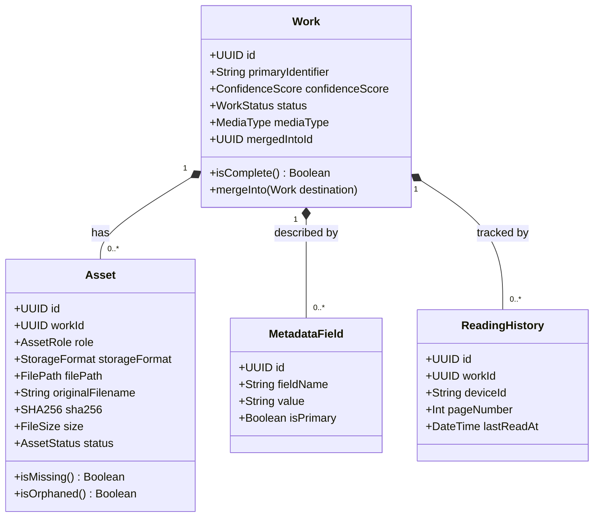
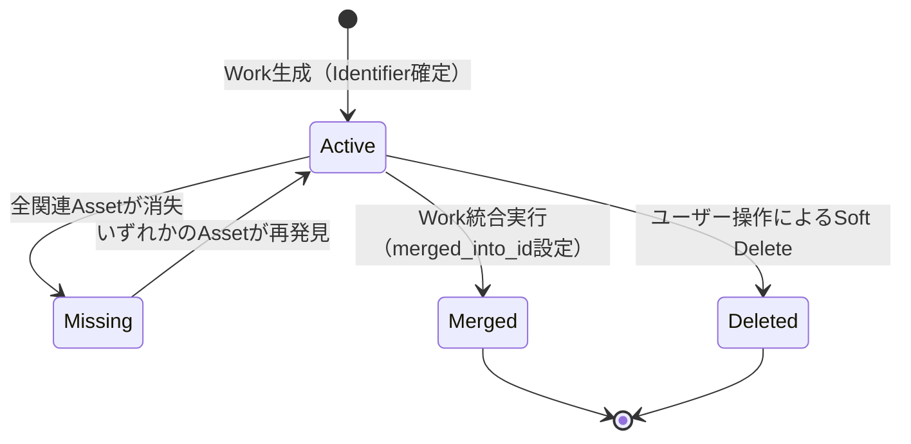
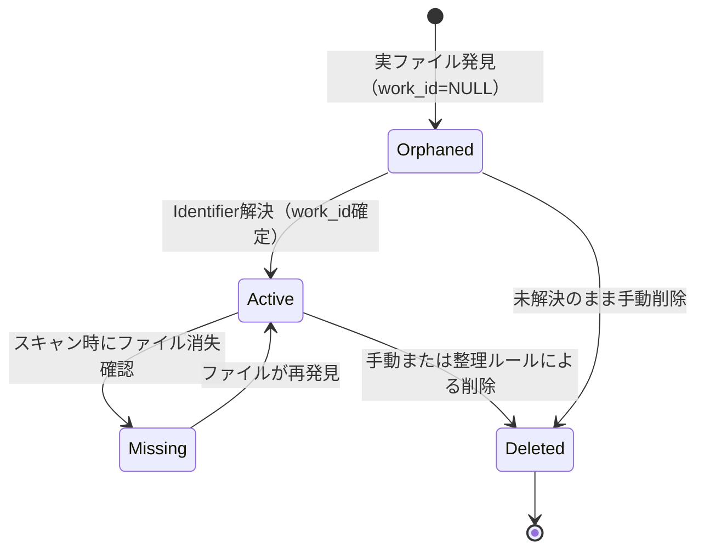

# WISE v2 Domain.md (v2.0)

> **本書はWork.md v1.0からDomain.md v2.0への更新である。**  
> 変更の主目的：AssetRole導入（FB①）、ReadingHistory独立モデル（FB②）、StorageFormat導入（FB③）、ICoverProvider Strategy（FB④）、MediaDisplayProfile（FB⑤）、Collection クロスメディア強化（FB⑥）、IMediaViewer DI（FB⑧）。

前提資料：**Architecture.md v2.0**、**Database.md v2.0**

---

# 1. 核心ドメイン概念とユビキタス言語

## 1.1 Work（作品）

**定義：** 概念上の「作品」そのものを表現するドメインの最上位境界（ルートエンティティ）。実体ファイル（Asset）の有無やメタデータの有無に関わらず、WISEの宇宙において独立してアイデンティティ（一意な識別子）を持つもの。

**責務：**
- 作品の「同一性」を保証する
- すべてのMetadata・Evidence・Job・EventLog・ReadingHistory・Collection所属を束ねる「重力の中心」
- MediaTypeを保持し、Strategy群（ICoverProvider/IMediaViewer等）の選択基準となる

**ドメインルール：**
- Metadataが一切存在しない状態でもWorkは成立し、存在し続ける
- 同一の `primary_identifier` を持つWorkはシステム内に同時に1つしか存在できない
- `media_type` はWork生成時に設定され、原則変更しない（誤紐付け防止）



## 1.2 Asset（物理ファイルのDB表現）

**定義：** ローカルまたはネットワーク上のストレージに存在する「実ファイル（PhysicalFile）」を、ドメイン内で管理可能にするドメインエンティティ。

**v2の変更点：** `AssetType` を廃止し `AssetRole` を導入。`ImageFolder` の概念を廃止し `StorageFormat` を導入。

**責務：**
- ファイルのパス・サイズ・ハッシュ値・メディア情報といった「物理的属性」のカプセル化
- WorkにおけるAssetの役割（Role）の表現
- ファイルの格納形式（StorageFormat）の表現

**ドメインルール：**
- 実ファイルが消失してもAssetオブジェクトは破棄されない（`missing` ステータス）
- AssetはWorkの「子」としてライフサイクルが始まるのではなく、「実ファイルの検出」とともに独立して生成される
- 生成時点ではWorkとの関連を持たない（`work_id = NULL`、Orphaned状態）

## 1.3 AssetRole（アセット役割）

AssetがWorkの中で担う「機能的役割」を表す値オブジェクト。

```csharp
public enum AssetRole
{
    Video,             // 本編動画
    Archive,           // ZIP/CBZ/RAR/CBR等のアーカイブファイル
    Image,             // 単体画像ファイル（コレクション等）
    CoverPortrait,     // 縦向きカバー画像
    CoverLandscape,    // 横向きカバー画像
    Thumbnail,         // サムネイル
    AnimatedThumbnail, // アニメーションサムネイル（AVIF/WebP）
    Sample,            // サンプル画像/動画
    Subtitle,          // 字幕ファイル（SRT/ASS）
    NFO,               // NFOファイル
    MetadataFile,      // ComicInfo.xml等のメタデータファイル
    Attachment,        // 添付ファイル（解説PDFなど）
    Preview            // プレビュー画像（表紙以外の見本）
}
```

**設計原則：**
- RoleはAssetの「何者か（type）」ではなく「何をするか（role）」を表す
- 同一の物理ファイルが複数のRoleを持つことは（通常）ない
- Roleは Identifier Resolver / Import処理が自動設定し、ユーザーが後から変更できる

## 1.4 StorageFormat（格納形式）

Assetがコンテンツをどのようにパッケージするかを表す値オブジェクト。役割（Role）と直交する概念。

```csharp
public enum StorageFormat
{
    SingleFile,  // 単一ファイル（MP4, MKV, MP3, EPUB等、Default）
    Archive,     // ZIP, CBZ, RAR, CBR
    Folder,      // 画像フォルダ（フォルダパスをAssetとして保持）
    Pdf,         // PDF
    Epub,        // EPUB（将来：SingleFileと分離が必要な場合）
}
```

**用途：**
- IArchiveReader実装の選択（ZipArchiveReader / FolderArchiveReader / PdfArchiveReader）
- ComicImport処理でのページリスト構築方法の決定
- GalleryでのAssetアイコン表示

## 1.5 ReadingHistory（読書進捗 — 独立エンティティ）

> **FB②の核心：ReaderPosition/ReaderStateはWorkエンティティに持たせない。**  
> 理由：デバイス複数対応・将来のクラウド同期・状態更新の頻度がWorkのライフサイクルと無関係なため。

**定義：** ユーザーの「どこまで読んだか」「どこまで見たか」という進捗情報を、WorkとDeviceの組み合わせで管理する独立エンティティ。

```csharp
public class ReadingHistory
{
    public Guid Id { get; }
    public Guid WorkId { get; }       // 対象Work
    public string DeviceId { get; }   // デバイス識別子（localStorage UUIDなど）
    public int PageNumber { get; }    // 現在ページ（動画は秒数をページ単位換算、または別フィールド）
    public float? PositionSeconds { get; }  // 動画のみ：再生位置（秒）
    public float? PositionPercent { get; }  // 進捗（0.0-1.0）
    public DateTime LastReadAt { get; }
    public DateTime CreatedAt { get; }
}
```

**ドメインルール：**
- 同一 `(work_id, device_id)` の組み合わせは1レコード（UPSERT）
- WorkエンティティはReadingHistoryを知らない（Work→ReadingHistoryは持たない）
- ReadingHistoryはWorkの削除時に連動してSoft Deleteする

**将来拡張：**
- クラウド同期時はDeviceIdをサーバー側で解決し、最後に更新されたデバイスの進捗を採用
- `last_read_at` のDeviceId横断最大値でWork一覧の「最終閲覧日」を算出

## 1.6 Collection（作品のグルーピング — クロスメディア対応）

**定義：** 複数のWorkを特定の文脈や目的において束ねるドメイン概念。v2でクロスメディア（Video/Comic/Book横断）対応を強化。

**CollectionType（v2更新）：**

```csharp
public enum CollectionType
{
    Favorite,     // お気に入り（全MediaType横断）
    Playlist,     // 手動プレイリスト（全MediaType横断）
    SmartFolder,  // 動的抽出（全MediaType横断）
    Series,       // シリーズ（Video/Comic共通）
    Maker,        // メーカー・出版社（Video/Comic共通）
    Author,       // 作者（Video女優/Comic作家を横断する人物単位）
    Circle,       // サークル（主にComic/Doujin、同人サークル）
    Person,       // 出演者・作家・監督など（役割横断の人物エンティティ）
}
```

> **Author/Circle/Personの違い：**
> - `Author`：作品を「書いた/描いた」人物（VideoのAVでは監督が近い）
> - `Circle`：同人活動の主体。Author複数人が所属することがある
> - `Person`：Video女優・Comic作家・監督などをMediaType横断で束ねる最上位の人物概念

**ドメインルール：**
- Collectionの生成・変更・削除は、所属するWork自体の状態に副作用を与えない
- CollectionとWorkはN:Mの関係（COLLECTION_WORK中間テーブル）
- SmartFolderはCOLLECTION_WORKに物理行を持たず、動的クエリで算出
- `Author` / `Circle` / `Person` CollectionはMetadataFieldの値（`actress`, `author`, `circle`）と連携して自動生成される

---

# 2. ドメインインターフェース

## 2.1 ICoverProvider

**設計思想：** ComicCoverExtractorのようなMediaType固有のクラスを直接呼び出すのではなく、ICoverProviderインターフェースを経由してCoverServiceがChain of Responsibilityで最適なProviderを選択する。

```csharp
public interface ICoverProvider
{
    IReadOnlyList<MediaType> SupportedMediaTypes { get; }
    int Priority { get; }
    Task<CoverResult?> GetCoverAsync(Work work, CancellationToken ct = default);
}

public record CoverResult(
    Stream ImageStream,
    string ContentType,
    CoverSource Source  // Metadata / Archive / Thumbnail / Placeholder
);
```

**実装クラス：**

| クラス | SupportedMediaTypes | Priority | 動作 |
|---|---|---|---|
| `MetadataCoverProvider` | All | 100 | MetadataField `CoverPortrait`/`CoverLandscape` URLをDL |
| `ArchiveCoverProvider` | Comic, PhotoBook | 80 | ZIP/CBZの1ページ目をIArchiveReader経由で取得 |
| `VideoThumbnailProvider` | Video | 60 | ffmpegで特定フレームを抽出 |
| `PdfCoverProvider` | Book, PhotoBook | 60 | PDFの表紙ページをレンダリング |
| `FolderCoverProvider` | ImageCollection | 40 | 画像フォルダの先頭ファイルを使用 |
| `DefaultCoverProvider` | All | 0 | プレースホルダー画像を返す |

**CoverService（Application層）：**

```csharp
public class CoverService
{
    // DIで全ICoverProvider実装を受け取り、Priority降順でChain of Responsibilityを構成
    public async Task<CoverResult> GetCoverAsync(Work work, CancellationToken ct)
    {
        foreach (var provider in _providers
            .Where(p => p.SupportedMediaTypes.Contains(work.MediaType))
            .OrderByDescending(p => p.Priority))
        {
            var result = await provider.GetCoverAsync(work, ct);
            if (result is not null) return result;
        }
        return _defaultProvider.GetCoverAsync(work, ct); // フォールバック
    }
}
```

## 2.2 IMediaViewer

**設計思想：** ViewerはMediaTypeに応じてDIで選択される。UI（Next.js）はAPIから `ViewerRoute` を受け取り、該当ルートへナビゲートする。UIはif/elseを持たない。

```csharp
public interface IMediaViewer
{
    IReadOnlyList<MediaType> SupportedMediaTypes { get; }
    ViewerCapabilities Capabilities { get; }
    string ViewerRoute { get; }
}

public record ViewerCapabilities(
    bool SupportsResume,          // 途中再開
    bool SupportsPageNavigation,  // ページめくり
    bool SupportsZoom,            // ズーム
    bool SupportsPlaybackSpeed,   // 再生速度変更
    bool SupportsBookmark,        // しおり
    bool SupportsDoublePage       // 見開き表示
);
```

**ViewerRouterService（Application層）：**

```csharp
public class ViewerRouterService
{
    public IMediaViewer GetViewer(MediaType mediaType)
        => _viewers.First(v => v.SupportedMediaTypes.Contains(mediaType));
}
```

## 2.3 IArchiveReader

```csharp
public interface IArchiveReader
{
    IReadOnlyList<StorageFormat> SupportedFormats { get; }
    Task<int> GetPageCountAsync(string path, CancellationToken ct = default);
    Task<Stream> GetPageStreamAsync(string path, int pageIndex, CancellationToken ct = default);
    Task<IReadOnlyList<ArchivePage>> GetPageListAsync(string path, CancellationToken ct = default);
}

public record ArchivePage(int Index, string Name, long SizeBytes);
```

## 2.4 MediaDisplayProfile

```csharp
public record MediaDisplayProfile
{
    public MediaType MediaType { get; init; }
    public CoverOrientation DefaultCoverOrientation { get; init; }
    public IReadOnlyList<DisplayField> GalleryFields { get; init; }
    public IReadOnlyList<DisplayField> DetailFields { get; init; }
    public string DefaultSort { get; init; }
    public bool IsUserCustomized { get; init; }  // デフォルト vs ユーザーカスタマイズ
}

public record DisplayField(
    string FieldName,
    string Label,       // 表示ラベル（日本語/英語）
    bool IsVisible,     // ON/OFF
    int Order           // 表示順
);
```

**デフォルトProfile定義（Infrastructure層で初期化）：**

```
Video:
  CoverOrientation: Landscape
  GalleryFields: [Title, Actress, Maker, Duration, ReleaseDate]
  DetailFields:  [Title, Actress, Director, Maker, Label, Genre, ReleaseDate, Description]
  DefaultSort: created_at DESC

Comic:
  CoverOrientation: Portrait
  GalleryFields: [Title, Circle, Author, PageCount, ReleaseDate]
  DetailFields:  [Title, Circle, Author, Genre, PageCount, Language, ReleaseDate, Description]
  DefaultSort: created_at DESC

Book:
  CoverOrientation: Portrait
  GalleryFields: [Title, Author, Publisher, PageCount]
  DetailFields:  [Title, Author, Publisher, ISBN, PageCount, Language, Description]
  DefaultSort: created_at DESC
```

---

# 3. ドメインモデルの不変条件（Invariants）

## 3.1 Workの不変条件

1. **識別子の排他性：** `primary_identifier` は空であってはならず、システム内で一意
2. **Confidenceスコアの範囲：** `confidence_score` は 0 以上 100 以下の整数
3. **MediaTypeの固定：** Work生成後の `media_type` 変更は原則不可（誤紐付け防止）
4. **Merge時の一方向性：** `status = 'merged'` のWorkはさらに別Workを統合できない

## 3.2 Assetの不変条件

1. **物理属性の不変性：** SHA256・ファイルサイズは確定後不変（ファイル自体が変更されない限り）
2. **original_filename の保持：** `missing` 状態でも `original_filename` は必ず保持
3. **RoleとStorageFormatの整合性：** `role = Archive` のAssetは `storageFormat ∈ {Archive, Folder, Pdf, Epub}` でなければならない
4. **CoverPortrait/CoverLandscapeのファイルタイプ：** `role ∈ {CoverPortrait, CoverLandscape}` のAssetは画像ファイルでなければならない

## 3.3 ReadingHistoryの不変条件

1. **(work_id, device_id) ペアの一意性：** 同一ペアは1レコードのみ（UPSERTで更新）
2. **PageNumberの範囲：** 0 以上、対象Workの総ページ数以下
3. **PositionSecondsの範囲：** Video系のみ有効、0.0以上、Asset.duration_sec以下

## 3.4 Collectionの不変条件

1. **SmartFolderの排他性：** `type = SmartFolder` かつ `rule_definition != null`、かつCOLLECTION_WORKに物理行なし
2. **静的Collectionの排他性：** 上記以外の `type` は `rule_definition = null`
3. **CircleはComicとの関連性：** `type = Circle` のCollectionは、所属Workが `mediaType = Comic` である前提（強制はしないが推奨）

---

# 4. ライフサイクルと状態遷移

## 4.1 Workのライフサイクル



**ドメインイベント：**
- `WorkCreated` — Work生成時
- `WorkMissing` — 全Asset消失時
- `WorkMerged` — 統合時
- `WorkDeleted` — Soft Delete時

## 4.2 Assetのライフサイクル



**ドメインイベント：**
- `AssetDetected` — Orphaned生成時
- `AssetAssociated` — Workへの紐付け完了時
- `AssetMissing` — ファイル消失確認時
- `AssetRoleAssigned` — Role確定時（ImportまたはManual設定）

## 4.3 ReadingHistoryのライフサイクル

ReadingHistoryはWorkに紐付くが、独立したライフサイクルを持つ。

- **生成：** ユーザーがビューワーを開き、進捗を更新した時点で自動生成（UPSERT）
- **更新：** ビューワーがページ/時間を記録するたびに更新（高頻度だがWorkには波及しない）
- **削除：** Workが削除された時点で連動Soft Delete（ユーザーが進捗をリセットする操作も可）

---

# 5. MediaType別のドメインルール

## 5.1 Video

- `primary_identifier` 例：`FANZA-ABP-123`, `FC2-PPV-456789`
- 主要Asset Role：`Video`（本編）, `Sample`（サンプル）, `Subtitle`（字幕）, `CoverPortrait`/`CoverLandscape`
- StorageFormat：`SingleFile`
- ReadingHistory：`PositionSeconds` を使用（ページではなく秒）
- ICoverProvider順：`MetadataCoverProvider` → `VideoThumbnailProvider` → `DefaultCoverProvider`

## 5.2 Comic / Doujin

- `primary_identifier` 例：`DLSite-RJ123456`, `circle-title-sha256[:8]`
- 主要Asset Role：`Archive` / または複数 `Image`（フォルダ形式）, `CoverPortrait`, `MetadataFile`（ComicInfo.xml）
- StorageFormat：`Archive`, `Folder`, `Pdf`
- ReadingHistory：`PageNumber` を使用
- ICoverProvider順：`MetadataCoverProvider` → `ArchiveCoverProvider` → `DefaultCoverProvider`
- IArchiveReader：ZipArchiveReader / FolderArchiveReader / PdfArchiveReader
- コミック固有MetadataField例：`PageCount`, `Circle`, `Author`, `Language`, `Series`, `Volume`, `Chapter`, `Tags`

## 5.3 Book（EPUB/PDF）

- `primary_identifier` 例：`ISBN-978-4-...`, `publisher-title-hash`
- 主要Asset Role：`Archive`（EPUB/PDF本体）, `CoverPortrait`
- StorageFormat：`Epub`, `Pdf`
- ReadingHistory：`PageNumber`（PDF）または `CfiPosition`（EPUB将来）
- ICoverProvider順：`MetadataCoverProvider` → `PdfCoverProvider` / EPUB表紙 → `DefaultCoverProvider`

---

# 6. 設計上の検討・懸念点

## 6.1 Asset主導のWork生成における不変条件の保護

- **懸念：** Orphaned Assetがシステムに溢れる可能性
- **解決策：** Orphaned状態のAssetは「Inbox（整理待ち）」として定義し、Galleryのメインストリームから除外。「未解決アセット一覧」UIでユーザーが手動整理可能

## 6.2 ReadingHistoryの高頻度更新とDBロック

- **懸念：** ビューワーが読書中に1秒ごとにReadingHistoryを更新するとSQLiteがロックされる
- **解決策：** フロントエンド側でdebounce（5秒間隔）し、ページ移動時・ウィンドウクローズ時のみDB更新。アプリ内はlocalStorageでリアルタイム保持

## 6.3 Author/Circle/Person Collectionの自動生成

- **懸念：** MetadataFieldの `actress` / `circle` の値からCollectionを自動生成する際、同一人物の表記揺れ（「あ」と「ア」）でCollectionが分裂する
- **解決策：** 正規化（全角→半角、ひらがな→カタカナ）をCollection生成時に適用。将来的にPersonのエイリアス管理テーブルで統合

## 6.4 StorageFormatがFolderの場合のAsset表現

- **懸念：** 100枚の画像が入るフォルダをどうAssetとして持つか（100 Assetか、1 Assetか）
- **解決策：** フォルダパス自体を `role=Archive, storageFormat=Folder` の1つのAssetとして持つ。個別の画像ファイルはAsset化しない（IArchiveReaderが動的にリスト化）

---

*WISE v2 Domain.md v2.0 — 2026-06-30*
