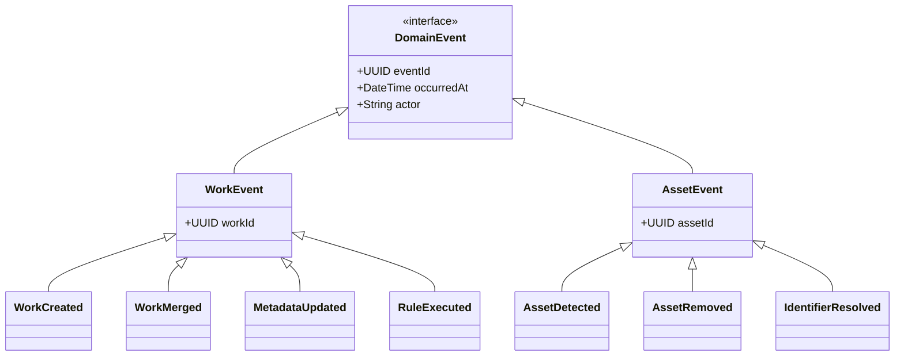
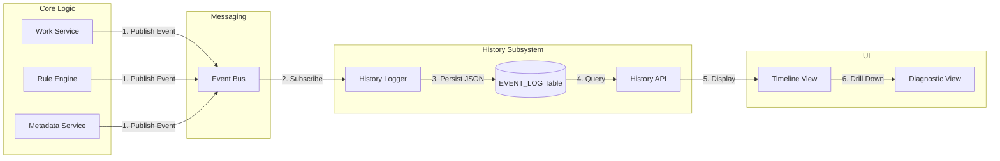
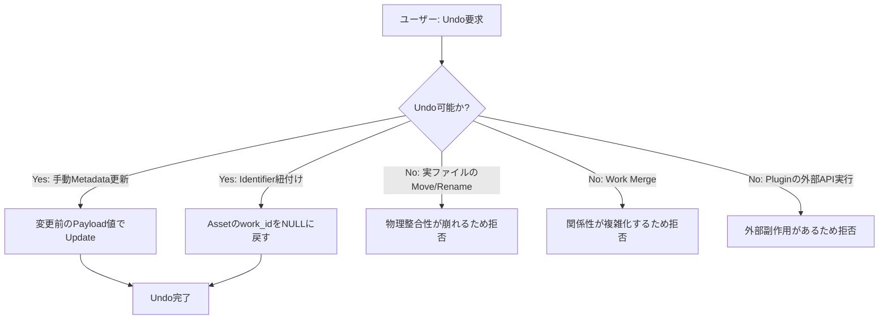

# WISE v2 History.md (v1.0)

## 0. 本書の位置づけ

本書は、メディアライブラリ管理アプリケーション「WISE v2」における **「履歴（History）および監査性（Auditability）」** を司る仕組みの設計書である。

前提資料として **Architecture.md v1.1**、**Database.md v1.0**、**Work.md v1.0**、**Metadata.md v1.0**、**Identifier.md v1.0**、**Pipeline.md v1.0**、**RuleEngine.md v1.0**、**Plugin.md v1.0** を参照し、これらと完全に整合する設計を行う。

WISEにおけるHistoryは単なるデバッグログではなく、「システム内で発生したすべての意味ある状態変化」を記録し、ユーザーに対して「いつ・なぜ・誰が・何を変えたか」を説明可能にするための中核的なドメイン機能である。

---

## 1. Historyとは

### 責務と存在理由
Historyの責務は、システム上で発生した **「ドメインイベント（Domain Event）」を永続化し、時系列で可視化すること** である。
これにより、ユーザーは「なぜこのファイルがここに移動したのか」「いつこのメタデータが上書きされたのか」といった疑問を自己解決できるようになる。

### 各概念との違い
| 概念 | 違いと関係性 |
|---|---|
| **通常のログ** | 開発者向けのデバッグ情報（システムエラー、SQL実行ログ等）。Historyには含めない。 |
| **監査ログ** | セキュリティやコンプライアンスのための記録。Historyは監査ログの性質も持つが、WISEでは主に「ユーザーへの説明とUX向上」を目的とする。 |
| **Diagnostic (診断)** | IdentifierやRuleEngineが「なぜその判定を下したか」の詳細な理由。HistoryはそのDiagnosticの「発生事実（いつ・何が起きたか）」を時系列で結びつける入り口となる。 |
| **Event** | システム内でやり取りされるメッセージそのもの。Historyは、このEventを記録・表示するための機能全体を指す。 |

---

## 2. Eventモデル

WISE内で発行され、Historyとして記録される主要なドメインイベントを定義する。

### Mermaid Event関連図

### 主要なイベント一覧
- `WorkCreated`: 新しいWorkが生成された。
- `WorkMerged`: Work同士が統合された。
- `AssetDetected`: 新しい物理ファイルが発見された。
- `AssetRemoved`: 物理ファイルが消失（削除）された。
- `MetadataUpdated`: メタデータが取得・手動更新された。
- `IdentifierResolved`: Identifierによる判定（紐付け）が完了した。
- `RuleExecuted`: ルールエンジンによるアクション（移動・リネーム等）が実行された。
- `PluginExecuted`: プラグインによるカスタム処理が実行された。
- `JobCompleted` / `JobFailed`: 重い非同期Jobの完了または致命的な失敗。

---

## 3. Event構造

EventはDB（`EVENT_LOG` テーブル）に格納される際、以下の構造を持つ。

| フィールド | 型 | 役割 | 例 |
|---|---|---|---|
| `EventId` | UUID | イベントの一意なID | `123e4567-e89b-...` |
| `OccurredAt` | DateTime | 発生日時 | `2026-06-26 21:00:00` |
| `Actor` | String | イベントを引き起こした主体 | `System`, `User`, `FanzaProvider`, `RuleEngine` |
| `EventType` | String | イベントの種類 | `MetadataUpdated` |
| `Source` | String | イベントの発信元コンポーネント | `MetadataService` |
| `TargetId` | UUID | 影響を受けた主エンティティ（Work等） | `WorkId: 9876...` |
| `CorrelationId` | UUID | 一連の処理を紐づけるID | `JobId: 5432...` |
| `Payload` | JSON | 変更前後の値など、詳細なコンテキスト | `{"field": "Title", "old": "A", "new": "B"}` |

※ `CorrelationId` により、「あるJobがトリガーとなって発生した一連のEvent」をグループ化して追跡できる。

---

## 4. History Pipeline

イベントが発生してからUIの履歴（タイムライン）に表示されるまでの流れ。

### Mermaid History Pipeline

---

## 5. Undo / Redo (操作の取り消し)

Historyが存在することで、一部の操作に対する「元に戻す（Undo）」機能の提供が可能になるが、WISEでは制約を設ける。

### Mermaid Undo Flow

### Undoのポリシー
- **戻せるもの (Soft State):** 
  - `MetadataUpdated` (手動編集による上書きを元に戻す)
  - `IdentifierResolved` (誤ったWorkへの紐付けを解除する)
  - `TagAdded` / `CollectionAdded` (論理的な関連の解除)
- **戻せないもの (Hard State / Side Effects):**
  - **実ファイルの移動・リネーム:** ファイルシステムの状態は外部要因で変化しやすいため、DBの履歴だけでUndoしようとするとファイル消失事故の元になる。
  - **Work Merge:** 一度統合されたWorkの分離は、その後のメタデータやイベントの帰属を正しく分割できないため不可とする。
  - **外部連携:** Pluginを通じた外部APIへのPOST操作など。

---

## 6. Diagnosticとの関係

Historyは、システム全体を俯瞰する「タイムライン」であり、各処理の詳細な「診断（Diagnostic）」への入り口として機能する。

### Mermaid Timeline

```mermaid
gantt
    title Work Timeline (History View)
    dateFormat HH:mm
    axisFormat %H:%M

    section Event Log
    AssetDetected (Actor: Scanner)       :done, 10:00, 1m
    IdentifierResolved (Actor: Resolver) :done, 10:01, 1m
    WorkCreated (Actor: System)          :done, 10:01, 1m
    MetadataUpdated (Actor: Fanza Prov.) :done, 10:02, 1m
    RuleExecuted (Actor: Rule Engine)    :done, 10:03, 1m
    MetadataUpdated (Actor: User)        :active, 10:05, 1m
```

ユーザーがタイムライン上の `RuleExecuted` イベントをクリックすると、RuleEngineの `RULE_EXECUTION` テーブルにアクセスし、「どの条件に合致して、どうファイルがリネームされたか」という **Diagnostic詳細** が表示される。
同様に `IdentifierResolved` をクリックすれば、Evidenceのスコア積み上げ詳細が表示される。

---

## 7. 将来拡張

History（Event Log）の構造が整っていることで、以下の高度な機能拡張が可能になる。

1. **Event Replay (イベントの再実行):** 
   - 過去のイベントを再評価し、「もしルール設定が最初からこうだったらどうなっていたか」をシミュレーションする。
2. **Cloud Sync (クラウド同期):** 
   - 発生したEvent Logのシーケンス（差分）をクラウドへ送信し、別デバイスのWISEでそれを再生することで、データの完全な同期を実現する。
3. **Analytics (分析・ダッシュボード):** 
   - 「今月一番追加されたメーカー」「メタデータ取得成功率の推移」など、Payloadに蓄積されたデータを元にした統計分析を提供する。

---

## 8. 採用しなかった設計

| 不採用の設計案 | メリット | デメリット | 不採用理由 |
|---|---|---|---|
| **通常のテキストログのみ** | 実装が最も簡単。ファイル出力だけで済む。 | ログのパースが難しく、UI（画面）に時系列として表示・絞り込みできない。 | ユーザーへ説明可能（Diagnostic）であるという要件を満たせないため却下。 |
| **完全なEvent Sourcing（DB状態をEventから都度計算する）** | テーブル構造が不要になり、究極のUndo/Redoが可能。 | クエリ（検索）のパフォーマンスが絶望的になる。実装の複雑度が跳ね上がる。 | 高速な検索（Gallery）が最優先要件であるため、RDBへの状態保存を基本とし、イベントは「記録」として扱う設計（CQRSの簡易版）を採用。 |
| **各テーブルに `history_json` カラムを持たせる** | テーブル単位での履歴確認が容易。 | 複数のテーブルをまたぐイベント（RuleがAssetとMetadataを同時に変えた等）の追跡ができない。 | システム横断的なタイムラインを描画するため、中央集権型の `EVENT_LOG` テーブル方式を採用。 |

---

## 9. 設計の弱点とフィードバック

### この設計の弱点
- **データ量の肥大化:** すべてのドメインイベントをJSON（Payload）付きで永続化するため、長期間運用すると `EVENT_LOG` テーブルのデータ量が爆発的に増加する。
  - *対策:* 古いイベント（例: 1年前のもの）を自動的にSQLiteの別ファイルにアーカイブする、または重要なイベント（WorkCreated等）以外は自動パージする等のライフサイクル管理が必要。
- **Undoの不完全性へのユーザー不満:** 実ファイルの操作やMergeのUndoが提供されないため、ユーザーが「間違えた操作を戻せない」ことに不満を持つ可能性がある。
  - *対策:* 破壊的な操作（MoveやMerge）の前に、UI側で十分な確認ダイアログ（Preview）を提示し、Undoへの依存を減らす設計が必須。

### Architecture へのフィードバック
- **HistoryからEvent Logへの定義変更:** Architecture.md では「History」という機能名で呼ばれているが、その実体は「Event Log Service」であることをより明確にアーキテクチャ図に反映すべきである。

### Database へのフィードバック
- **CorrelationIdの追加:** Database.md の `EVENT_LOG` テーブル定義に、本ドキュメントで定義した `correlation_id`（一連の処理を紐づけるUUID）のカラム追記が必要。

### Pipeline / RuleEngine へのフィードバック
- **ActorとCorrelationIdの引き継ぎ:** Pipeline上の非同期Jobや、RuleEngineの非同期処理において、元のイベントの「誰が（Actor）」と「連鎖元ID（CorrelationId）」をコンテキストとして引き回す実装ルールを徹底しなければ、Historyの追跡性が失われる。

### Plugin へのフィードバック
- **PluginイベントのPayload標準化:** Pluginが独自に発行するカスタムイベントも `EVENT_LOG` に記録されるため、Payload内に含むべき最小限のメタデータスキーマ（何を・どう変えたか）をSDKの規約として定義する必要がある。

---

*WISE v2 History.md v1.0 — 設計完了*
