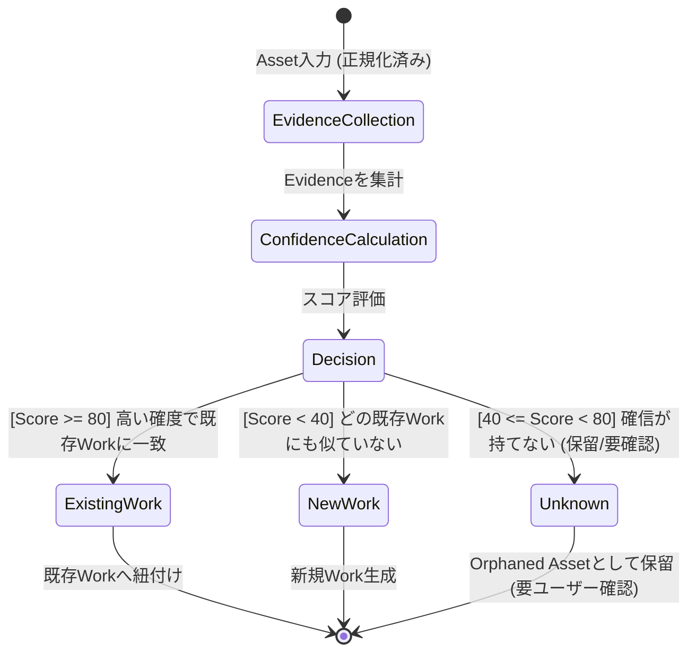
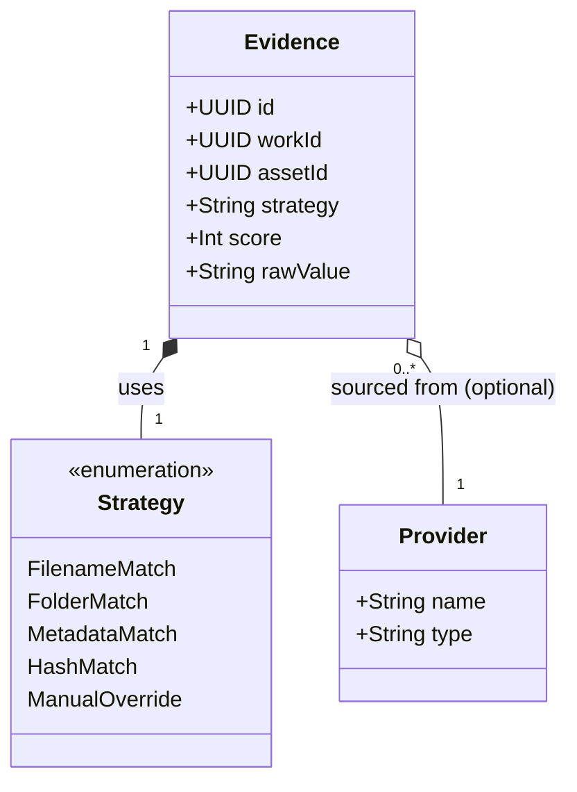
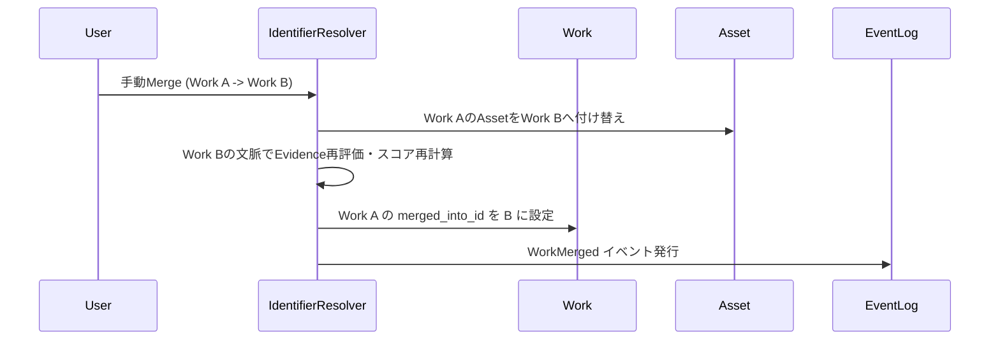

# WISE v2 Identifier.md (v1.0)

## 0. 本書の位置づけ

本書は、メディアライブラリ管理アプリケーション「WISE v2」において、最も重要なドメインロジックの一つである **「作品同一性判定（Identifier Resolution）」** の仕組みを定義する設計書である。

前提資料として **Architecture.md v1.1**、**Database.md v1.0**、**Work.md v1.0**、**Metadata.md v1.0** を参照し、これらの既存設計と矛盾しない形で、単なる文字列一致ではない、証拠（Evidence）の積み上げによる高度な推論モデルを設計する。

アルゴリズムの詳細ではなく、「ドメインモデルとしてどのように判定を表現し、永続化し、説明可能にするか」に主眼を置く。

---

## 1. Identifierとは

### 役割と責務
Identifierとは **「このAsset（実ファイル）は、どのWork（作品）に属するか」を決定する仕組みおよびドメインロジック** である。
WISEにおけるWorkの「同一性」は、ファイルパスや単一の文字列（ファイル名）ではなく、Identifier Resolverが算出した結果によってのみ保証される。

### 各概念との違いと関係性
| 概念 | 違いと関係性 |
|---|---|
| **Work** | Identifier Resolverの出力先（結果）。Resolverの判定によって既存Workに紐づくか、新規Workが生成される。 |
| **Metadata** | 作品の「付帯情報」。Metadataが存在しなくてもIdentifierは機能する（ファイル名等のEvidenceから判定可能）。また、Metadata自体が強力なEvidenceとしてIdentifierの判定材料になり得る。 |
| **Evidence** | Identifierが判定を下すための「根拠・証拠」。Identifier Resolverは複数のEvidenceを収集・評価して結論を出す。 |

---

## 2. Normalizer

Identifier Resolverが正しく機能するためには、入力データのノイズを取り除く前処理が不可欠である。この役割を担うのが **Normalizer** である。

### 正規化のルールと対象
Assetの `original_filename` やフォルダ名から、識別に関係のない文字列を除去し、表記を統一する。

- **不要文字列の除去 (Remove):**
  - 解像度・品質タグ: `4K`, `FHD`, `1080p`, `高画質`
  - 配布サイト・宣伝タグ: `hhd800`, `【セール中】`, `sample`, `copy`
  - 連番・複製タグ: `(1)`, `コピー`
- **表記ゆれの統一 (Replace):**
  - 全角・半角の統一（英数字は半角、スペースは正規化）
  - ハイフン・アンダースコアの統一（例: `ABC_123` $\rightarrow$ `ABC-123`）
  - FC2の表記ゆれ吸収（例: `FC2-12345` / `FC2PPV-12345` $\rightarrow$ `FC2-PPV-12345`）

### ドメインモデルとしてのNormalizer
Normalizerは静的なコードではなく、`NORMALIZER_RULE` テーブルで管理されるルールエンジンとして振る舞う。これにより、新たなノイズパターンが登場しても、システムを再デプロイすることなくルールを追加できる。

---

## 3. Identifier Resolver

Identifier Resolverの責務は、正規化されたAsset情報と収集したEvidenceを元に、最終的な「判定」を下すことである。

### 判定基準（Identifier判定図）



- **Existing Work:** 十分な確信度（Confidence）を持って既存の作品と同一であると判定された場合。
- **New Work:** どの既存作品とも一致しないと判定され、かつ単独の作品として成立する十分な情報（品番など）がある場合。
- **Unknown (保留):** 一致する可能性があるが確信が持てない、または情報が少なすぎて新規Workとして独立させるべきか判断できない場合。

---

## 4. Evidence (証拠)

Identifier Resolverは、単純な文字列比較ではなく、様々な情報源から得た「証拠（Evidence）」を積み重ねて推論を行う。

### Evidence関係図



### Evidenceの種類 (Strategy)
- **Filename / Folder:** 正規化されたファイル名やフォルダ名から品番を抽出する。
- **Metadata:** 同一フォルダに存在する `Local NFO` ファイルや、既に他Providerから取得済みのMetadata内容との照合。
- **Hash:** ファイルのSHA256ハッシュが既知のデータベース（ローカルまたはクラウド）と一致するか。
- **Manual (Override):** ユーザーが手動で「これはこの作品である」と指定した絶対的な証拠。

---

## 5. Confidence (確信度)

Identifierは固定の点数配分ではなく、Evidenceの積み上げによる「スコアリングモデル」を採用する。

### Confidence算出フロー

```mermaid
flowchart TD
    E1[Evidence: Filename Match<br>+50]
    E2[Evidence: Folder Match<br>+20]
    E3[Evidence: Provider Metadata<br>+20]
    E4[Evidence: SHA256 Hash<br>+100]
    E5[Evidence: Manual Override<br>+999]

    Sum[スコア合算]
    
    E1 --> Sum
    E2 --> Sum
    E3 --> Sum
    E4 --> Sum
    E5 --> Sum

    Sum --> Eval{スコア評価}
    
    Eval -->|Score >= 999| Manual[絶対一致 (手動)]
    Eval -->|Score >= 100| Absolute[絶対一致 (Hash等)]
    Eval -->|Score >= 80| High[高確度 (既存Workへ)]
    Eval -->|40 <= Score < 80| Medium[中確度 (Unknown/要確認)]
    Eval -->|Score < 40| Low[低確度 (New Workへ)]
```

### 算出モデルの拡張性
- 各Evidenceには動的な `Weight (重み)` を設定できるようにし、将来的にAIを用いた判定（例：「画像の特徴点一致」は+30点）を容易に組み込めるようにする。
- **Manual Override:** ユーザーの手動判定はスコア「999」のような特殊値（絶対優先）として扱い、システム推論を強制的に上書きする。

---

## 6. Diagnostic (診断と説明可能性)

Identifierはブラックボックスであってはならない。ユーザーが「なぜこのファイルがこの作品に紐づいたのか（または紐づかなかったのか）」を理解し、修正できる画面（Diagnostic View）を提供する。

### Diagnostic 画面の設計要素
1. **判定結果と総スコア:** `Total Confidence Score: 90 / Existing Work (ABP-123)`
2. **Evidence一覧 (採用理由):**
   - `[+50] FilenameMatch:` ファイル名 'ABP-123.mp4' から正規化品番を抽出
   - `[+40] MetadataMatch:` 同一フォルダの NFO ファイルにタイトル記載あり
3. **除外理由 / 減点要素:**
   - `[-10] SizeMismatch:` 過去に登録された同一作品とファイルサイズが著しく異なる
4. **アクション (Retry / Override):**
   - 誤判定の場合、ユーザーが手動で別Workを指定する（Manual Override）。
   - Normalizerルールを追加した上で、判定を再実行する（Retry）。

---

## 7. Mergeとの関係

Identifierの再評価や、WorkのMerge（統合）は密接に関わっている。



- **再評価 (Re-evaluation):** 新しいEvidence（例：後から追加されたLocal NFO）が発見された場合、Identifierは既存Assetのスコアを再計算し、閾値を超えれば自動的にWorkを紐付け直す（またはMergeを提案する）。

---

## 8. 将来拡張

Identifierの証拠積み上げモデルは、将来的な技術拡張に対して極めて柔軟である。

1. **OCR / 画像認識:** パッケージ画像や動画のタイトルロゴをOCR解析し、「画像内のテキスト」を新たなEvidenceとして追加する。
2. **音声解析:** 動画内の音声パターンや特定のキーワードを抽出し、証拠とする。
3. **AI推論:** ルールベースではなく、Embedding（ベクトル化）を用いた類似度計算を行い、Confidenceスコアの算出ロジックを機械学習ベースに置き換える。
4. **クラウド照合 / ローカル辞書:** ユーザー間でHashと品番の対応表を共有するクラウドサービスへの照会、またはユーザー自身が鍛えたローカル辞書との照合。

---

## 9. 採用しなかった設計

| 不採用の設計案 | メリット | デメリット | 不採用理由 |
|---|---|---|---|
| **正規表現・文字列一致のみ** | 実装が非常に簡単。高速。 | 「FC2-123」と「FC2PPV-123」の違いなど、少しの表記ゆれで別作品として扱われる。誤判定時の追跡が不可能。 | 推論の柔軟性がなく、ユーザーへの説明可能性（Diagnostic）が担保できないため却下。 |
| **ハッシュ一致のみ** | 誤判定が理論上ゼロ（絶対一致）。 | ファイルサイズが1バイトでも違う（再エンコード等）と別作品になる。同人誌や自炊ファイルには無力。 | ライブラリ管理としての網羅性が極端に下がるため却下。Evidenceの一つとしてのみ採用。 |
| **AI推論のみ (完全ブラックボックス)** | 複雑なルールを書かなくても賢く判定できる。 | 判定理由をユーザーに説明できない。ユーザーがルールを微調整（Normalizer追加など）することができない。 | Diagnosticの要件（説明可能性）を満たせず、誤判定時のユーザーフラストレーションが高まるため却下。 |

---

## 10. 設計の弱点とフィードバック

### この設計の弱点
- **スコア閾値のチューニング:** 確度を判断する「80点」「40点」などの閾値や、各Evidenceの加点ルールが初期状態ではヒューリスティック（経験則）になりやすく、運用しながらのチューニングが必須になる。
- **再評価の計算コスト:** フォルダ内に数万ファイルがある状態で、新しいNormalizerルールを追加した際の「全AssetのIdentifier再評価」は非常に計算コストが高い。Job Queueを活用した非同期バッチ処理が必須となる。

### Architecture へのフィードバック
- **IdentifierとNormalizerの分離明記:** Architecture.md 4.2節および4.3節において、NormalizerとIdentifierは別コンポーネントとして描かれているが、本設計により「Normalizerはルールエンジンであり、Identifierは証拠積み上げエンジンである」という責務の違いがより鮮明になった。これをArchitecture側でも強調すべき。

### Database へのフィードバック
- **Evidenceの永続化コスト:** すべての判定理由を `EVIDENCE` テーブルに永続化すると、ファイル数に比例して膨大なレコード（1ファイルあたり数レコード）が生成される。DBパフォーマンス（特にSQLite）を考慮し、閾値未満（棄却された）Evidenceの定期パージや、JSONへの圧縮保存を検討する余地がある。

### Work へのフィードバック
- **Unknown状態のドメイン表現:** Work.mdにおいて Assetの `Orphaned`（未解決）状態が定義されているが、Identifierの判定結果である `Unknown`（保留）はこれと同義である。「紐付けるべきWorkが未定」という状態を、ドメインモデルとしてより強固に扱う（Inbox機能への直結など）必要がある。

### Metadata へのフィードバック
- **MetadataはEvidenceである:** Metadata.mdでは「作品を説明する情報」と定義されているが、Identifierの視点からは「Metadataそのものが、同一性を証明するための強力なEvidenceになり得る」という双方向の関係がある。この連携を相互に認識しておく必要がある。

---

*WISE v2 Identifier.md v1.0 — 設計完了*
