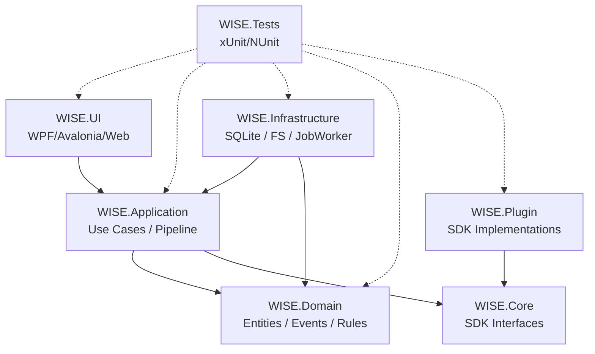

# WISE v2 ImplementationPlan.md (v1.0)

## 0. 本書の位置づけ

本書は、メディアライブラリ管理アプリケーション「WISE v2」の全設計書（Architecture, Database, Work, Metadata, Identifier, Pipeline, RuleEngine, Plugin, History, Roadmap）を基に、**「どう実装するか」をLLM（大規模言語モデル）エージェント達に指示するための具体的な実装計画書** である。

画面（UI）からの実装を固く禁じ、**Domain層から外側へ向かって実装（Inside-Out）** する方針を徹底する。コードは一切含まれないが、AIエージェントが次にどのクラスを作成し、どのテストを書くべきかを判断できる解像度で記述されている。

---

## 1. Solution構成

.NET (C#) 等を想定したクリーンアーキテクチャベースのソリューション構成。



- **WISE.Domain:** 依存を一切持たない純粋なドメインモデル（Work, Asset, Event等）。テストが最もしやすい。
- **WISE.Core (SDK):** PluginとAppが共有するインターフェース（`IPlugin`, `IMetadataProvider`等）。OCPを実現するため分離。
- **WISE.Application:** UseCase、Pipelineのオーケストレーション、EventBusの定義。
- **WISE.Infrastructure:** データベースへのアクセス（Entity Framework等）、ファイルシステムI/O、Jobの実働部。
- **WISE.UI:** 最終的に接続される画面。MVP達成まではCLIまたはテストコードのみで駆動させる。
- **WISE.Plugin:** 外部プロバイダーなどの実装。
- **WISE.Tests:** すべてのレイヤーに対するテストコード。

---

## 2. & 3. Sprint計画と詳細クラス設計

各Sprintは、LLMエージェントが自律的にタスクを消化できる粒度に分割されている。

### Sprint 0: 基盤構築 (Foundation)
- **目的:** 開発環境、DI、ログ、Repositoryパターンの基盤を固める。
- **実装内容:** ソリューションの作成、プロジェクト参照の設定、DIコンテナのセットアップ。
- **詳細:**
  - *Interfaces:* `IRepository<T>`, `IUnitOfWork`, `ILogger`, `IEventBus`
  - *Classes:* `ServiceCollectionExtensions` (DI登録)
- **完了条件 (DoD):** 空のプロジェクトがビルドでき、DIからロガーが取得できること。
- **次への依存:** Sprint 1のDB実装の前提となる。

### Sprint 1: データベース (Database)
- **目的:** Database.md に基づくテーブル構造のコード化。
- **実装内容:** Entityクラスの実装と、ORM（EF Core等）のDbContext・Migration作成。
- **詳細:**
  - *Entities:* `WorkEntity`, `AssetEntity`, `MetadataFieldEntity`, `EventLogEntity`
  - *Repository:* `WorkRepository`, `EventLogRepository`
  - *Classes:* `WiseDbContext`
  - *Tests:* インメモリDBを用いたRepositoryのCRUDテスト。
- **完了条件:** Migrationが通り、SQLiteファイル上に正しくテーブルが生成されること。

### Sprint 2: ドメインモデル (Domain - Work & Asset)
- **目的:** Work.md に基づくビジネスルールの実装。
- **実装内容:** Identifierを持たない状態のWork、Assetの生成と不変条件のバリデーション。
- **詳細:**
  - *Entities (Domain):* `Work`, `Asset` (DB Entityとは別のドメインオブジェクト、または兼任)
  - *Services:* `WorkFactory`, `AssetDetectiveService` (ファイル発見ロジック)
  - *Tests:* `Work` クラスが不正な識別子を受け付けないことのUnitテスト。
- **完了条件:** 物理ファイルを渡し、DBにAssetとして登録されるところまでが動くこと。

### Sprint 3: パイプラインとイベント (Pipeline & Event)
- **目的:** Pipeline.md / History.md に基づく非同期基盤。
- **実装内容:** EventBusのインメモリ実装と、JobQueueのDBベース実装。
- **詳細:**
  - *Interfaces:* `IJobScheduler`, `IJobWorker`, `IEventSubscriber`
  - *Classes:* `EventBus`, `JobWorkerBackgroundService`, `HistoryLogger` (イベント購読者)
  - *Tests:* Eventを発行し、別クラスで購読・DB記録されることのIntegrationテスト。
- **完了条件:** `AssetDetected` イベントを発行すると、JobQueueにタスクが入り、非同期で処理されること。

### Sprint 4: 識別と正規化 (Identifier)
- **目的:** Identifier.md に基づく作品同定アルゴリズム。
- **実装内容:** Normalizerによるノイズ除去と、Evidence積み上げによるスコア計算。
- **詳細:**
  - *Interfaces:* `INormalizerRule`, `IEvidenceStrategy`
  - *Services:* `IdentifierResolver`, `ConfidenceCalculator`
  - *Classes:* `FilenameStrategy`, `FolderStrategy`
  - *Tests:* 「FC2-PPV-12345【セール】.mp4」を渡し、「FC2-12345」として高スコア判定されるUnitテスト（最重要）。
- **完了条件:** テストデータに対して正しいWork IDが（新規または既存として）返却されること。

### Sprint 5: メタデータ (Metadata)
- **目的:** Metadata.md に基づく情報取得と競合解決。
- **実装内容:** 競合解決ロジック（Conflict Resolution）と、FANZA等の単一Provider実装。
- **詳細:**
  - *Interfaces:* `IMetadataProvider`
  - *Services:* `MetadataEnrichmentService`, `ConflictResolver`
  - *Classes:* `FanzaProvider`
  - *Tests:* 複数Providerから異なるデータが来た際に、Priority高いものが `is_primary=true` になるテスト。
- **完了条件:** Identifierで特定されたWorkに対し、Webからメタデータを取得しDBに保存できること。

### Sprint 6: ルールエンジンと自動化 (RuleEngine)
- **目的:** RuleEngine.md に基づく自動整理。
- **実装内容:** Conditionの評価木（Expression Tree）と、Actionの実装。
- **詳細:**
  - *Interfaces:* `IRuleCondition`, `IRuleAction`
  - *Services:* `RuleEngineService`, `ConditionEvaluator`
  - *Classes:* `RenameAction`, `MoveAction`
  - *Tests:* 「メタデータが存在する」という条件で「リネームする」アクションが正しく発火するテスト。
- **完了条件:** メタデータ取得完了イベントをトリガーに、ファイルが自動リネームされること。

### Sprint 7: プラグインSDK (Plugin)
- **目的:** Plugin.md に基づく拡張機能の分離。
- **実装内容:** ProviderをSDKインターフェースとして切り出し、動的ロード（Reflection等）を実装。
- **詳細:**
  - *Interfaces:* `IPluginManifest`, `IPluginManager`
  - *Classes:* `PluginLoader`, `SandboxContext`
- **完了条件:** 外部のDLL（プラグイン）を `plugins` フォルダに置くだけで、プロバイダーとして認識されること。

### Sprint 8: 検索とUI結合 (Gallery & Search)
- **目的:** 蓄積されたデータをUIへ提供するAPI。
- **実装内容:** DTOの作成、ページネーション、インメモリ（またはSQLite FTS）検索。
- **詳細:**
  - *Services:* `GalleryService`, `SearchEngine`
  - *Tests:* タイトルの一部で検索し、正しいWork一覧が返却されるテスト。
- **完了条件:** CUIやAPI経由で、ギャラリーデータの一覧・検索・詳細取得ができること。

---

## 4. 実装順序と依存関係

### Mermaid Sprint依存図

```mermaid
flowchart TD
    S0[Sprint 0<br>Foundation] --> S1[Sprint 1<br>Database]
    S1 --> S2[Sprint 2<br>Domain (Work/Asset)]
    
    S2 --> S3[Sprint 3<br>Pipeline & Event]
    
    S3 --> S4[Sprint 4<br>Identifier]
    S4 --> S5[Sprint 5<br>Metadata]
    
    S5 --> S6[Sprint 6<br>RuleEngine]
    S5 --> S7[Sprint 7<br>Plugin SDK]
    S5 --> S8[Sprint 8<br>Search & Gallery API]
```

### Mermaid 開発ロードマップ (Gantt)

```mermaid
gantt
    title WISE v2 Implementation Roadmap
    dateFormat X
    axisFormat Sprint %s

    section Core
    S0: Foundation         :done, s0, 0, 1w
    S1: Database           :done, s1, after s0, 1w
    S2: Domain             :active, s2, after s1, 1w
    
    section Engine
    S3: Pipeline & Event   :s3, after s2, 1w
    S4: Identifier         :s4, after s3, 1w
    S5: Metadata           :s5, after s4, 1w
    
    section Extended
    S6: RuleEngine         :s6, after s5, 1w
    S7: Plugin SDK         :s7, after s5, 1w
    S8: Search & UI API    :s8, after s5, 1w
```

---

## 5. テスト戦略

- **Unit Test (Sprint 0〜8すべて):** ドメイン層（Identifierのスコア計算、RuleEngineの条件判定、Metadataの競合解決）はUIやDB抜きで徹底的に単体テストする。LLM生成コードの正しさを保証する命綱となる。
- **Integration Test (Sprint 1, 3, 5):** Entity FrameworkのSQLite保存、Job Queueからのワーカー起動、Providerの外部API呼び出しなど、インフラが絡む部分。
- **UI / Performance Test (MVP後):** SQLiteのロック競合や、数万ファイルのロードテストは、Sprint 8完了後に実施する。

---

## 6. リスクと注意点

- **Identifierのスコア調整 (Sprint 4):**
  - **難しい箇所:** 「FC2-123」と「FC2PPV-123」を同じとみなす正規化ロジック。
  - **LLMが苦手な箇所:** 日本語特有の全角半角の表記ゆれや、ニッチなメーカーの品番規則。ここはChatGPT等にレビューさせず、人間がテストケースを書くべき。
- **SQLiteのロック競合 (Sprint 3):**
  - **難しい箇所:** EventBusとJobWorkerが同時にSQLiteへアクセスした際の `database is locked` エラー。
  - **対応:** `WAL` モードの有効化と、リトライロジックを必ず組み込むようLLMに指示する。
- **Pluginの動的ロード (Sprint 7):**
  - **レビューが必要な箇所:** 依存関係の衝突（DLL地獄）。Claudeにアーキテクチャレビューを依頼する。

---

## 7. LLM役割分担 (個人開発チーム体制)

LLMを仮想的な開発チームとしてアサインし、効率を最大化する。

| 役割 / LLM | 担当Sprint / タスク | 理由と特性 |
|---|---|---|
| **Gemini 3.1 Pro (実装担当)** | Sprint 2, 4, 5, 6 | 複雑なドメインロジック（Identifier, RuleEngine）のゼロからの実装に強い。設計書（プロンプト）の文脈を深く理解してC#コードに落とし込める。 |
| **Jules (大量実装・リファクタ)** | Sprint 1, 8 | データベースEntityの大量生成、DTOの作成、定型的なCRUDリポジトリの実装、テストケースの量産など、手を動かす作業が得意。 |
| **Claude (難関レビュー)** | Sprint 3, 7 | 非同期処理のデッドロック回避（Pipeline）や、PluginのSandbox設計など、高度なアーキテクチャの潜在的バグを見抜く能力が高い。 |
| **ChatGPT (PM・汎用レビュー)** | 全SprintのDoD確認 | 進行管理、変数名のネーミングセンス、Sprint間のインターフェースの整合性チェック。ユーザー（人間）との壁打ち相手。 |

---

## 8. Definition of Done (完了条件)

各Sprint、各タスクが「完了した」とみなされる絶対基準。

1. **コードの要件:** 設計書（MDファイル）の要件をすべて満たしていること。
2. **テストの要件:** 主要なドメインロジックに対するUnitテストが記述され、すべてPass（Green）していること。
3. **副作用の排除:** 追加した機能によって、前のSprintで作成した機能のテストが壊れていないこと。
4. **警告ゼロ:** コンパイラのWarning（Null許容参照型など）がゼロであること。

---

## 9. MVP判定 (v1.0 リリース基準)

「ここまでできたらWISE v1.0として実用に耐えうる」というマイルストーン。

1. ローカルのフォルダを指定すると、ファイルがスキャンされ **Asset** が生成される。
2. **Identifier** が品番を判定し、**Work** に紐づく（または新規作成される）。
3. FANZA等の1つの **Provider** からメタデータが自動取得され、保存される。
4. **History (Event Log)** にその一連の処理が記録されている。
5. CLIツールまたは簡易API経由で、作品一覧が取得できる。

※ RuleEngineによる自動移動や、Pluginの外部切り出しはMVP（v1.0）には含まれない。

---

## 10. 実装開始の第一歩

LLMエージェントが迷わず作業を開始できるよう、具体的な最初のステップを定義する。

### 最初に作るべき5つのクラス (Sprint 0〜1)
1. `Work` (Domain Entity) - すべての起点。
2. `Asset` (Domain Entity) - 物理ファイルの表現。
3. `IEventBus` (Interface) - イベント駆動の要。
4. `WiseDbContext` (Infrastructure) - SQLiteのスキーマ。
5. `IdentifierResolver` (Domain Service) - 同一性判定の中核（空のメソッドガワだけ）。

### 最初のGitHub Commit
- **Commit Message:** `chore: initialize solution and wise core projects`
- **内容:** `WISE.sln` と空のプロジェクト構成（Domain, App, Infra, Tests）、および `.gitignore` の追加。

### 最初のPull Request
- **Title:** `feat(domain): implement Work and Asset core entities`
- **内容:** Sprint 1〜2の成果物。`Work` クラスの不変条件チェックと、対応する Unit Test の追加。

### 最初の実装レビュー (Claudeへのお願い)
PR作成後、Claudeに対して以下のプロンプトでレビューを依頼する：
> 「WISE.Domain プロジェクトに Work と Asset クラスを実装しました。DDDの観点から、不変条件の漏れがないか、インフラ技術（Entity Framework等）への依存が漏れ出していないかを厳しくレビューしてください。」

---

*WISE v2 ImplementationPlan.md v1.0 — 実装計画完了*
