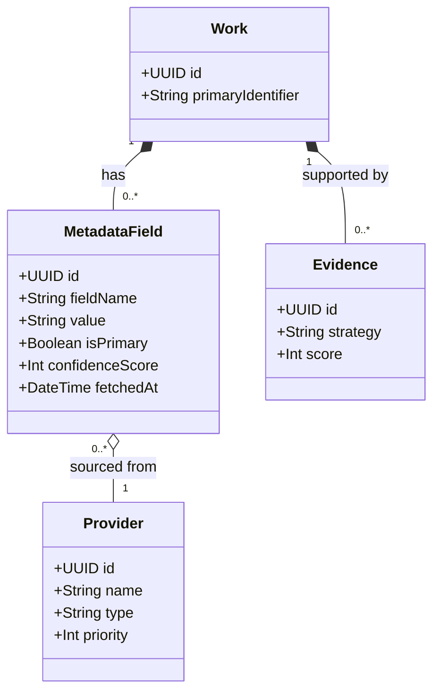
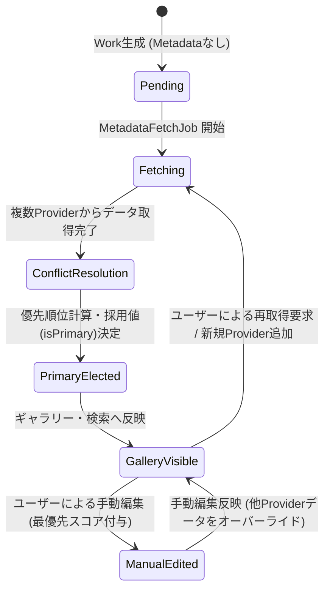
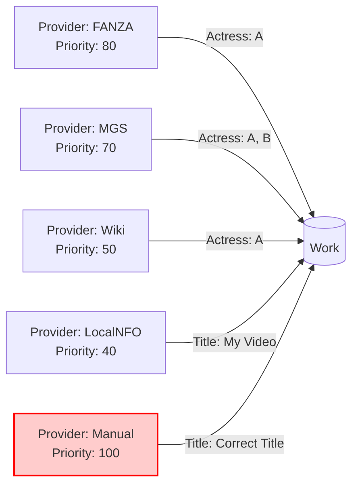
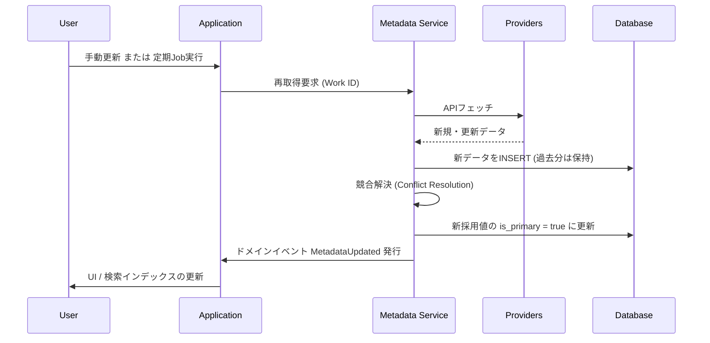

# WISE v2 Metadata.md (v1.0)

## 0. 本書の位置づけ

本書は、メディアライブラリ管理アプリケーション「WISE v2」における **Metadata（メタデータ）** の定義、責務、競合解決、およびライフサイクルをまとめた設計書である。

前提資料として **Architecture.md v1.1**、**Database.md v1.0**、**Work.md v1.0** を参照し、これらの既存設計と完全に整合する形で「作品情報」のドメインモデリングを行う。

本書の最優先事項は **「Work（作品の同一性）」と「Metadata（作品の付帯情報）」の境界を明確にし、責務の混同を防ぐこと** である。

---

## 1. Metadataとは

### 役割と存在理由
Metadataは **「Workを説明し、豊かにするための情報の集合」** である。
WISEにおける「作品（Work）」は、識別子（ID）のみで成立する空の器（本棚の背表紙のようなもの）であり、Metadataはその器の中身（あらすじ、タイトル、著者名など）に相当する。

### 責務
- 複数の外部情報源（Provider）から得られた情報を、Workに紐づく形で保持する。
- 同一の属性（例：タイトル）に対する複数の候補値を管理し、優先度ルールに従って「システムとしての採用値」を決定する。

### ライフサイクル
Workが誕生した時点では、Metadataは存在しなくてよい。Metadataは非同期のJobによって後から取得され、追加のProvider処理やユーザーの手動編集を通じて、**時間をかけて継続的に成長・洗練されていく**。

### 概念の違い
| 概念 | 存在意義 | 消滅条件 | 
|---|---|---|
| **Work** | 作品の「同一性」の証明。DBにおけるすべての起点。 | ユーザーが明示的に削除した場合のみ。 |
| **Asset** | 実ファイル（物理データ）の表現。 | ファイルがディスクから失われ、かつシステムからパージされた場合。 |
| **Metadata** | 作品を説明し、検索・分類を可能にする付加情報。 | Providerからの再取得で上書きされた場合、または手動で削除された場合。無くてもWorkは死なない。 |

---

## 2. Metadataモデル

Metadataを構成する要素を整理する。どこまでがMetadataであり、どこからがそうでないかの境界を明確にする。

### Metadataに含まれる要素（例）
これらは `METADATA_FIELD` テーブル内で `field_name` と `value` のペア（EAVモデル）として保持される。
- **基本情報:** `Title` (作品名), `Series` (シリーズ), `Release Date` (発売日), `Runtime` (収録時間)
- **人物・組織:** `Actress` / `Actor` (出演者), `Director` (監督), `Maker` (メーカー), `Label` (レーベル)
- **分類:** `Genre` (ジャンル・カテゴリ)
- **詳細情報:** `Description` (あらすじ・解説)
- **メディア:** `Cover URL` (パッケージ画像URL), `Sample Image URLs` (サンプル画像URL群), `Preview Movie URL` (サンプル動画URL)

### Metadataに含まれない要素
- **物理ファイル情報:** `FileSize`, `Duration (実ファイルの再生時間)`, `Resolution`, `Codec`, `SHA256` は **Asset** の責務。
- **識別根拠:** 「なぜこのWorkと判定されたか」の証拠データは **Evidence** の責務。
- **ユーザーによるグルーピング:** お気に入りやプレイリストへの所属は **Collection** の責務。
- **ユーザー独自タグ:** Provider由来ではない、ユーザーが自由に付けたタグは **Tag / WorkTag** の責務。

---

## 3. Metadata Lifecycle

Metadataは一度取得して終わりではなく、常に更新や競合解決が行われる。

---

## 4. Providerとの関係

Metadataは必ず「どこから取得したか（Provider）」の情報を持つ。

### 複数Providerデータの扱い
- 同一の `field_name` に対して、異なるProviderから情報が届いた場合、古いものを上書きするのではなく、**全Providerの候補値をDB（METADATA_FIELD）に保持する**。
- その上で、アプリケーション層のロジックで「どれを採用値（`is_primary = true`）とするか」を決定する。これにより、あるProviderが急に利用不可になっても、過去の他Providerのデータへフォールバックできる。

---

## 5. Metadata Conflict (競合解決)

複数Providerから異なるデータが提供された場合の、採用値（`is_primary = true`）の決定アルゴリズムを設計する。

### 優先順位決定ロジック
各 `MetadataField` の評価スコアは以下のように計算される。

1. **基本優先度 (Provider Priority):** 
   - DBの `PROVIDER.priority` の値（0〜100）。信頼できるProviderほど高く設定される。
2. **手動編集の絶対優先 (Manual Override):** 
   - ユーザーがUIから手動で編集・追加した値は、システム定義の `Manual` Provider由来として記録され、Priorityは常にMAX（例：100）として扱われる。これにより、スクレイピング結果がユーザーの意図を上書きすることを防ぐ。
3. **データ品質加点 (Data Quality Bonus):**
   - 同一優先度の場合、データの「リッチさ」で判断する。（例：あらすじの文字数が多い方、画像URLの解像度が高いと推測される方）。
4. **取得日時 (Freshness):**
   - 上記すべてが同点の場合、より新しい `fetched_at` を持つデータを採用する。

### 採用値の振る舞い
- 採用値に選ばれたレコードの `is_primary` が `true` となり、Galleryの表示やSearch Engineのインデックス化対象となる。
- 選ばれなかったレコードは `is_primary = false` として休眠状態で保持される。

---

## 6. Metadata Quality (品質評価)

Workが持つMetadata全体の「品質（充実度）」を評価し、ライブラリ管理に役立てる。

### 品質評価の指標
- **Fill Rate (網羅率):** 主要なフィールド（Title, Actress, Cover, Release Date）のうち、値が存在する割合。
- **Confidence (信頼度):** 採用されたMetadataが、どの程度高いPriorityのProviderから来ているかの平均値。
- **Freshness (鮮度):** 最終取得日時からの経過時間。

これらの品質スコアが一定以下のWorkは、「要再取得リスト」や「情報不足リスト」としてUI（Diagnostic画面やスマートフォルダ）でフィルタリング可能にする。

---

## 7. Metadataと検索

Metadataは、各システムコンポーネントで以下のように利用される。

| コンポーネント | 利用方法 |
|---|---|
| **Gallery (UI)** | `is_primary = true` のMetadataを利用し、サムネイル、タイトル、女優名などのカード情報を描画する。 |
| **Search Engine** | `is_primary = true` の値を抽出し、高速検索用のインデックス（転置インデックスなど）を構築する。ユーザーのキーワード検索にヒットさせる。 |
| **Collection** | スマートフォルダの `rule_definition`（例：「発売日が2023年以降」かつ「ジャンルに"VR"を含む」）を評価するための元データとなる。 |
| **Rule Engine** | リネームルールやフォルダ移動ルールの変数（例：`{Maker}/{Actress}/{Title}.mp4`）に展開・置換される。 |
| **AI (将来拡張)** | 説明文（Description）をAIに読み込ませ、より高度なベクトル検索や、関連作品のレコメンド生成に利用する。 |

---

## 8. Metadata更新のライフサイクル

### イベントに応じた振る舞い
- **Provider追加:** 新しいProviderのプラグインが追加された場合、一括再取得Jobを走らせ、既存のMetadata群に新たな候補を追加し、再評価（競合解決）を行う。
- **Merge (統合):** Work A を Work B に統合する場合、A の MetadataField レコード群の `work_id` を B に書き換えた後、B の文脈で再度 競合解決 を実行し、採用値を一つに絞り直す。
- **削除:** ユーザーがMetadataフィールドを手動で「削除」した場合、手動削除フラグ（または空文字によるManual Providerでの上書き）を行い、以降自動取得データが復活しないようにする。

---

## 9. 将来拡張

1. **AIタグ生成 / 画像・音声解析:**
   - ローカルのAIモデルを利用し、Asset（動画ファイル）から特徴を抽出し、AIを一つのProviderとして `Tag` や `Genre` を生成する。
2. **全文検索・ベクトル検索:**
   - 蓄積された豊富な `Description` や `Review` メタデータを対象に、Elasticsearch等を用いた全文検索や、Embedding APIを通じたセマンティック検索を導入する。
3. **多言語Metadata:**
   - `METADATA_FIELD` テーブルに `language` カラムを追加（または `field_name` に `title_en` のようにサフィックスを付与）し、ユーザーのUI言語設定に応じたMetadataフォールバックを可能にする。
4. **OCR連携:**
   - カバー画像等からOCRで文字列を抽出し、識別子解決（Evidence）や補助的なMetadataとして活用する。

---

## 10. 採用しなかった設計

| 不採用の設計案 | メリット | デメリット | 不採用理由 |
|---|---|---|---|
| **Workテーブルに直接カラムを持つ** (Work.title, Work.actress...) | ER図が単純になり、JOINなしでSELECT可能。 | Providerが増えたり、管理項目が増えるたびにスキーマのALTER TABLEが必要。複数Providerからの競合値を保持できない。 | 拡張性と「Source of Truth」の競合解決の観点から却下。EAVモデルを採用。 |
| **JSON一括保存** (Work.metadata_json) | スキーマレスで無限に柔軟。書き込みが容易。 | 特定フィールド（例：Actress）での絞り込みや集計、検索インデックス化がRDB上で極めて非効率になる。 | 高速検索と関係ベースのルール適用（Rule Engine）を重視するため却下。 |
| **Providerごとの完全分離テーブル** (FANZA_METADATA, WIKI_METADATA...) | Providerの仕様変更に強い。型安全にしやすい。 | Providerが追加されるたびにテーブル追加・アプリ側のクエリ修正が必要になり、プラグイン機構と相性が悪い。 | Open/Closed原則に違反し、将来のProvider拡張を阻害するため却下。 |

---

## 11. 設計の弱点とフィードバック

### この設計の弱点
- **EAVモデルのクエリ複雑性:** MetadataがEAV（Entity-Attribute-Value）形式であるため、「ActressがAで、かつRelease Dateが2023年のWork」を取得するようなSQLクエリが複雑（複数のJOINまたはサブクエリが必要）になる。
  - *対策:* RDBへの直接クエリは避け、Search Engine（転置インデックス）側にクエリの責務を移譲することでパフォーマンスと複雑性を解決する。
- **データ型の喪失:** `value` カラムがTEXT型であるため、発売日の日付比較や、収録時間の数値比較をDBレイヤーで直接行えない。
  - *対策:* アプリケーション層でのパース処理、またはSearch Engineインデックス生成時に型付けを行う。

### Database.md へのフィードバック
1. **Manual Overrideの保証:** `PROVIDER` テーブルにおいて、手動編集用の `Manual` Providerレコード（ID固定または予約語）が初期化時に必ず投入され、最大の Priority を持つことを必須制約として明記するべき。
2. **品質指標カラムの検討:** `WORK` テーブルに、非同期で算出された `metadata_fill_rate` のようなキャッシュカラムを追加することで、ギャラリーでの「情報不足」絞り込みが格段に高速化される可能性がある（今後の要検討事項）。

### Work.md へのフィードバック
1. **Workの同一性保証の強化:** WorkがMetadataを持たなくても成立するという定義（Work.md 1.1節）は強力だが、Metadataが完全に空のWork同士をどう区別するかがUI上の課題になる。Identifier Resolverが生成した `primary_identifier` が唯一の表示用ラベルとして機能することを強調しておくべき。
2. **Mergeロジックの補足:** Work.md 4.2節のMerge時の「競合解決」において、本Metadata.mdの「競合解決ロジック（Conflict Resolution）」を呼び出す、という依存関係を明示することで、ドメイン間の協調関係がより明確になる。

---

*WISE v2 Metadata.md v1.0 — 設計完了*
