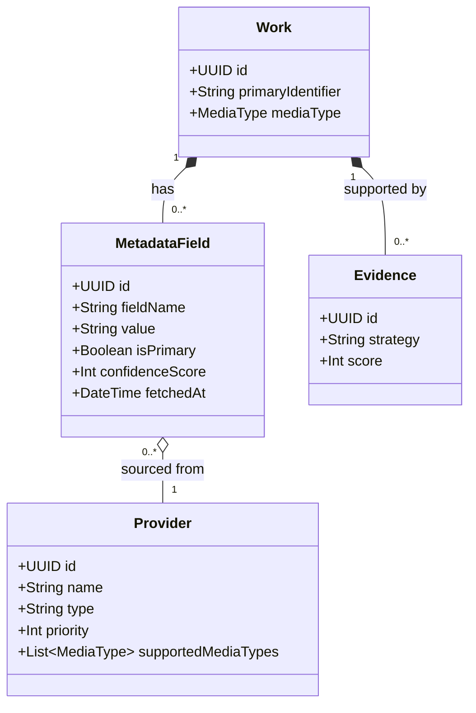
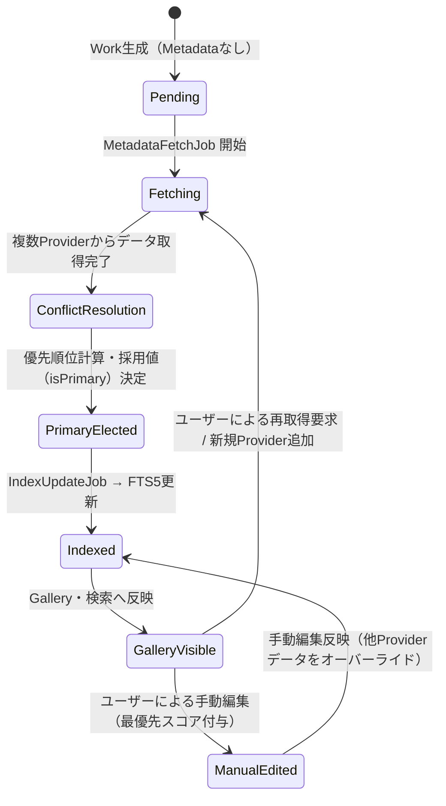
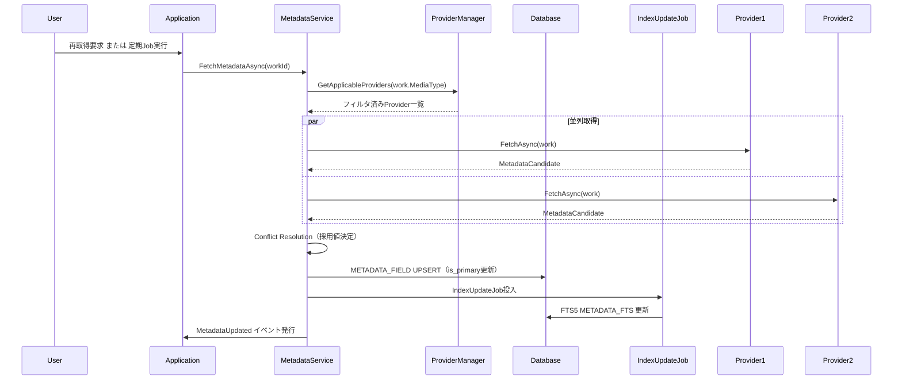

# WISE v2 Metadata.md (v2.0)

> **本書はv1.0からv2.0への更新である。**  
> 変更の主目的：SupportedMediaTypes追加（FB③と連携したProvider絞り込み）、Comic/Doujin固有フィールド定義（FB⑥関連）、ICoverProvider位置づけの明確化（FB④）、FTS5全文検索との連携（FB⑦）。

前提資料：**Architecture.md v2.0**、**Domain.md v2.0**、**Database.md v2.0**

---

# 1. Metadataとは

## 役割と存在理由

Metadataは **「Workを説明し、豊かにするための情報の集合」** である。WISEにおける「作品（Work）」は、識別子（ID）のみで成立する空の器（本棚の背表紙のようなもの）であり、Metadataはその器の中身（タイトル、著者名、あらすじなど）に相当する。

## 責務

- 複数の外部情報源（Provider）から得られた情報を、Workに紐づく形で保持する
- 同一の属性（例：タイトル）に対する複数の候補値を管理し、優先度ルールに従って「採用値」を決定する
- FTS5全文検索インデックスの元データを提供する

## ライフサイクル

Workが誕生した時点では、Metadataは存在しなくてよい。Metadataは非同期のJobによって後から取得され、追加のProvider処理やユーザーの手動編集を通じて、**時間をかけて継続的に成長・洗練されていく**。

## 概念の境界

| 概念 | 存在意義 | 消滅条件 |
|---|---|---|
| **Work** | 作品の「同一性」の証明。DBにおけるすべての起点 | ユーザーが明示的に削除した場合のみ |
| **Asset** | 実ファイル（物理データ）の表現 | ファイルが失われ、かつシステムからパージされた場合 |
| **Metadata** | 作品を説明し、検索・分類を可能にする付加情報 | Providerからの再取得で上書き、または手動削除 |
| **ReadingHistory** | ユーザーの閲覧/視聴進捗 | ユーザーが進捗リセット、またはWork削除連動 |

---

# 2. Metadataモデル

## 2.1 構成要素



## 2.2 フィールド定義（MediaType別）

MetadataFieldのフィールド名は全MediaType共通の `METADATA_FIELD` テーブルに保存される。ただし実際に使用されるフィールドはMediaTypeによって異なる。

> ⚠️ **既知の罠: FieldNameの大小文字不一致（実装の現実、下表のsnake_caseは設計上の理想形）**
> 下表は設計時の命名規則（snake_case）を示すが、実際の実装ではProviderの種別によって大小文字が異なる：
> - Video系Provider（Fanza/Mgs/JavBus/Fc2等）は PascalCase で保存する（例: `Actress`, `Maker`, `Title`）
> - Comic系Provider（DoujinishiFilenameMetadataProvider/DLSiteMetadataProvider/FanzaMetadataProvider の同人経路）は
>   小文字で保存する（例: `author`, `circle`）
>
> このためクライアント側（`WorkItemMapper` 等）は両方のケースにフォールバックする実装になっている。
> 新しいProviderを追加する際は、既存の同じ論理フィールドを扱うProviderと大小文字を揃えること
> （揃っていないとタグが重複表示される、または検索でヒットしない不具合の原因になる）。

### Video専用フィールド

| field_name | 説明 | 例 |
|---|---|---|
| `actress` | 女優名（複数の場合は複数レコード） | `葵つかさ` |
| `director` | 監督名 | `田中太郎` |
| `maker` | メーカー名 | `ムーディーズ` |
| `label` | レーベル名 | `MOODYZ IDEA` |
| `duration` | 収録時間（秒数またはHH:MM表記） | `7200` |
| `sample_movie_url` | サンプル動画URL | `https://...` |
| `cover_landscape_url` | 横向きカバー画像URL | `https://...` |
| `sample_image_urls` | サンプル画像URL群（JSON配列） | `["url1","url2"]` |

### Comic / Doujin専用フィールド

| field_name | 説明 | 例 |
|---|---|---|
| `author` | 作者名（複数の場合は複数レコード） | `田中花子` |
| `circle` | サークル名 | `幻想工房` |
| `page_count` | 総ページ数 | `48` |
| `language` | 言語 | `Japanese` / `English` |
| `volume` | 巻数 | `3` |
| `chapter` | 話数 | `12` |
| `event` | 発表イベント | `コミックマーケット103` |
| `dlsite_id` | DLサイトRJ番号 | `RJ123456` |
| `getchu_id` | Getchu作品ID | `123456` |
| `has_full_color` | フルカラーフラグ | `true` |

### Book専用フィールド

| field_name | 説明 | 例 |
|---|---|---|
| `author` | 著者名 | `山田太郎` |
| `publisher` | 出版社 | `集英社` |
| `isbn` | ISBN | `978-4-08-...` |
| `page_count` | ページ数 | `320` |
| `language` | 言語 | `Japanese` |

### 全MediaType共通フィールド

| field_name | 説明 | 例 |
|---|---|---|
| `title` | 作品タイトル | `進撃の巨人` |
| `release_date` | 発売日（YYYY-MM-DD） | `2024-01-15` |
| `genre` | ジャンル（複数の場合は複数レコード） | `アクション` |
| `description` | あらすじ/説明 | `人類は...` |
| `series` | シリーズ名 | `ABCシリーズ` |
| `cover_url` | カバー画像URL（縦向き） | `https://...` |
| `rating` | 評価スコア（サイト評価） | `4.5` |
| `tags` | タグ一覧（JSON配列） | `["tag1","tag2"]` |

## 2.3 Metadataに含まれない要素

- **物理ファイル情報：** `FileSize`, `Duration（実ファイルの再生時間）`, `SHA256` → **Asset** の責務
- **識別根拠：** 「なぜこのWorkと判定されたか」のEvidence → **Evidence** の責務
- **ユーザーグルーピング：** お気に入り・プレイリスト → **Collection** の責務
- **ユーザー独自タグ：** Provider由来でないタグ → **Tag / WorkTag** の責務
- **読書進捗：** ページ位置・再生位置 → **ReadingHistory** の責務
- **カバー画像（キャッシュ済み）：** ICoverProviderで取得したローカルキャッシュ → **CoverCache** の責務

---

# 3. Provider と SupportedMediaTypes

## 3.1 Providerの役割

Metadataは必ず「どこから取得したか（Provider）」の情報を持つ。v2では各Providerが対応するMediaTypeを `SupportedMediaTypes` として宣言する。

```csharp
interface IMetadataProvider
{
    string Name { get; }
    int Priority { get; }
    IReadOnlyList<MediaType> SupportedMediaTypes { get; }  // v2追加
    Task<IReadOnlyList<MetadataCandidate>> FetchAsync(Work work, CancellationToken ct);
}
```

## 3.2 Provider一覧（v2更新）

> ⚠️ **本表は設計時点の想定であり、実装（`src/WISE.Api/Program.cs` の DI 登録と
> `appsettings.json` の `MetadataProviders` セクション）とは一致しない。**
> `Melonbooks`/`NDL`/`FolderParser` は未実装。実際のPriority値・有効/無効設定は
> `Program.cs`/`appsettings.json` を正とすること。また `Manual` は Priority ではなく
> **ConfidenceScore=999**（`MetadataField` コンストラクタの第4引数）として実装されており、
> Priority自体は他Providerと同様の整数値が使われる点も設計時点の記述と異なる。

| Provider | SupportedMediaTypes | Priority | 概要 |
|---|---|---|---|
| `Manual` | All | （ConfidenceScore=999） | ユーザー手動編集（最優先、絶対上書き不可） |
| `FANZA` | Video | 80 | FANZA AV専用スクレイパー |
| `JavBus` | Video | 70 | JavBus AV情報 |
| `FC2` | Video | 70 | FC2 PPV情報 |
| `AvWiki` | Video | 50 | AV女優Wiki |
| `DLSite` | Comic, Book, PhotoBook, Audio | 80 | 同人誌・電子書籍 |
| `Getchu` | Comic, Book | 70 | 美少女ゲーム/同人誌 |
| `Melonbooks` | Comic, Book | 60 | 同人誌通販（未実装） |
| `NDL` | Book | 70 | 国立国会図書館（書籍ISBN）（未実装） |
| `LocalNFO` | All | 40 | ローカルのNFOファイル |
| `ComicInfoXml` | Comic, Book | 45 | ComicInfo.xml（Kavita互換） |
| `FolderParser` | All | 20 | フォルダ名・ファイル名からの推測（未実装） |

## 3.3 ProviderManagerのMediaType絞り込み

```csharp
// WorkのMediaTypeに対応するProviderのみを選択
var applicableProviders = _allProviders
    .Where(p => p.SupportedMediaTypes.Contains(work.MediaType))
    .Where(p => p.IsEnabled)
    .OrderByDescending(p => p.Priority);
```

これにより、ComicのWorkにFANZAが呼び出されることを防ぐ。

---

# 4. ICoverProviderとMetadataの関係

## 4.1 カバー画像のMetadataフィールド

`cover_url`（縦向き）と `cover_landscape_url`（横向き）はMetadataFieldとして保持される。これはProviderがスクレイピングで取得したリモートURLである。

ICoverProvider の `MetadataCoverProvider` はこのMetadataFieldを参照し、URLをダウンロードしてCoverCacheにキャッシュする。

## 4.2 カバー抽出の優先順位

```
MetadataField.cover_url が存在し、URLが有効
    → MetadataCoverProvider が使用（Priority: 100）

MetadataField.cover_url が存在しない、または404
    → ArchiveCoverProvider / VideoThumbnailProvider / PdfCoverProvider のいずれかが使用
    → CoverCache に生成済みキャッシュを保存
```

Metadataが充実している（= cover_urlが取得できている）ほどカバー品質が高い。これがMetadata取得を優先する設計の動機の一つである。

---

# 5. Metadata Lifecycle



---

# 6. Metadata Conflict（競合解決）

複数Providerから異なるデータが提供された場合の採用値（`is_primary = true`）決定アルゴリズム。

## 6.1 優先順位決定ロジック

各 `MetadataField` の評価スコアは以下のように計算される：

1. **基本優先度（Provider Priority）：** `PROVIDER.priority` の値（0〜100）
2. **手動編集の絶対優先（Manual Override）：** 実装上は Priority ではなく **ConfidenceScore=999**
   （通常Providerは最大でも数十〜100程度）として付与され、他のProviderがいかに高スコアでも上書き不可
3. **データ品質加点（Data Quality Bonus）：** 同一優先度の場合、データのリッチさで判断（あらすじの文字数、画像URL品質等）
4. **取得日時（Freshness）：** 上記すべてが同点の場合、より新しい `fetched_at` を採用

## 6.2 採用値の振る舞い

- 採用値に選ばれたレコードの `is_primary = true` となり、GalleryおよびFTS5インデックス化の対象となる
- 選ばれなかったレコードは `is_primary = false` として休眠状態で保持（Providerが無効化された時のフォールバック用）

---

# 7. Metadata Quality（品質評価）

## 7.1 品質評価の指標

| 指標 | 説明 |
|---|---|
| **Fill Rate（網羅率）** | MediaTypeの主要フィールドのうち値が存在する割合 |
| **Confidence（信頼度）** | 採用Metadataが高PriorityのProviderから来ているかの平均 |
| **Freshness（鮮度）** | 最終取得日時からの経過時間 |
| **Cover Quality** | カバー画像の取得元（MetadataCoverProvider > ArchiveCoverProvider > Placeholder） |

## 7.2 MediaType別「主要フィールド」定義

isCompleteの判定に使用される主要フィールド：

| MediaType | 必須フィールド | 推奨フィールド |
|---|---|---|
| Video | title, cover_url, actress | maker, release_date, genre |
| Comic | title, cover_url, author or circle | page_count, genre, release_date |
| Book | title, cover_url, author | publisher, isbn, page_count |

これらの品質指標が一定以下のWorkは、「要再取得リスト」や「情報不足リスト」としてSmartFolderでフィルタリング可能にする。

---

# 8. MetadataとFTS5全文検索

## 8.1 検索の設計原則（FB⑦）

FTS5全文検索は **MediaTypeに依存しない**。

- `is_primary = true` の全MetadataFieldを検索対象とする
- 「VideoだけのFTSと、ComicだけのFTSを分けない」
- ユーザーが検索した場合、Video・Comic・Bookを横断した結果が返る
- 結果をMediaTypeでフィルタリングするのはUIの責務（検索インデックスの責務ではない）

## 8.2 IndexUpdateJobのトリガー

| イベント | アクション |
|---|---|
| `MetadataUpdated`（Providerによる更新） | IndexUpdateJobをキューに投入 |
| `MetadataUpdated`（Manual手動編集） | IndexUpdateJobを高優先度でキューに投入 |
| Work Merge | 統合後の全MetadataFieldを再インデックス |
| Work Soft Delete | FTS5から削除（コンテンツテーブルモードで自動） |

---

# 9. Metadataの利用先

| コンポーネント | 利用方法 |
|---|---|
| **Gallery（UI）** | `is_primary = true` のMetadataを利用。表示フィールドはMediaDisplayProfileが制御 |
| **FTS5 Search** | `is_primary = true` の値をIndexUpdateJobが更新。MediaType横断検索 |
| **ICoverProvider** | `MetadataCoverProvider` が `cover_url` / `cover_landscape_url` を参照 |
| **Collection（SmartFolder）** | `rule_definition` の条件評価に使用（例：genre='百合' AND release_date >= '2024'） |
| **Rule Engine** | リネームルールの変数展開（例：`{circle}/{title}.zip`） |
| **IMediaViewer** | Work.MediaTypeをもとにViewerRouterが適切なViewerを選択 |

---

# 10. Metadata更新のライフサイクル



---

# 11. 将来拡張

1. **AIタグ生成 / 画像解析：** ローカルAIモデルを使用し、Assetから特徴を抽出してMetadataFieldとして追加
2. **多言語Metadata：** `language` サフィックスでフィールド名を区別（`title_en` / `title_ja`）
3. **OCR連携：** カバー画像からOCRで文字抽出し、IdentifierのEvidenceまたは補助Metadataとして活用
4. **ベクトル検索：** Descriptionや評価テキストをEmbedding化し、セマンティック検索を追加

---

# 12. 採用しなかった設計

| 不採用の設計案 | 不採用理由 |
|---|---|
| Workテーブルに直接カラムを持つ | Provider追加でスキーマ変更必須。競合値を保持不可 |
| JSON一括保存（metadata_json） | フィールド別絞り込み・FTS5インデックス化が極めて困難 |
| Providerごとの完全分離テーブル | Provider追加でテーブル追加必須。Open/Closed原則違反 |
| MediaType別のFTS5テーブル | 管理コスト高・Plugin追加に弱い（FB⑦で明示的に却下） |

---

*WISE v2 Metadata.md v2.0 — 2026-06-30*
