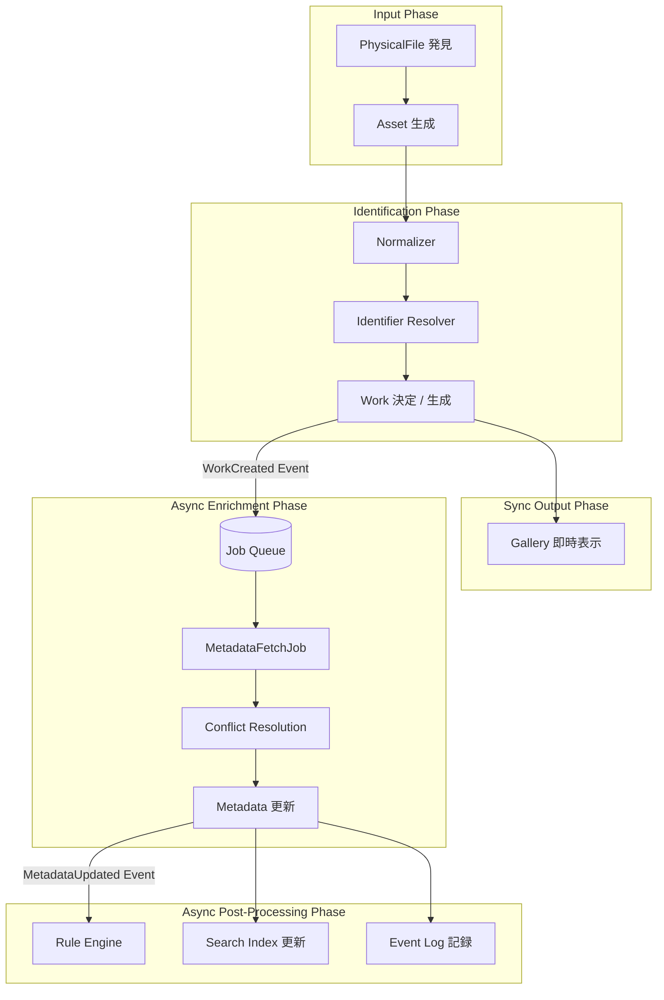
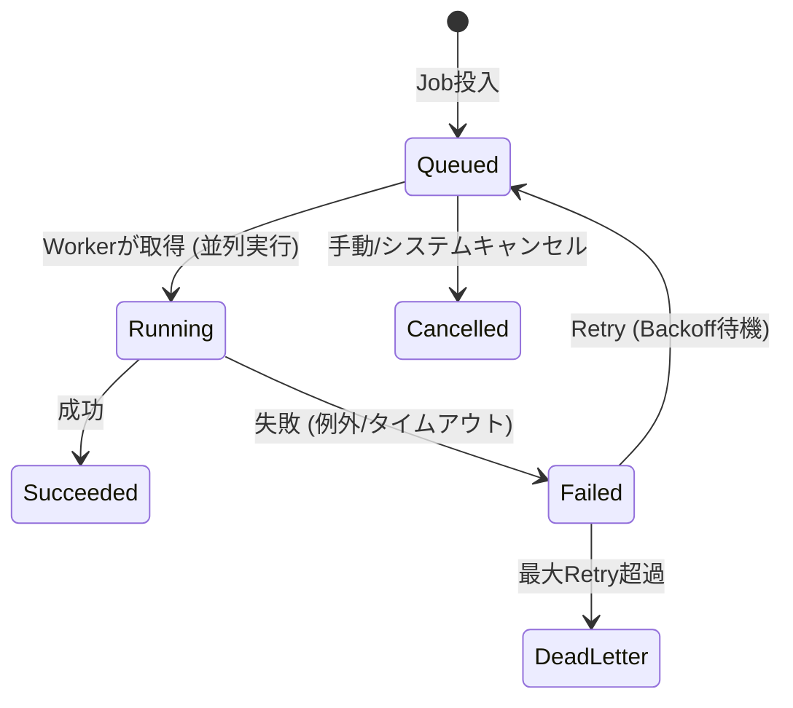
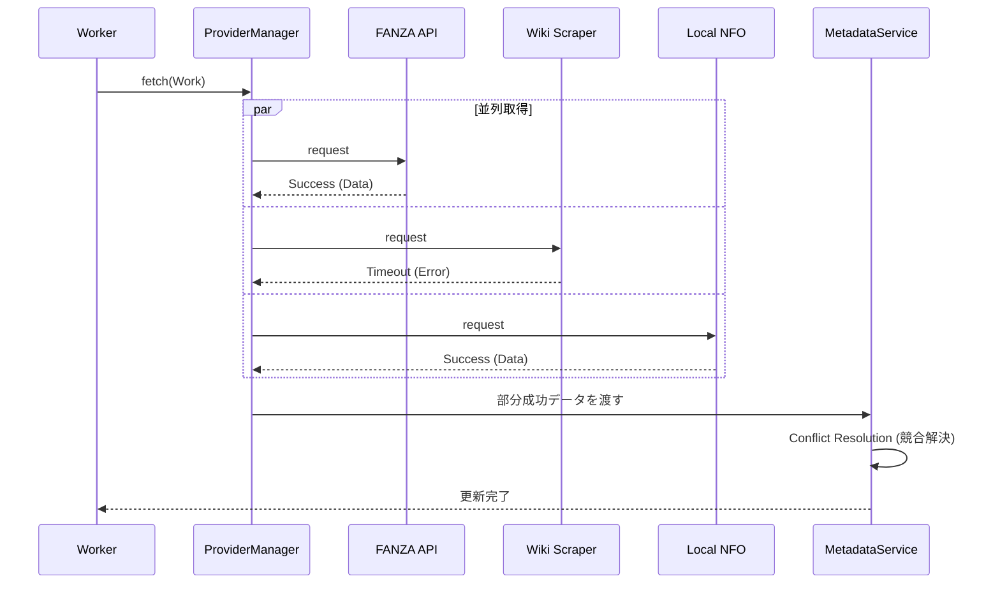
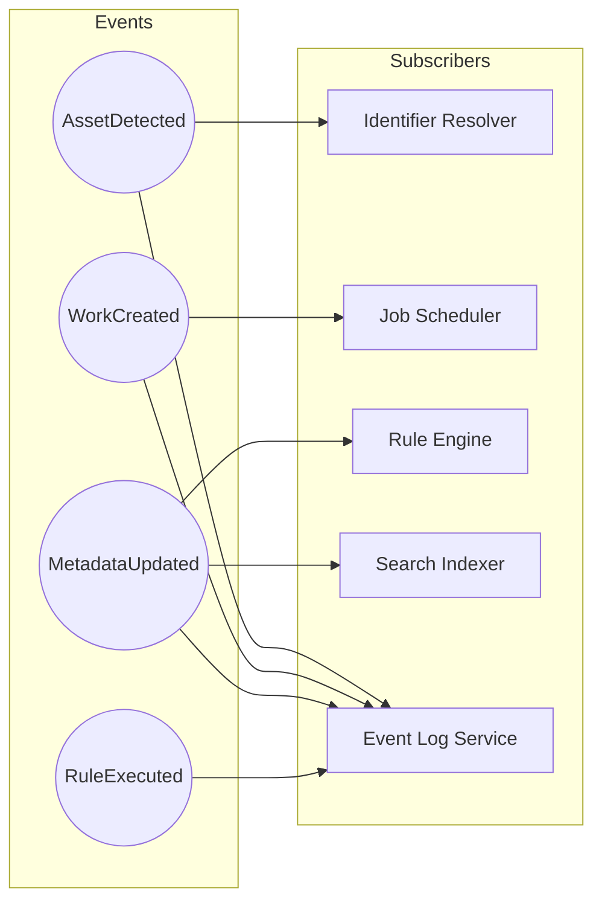

# WISE v2 Pipeline.md (v1.0)

## 0. 本書の位置づけ

本書は、メディアライブラリ管理アプリケーション「WISE v2」における **システム全体の動的な振る舞い（Pipeline）** を定義する設計書である。

前提資料として **Architecture.md v1.1**、**Database.md v1.0**、**Work.md v1.0**、**Metadata.md v1.0**、**Identifier.md v1.0** を参照し、矛盾しない形で設計を行う。

本書はデータの静的な構造ではなく、「イベントがいつ発行され、誰がそれを拾い、どのような非同期ジョブとして実行されるか」というシステム内の血流（情報の流れ）を整理することを目的とする。

---

## 1. Pipelineとは

### 責務と設計思想
Pipelineとは、WISE内で実行される「すべての状態変化の伝播」と「時間のかかる処理（非同期処理）」を安全かつ確実にオーケストレーションする仕組みである。

設計思想の根幹は **「ユーザーの操作（UI）をブロックしないこと」** と **「部分的失敗を許容し、全体を止めないこと」** にある。

### 各コンポーネントとの関係
- **Jobとの関係:** Pipelineの中で、時間・ネットワーク・CPUを消費する処理（メタデータ取得、ハッシュ計算等）はすべて `Job` としてキューに投入され、Workerによって非同期実行される。
- **Eventとの関係:** Pipelineの各フェーズの完了（例：Workが生成された、メタデータが更新された）は `Domain Event` として発行され、次の処理のトリガーとなる。
- **Providerとの関係:** Providerからのデータ取得はPipelineの一部（Job）として並列実行され、一つのProviderの失敗はPipeline全体に影響を与えない。
- **Rule Engineとの関係:** Rule EngineはMetadataやAssetの更新Eventを購読し、必要なタイミングでリネームや整理ルールを後追いで適用する。

---

## 2. メインパイプライン

ファイル発見から、ギャラリーへの表示、そしてメタデータ強化に至る基本フロー。

### メインパイプライン図

**重要なポイント:** `Work決定` の直後にGalleryへの表示（同期）が行われ、Metadata取得以降はすべて非同期パイプラインとしてバックグラウンドで実行される。

---

## 3. Job System

時間のかかる処理を安全に実行するための非同期基盤。

### Job Flow (ライフサイクルとリトライ)

- **Queue & Worker:** `JOB` テーブルをキューとして使用し、複数のWorkerスレッド/プロセスが優先度（Priority）順にJobを取得・実行する。
- **Priority:** ユーザーが直接指示した更新Jobは高優先度、定期スキャンやハッシュ計算は低優先度とする。
- **Timeout & Retry:** 各Jobにはタイムアウトが設定される。ネットワーク障害等で失敗した場合は、Exponential Backoff（指数的後退）アルゴリズムで再試行間隔を空けながら再実行される。
- **Cancellation:** 同一Workに対してより新しいJobが投入された場合、古いJobはキャンセルされることがある。

---

## 4. Provider Pipeline

Metadata取得において、複数のProviderをどう協調させるかの設計。

### Provider Sequence図

- **部分成功 (Partial Success):** いずれかのProviderがタイムアウトやエラーになっても、取得できた他Providerのデータのみでパイプラインを継続する。
- **Fallback:** 高優先度Providerが失敗した場合、次点のProviderのデータが競合解決（Conflict Resolution）フェーズで採用値（Primary）に昇格する。

---

## 5. Event Pipeline

システム内の状態変化を伝播させるパブサブ（Publish-Subscribe）モデル。

### Mermaid Event Flow

- **購読関係の分離:** イベントを発行する側（Publisher）は、誰がそのイベントを購読（Subscriber）しているかを知らない。これにより、将来的な機能追加（新しいSubscriberの追加）が容易になる。

---

## 6. Search更新

UIや検索エンジンへのデータ反映タイミング。

- **Gallery更新:** 同期（リアルタイム）。DBへの直接クエリで描画されるため、Workが生成された瞬間やMetadataの採用値が変わった瞬間に反映される。
- **Search Index更新:** 非同期。`MetadataUpdated` や `WorkCreated` イベントをフックして `IndexUpdateJob` がキューに投入される。数秒〜数十秒のタイムラグを許容する結果整合性（Eventual Consistency）モデル。
- **Collection (Smart Folder) 更新:** 非同期キャッシュ更新。ルール評価コストが高いため、検索インデックス更新と同時期にキャッシュをリフレッシュする。

---

## 7. Error Recovery (障害回復)

| 障害シナリオ | 回復（リカバリ）戦略 |
|---|---|
| **ネットワーク障害** | Provider Pipelineでのタイムアウト。Job自体をFailedとし、一定時間後に再試行（Retry）する。 |
| **Providerサイト仕様変更 (Scraping停止)** | Provider Managerが連続エラーを検知し、Circuit Breakerを発動。対象Providerへのアクセスを一時停止し、パイプラインの無駄な遅延を防ぐ。他ProviderへFallbackする。 |
| **Identifier解決失敗 (Unknown)** | Workに紐付かない Orphaned Asset として保留される。ユーザーが Diagnostic 画面から手動で解決（Manual Override）することで、パイプラインが再開される。 |
| **Jobワーカー強制終了** | DB（`JOB` テーブル）上でステータスが `Running` のままタイムアウトしたJobを、監視プロセスが `Failed` に戻してキューに復帰させる（ゾンビジョブ回収）。 |

---

## 8. 将来拡張

Pipeline基盤が整っていることで、以下のような機能拡張が容易に追加できる。

1. **AI解析 / OCR:** 
   - `AssetAssociated` イベントをトリガーに、新規Job `AiAnalysisJob` を投入する。結果が得られたら `MetadataUpdated` イベントを発行するだけ。
2. **Cloud Sync (クラウド同期):**
   - Event Logを順番に読み出し（Event Sourcing的アプローチ）、クラウド側のデータベースに変更差分（Delta）として送信・同期するSubscriberを追加する。
3. **Webhook / 外部通知:**
   - 特定のイベント（例：お気に入り女優の新規Work追加）をトリガーに、DiscordやTelegramへ通知を送るSubscriberを追加する。

---

## 9. 採用しなかった設計

| 不採用の設計案 | メリット | デメリット | 不採用理由 |
|---|---|---|---|
| **完全な同期処理 (Metadataが取れるまでUIをブロック)** | 実装が容易。状態管理がシンプル。 | ネットワークが遅いとアプリ全体がフリーズする。大量追加時に致命的。 | 快適なUX（高速表示）という絶対要件を満たせないため却下。 |
| **巨大な定期バッチ処理 (1日1回全更新)** | システム負荷が予測しやすい。 | ファイルを追加しても翌日までメタデータが反映されない。 | ユーザーのアクションに対して即座にフィードバックを返す要件に反するため却下。 |
| **Provider依存Pipeline (FANZA用フロー、Wiki用フローの分離)** | 各サイトの特性に合わせた個別最適化が容易。 | サイトごとの例外処理でメインパイプラインが肥大化し、スパゲティコード化する。 | Plugin追加に耐えられない（Open/Closed原則違反）ため却下。ProviderはManagerで抽象化し、パイプラインは共通化する。 |

---

## 10. 設計の弱点とフィードバック

### この設計の弱点
- **結果整合性（Eventual Consistency）によるUXの混乱:** メタデータ取得や検索インデックス更新が非同期であるため、ファイルを追加した直後は「タイトルなし」で表示されたり、検索にヒットしなかったりするタイムラグが発生する。ユーザーに「現在バックグラウンドで処理中」であることをUIで適切にフィードバックする必要がある。
- **SQLiteでのJob Queue競合:** `JOB` テーブルへの頻繁なポーリングと更新（ステータス変更）が、SQLiteのDBロックを引き起こし、メインUIの読み込みを遅延させる可能性がある。
  - *対策:* ジョブ状態のポーリング間隔を調整する、またはインメモリキューとDBのハイブリッド構成を検討する。

### Architecture へのフィードバック
- **Event Busの明記:** Architecture.md 5章（コアコンポーネント）において、各サービスが互いを直接呼び出すのではなく、「Event Bus」を介してイベントをやり取りする構成図へアップデートすべきである（結合度を下げるため）。

### Database へのフィードバック
- **Dead Letter Queue (DLQ):** 最大リトライ回数を超えたJob（Dead Letter）のステータス管理や、それらをまとめて再実行・破棄するためのカラム（または別テーブル）の考慮が `JOB` テーブルに必要かもしれない。

### Work へのフィードバック
- **状態の一時性:** Metadataが非同期で更新され続けるため、Workの「完全な状態（isComplete）」という定義は流動的になる。Work.md のモデリングにおいて、「Metadata取得待ち」といった補助ステータスは持たせず、あくまでイベント（振る舞い）として解決した設計方針は正しかったことがPipeline上で証明された。

### Metadata へのフィードバック
- **競合解決のタイミング:** 複数Providerを並列実行するため、「すべてのProviderの処理が終わってから一括でConflict Resolutionを実行する」か、「データが届くたびに再評価する」かのポリシーが必要。本Pipelineでは、Jobの完了単位で競合解決（再評価）を行う前提としている。

### Identifier へのフィードバック
- **Identifier再実行のトリガー:** Assetのパスが変わった場合だけでなく、新しい Metadata が取得された際（MetadataUpdatedイベント）にも、Identifierを再評価すべきかが議論になる。処理コストが高いため、「Identifierによる解決」フェーズと「Metadata Enrichment」フェーズは一方通行（フィードバックループを作らない）とするのが安全である。

---

*WISE v2 Pipeline.md v1.0 — 設計完了*
