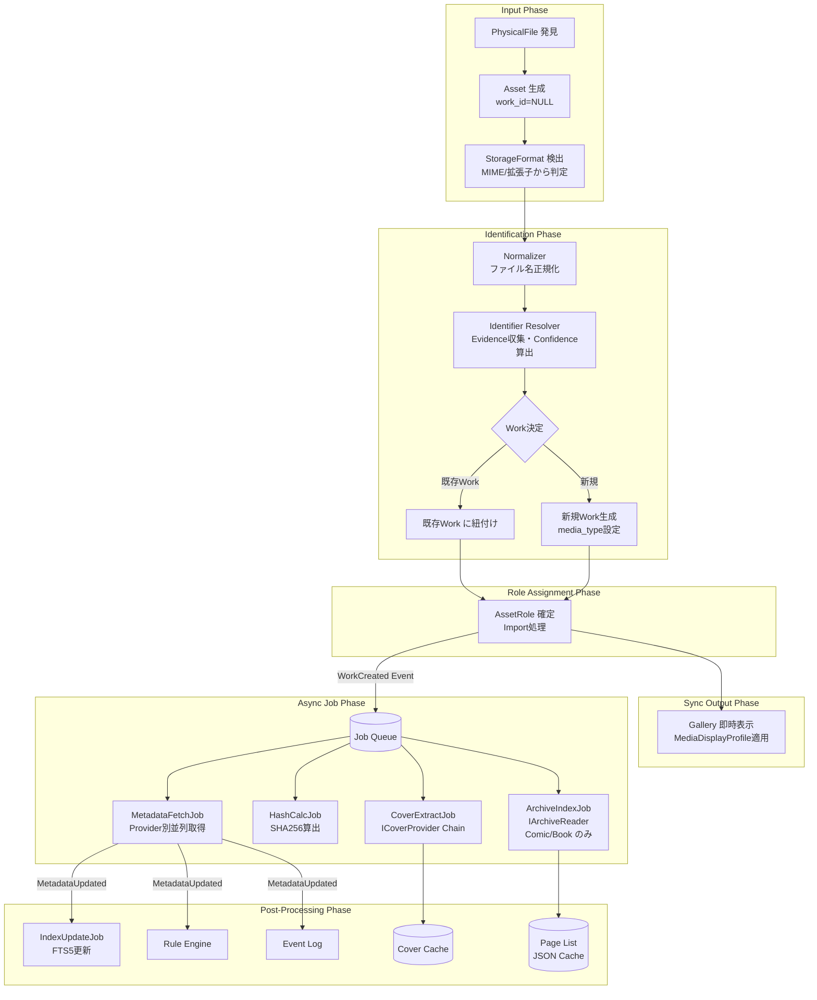
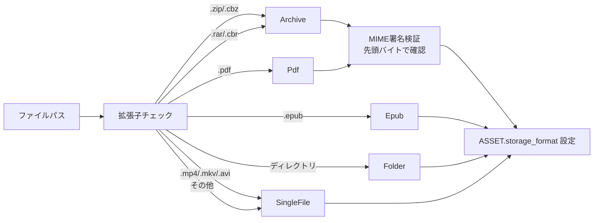
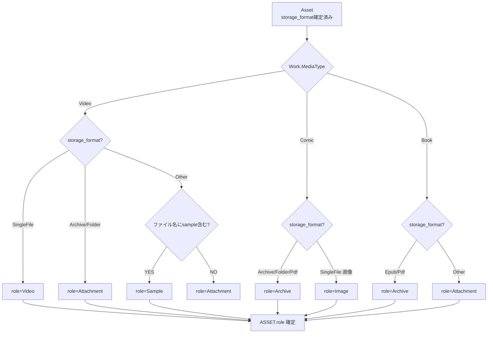
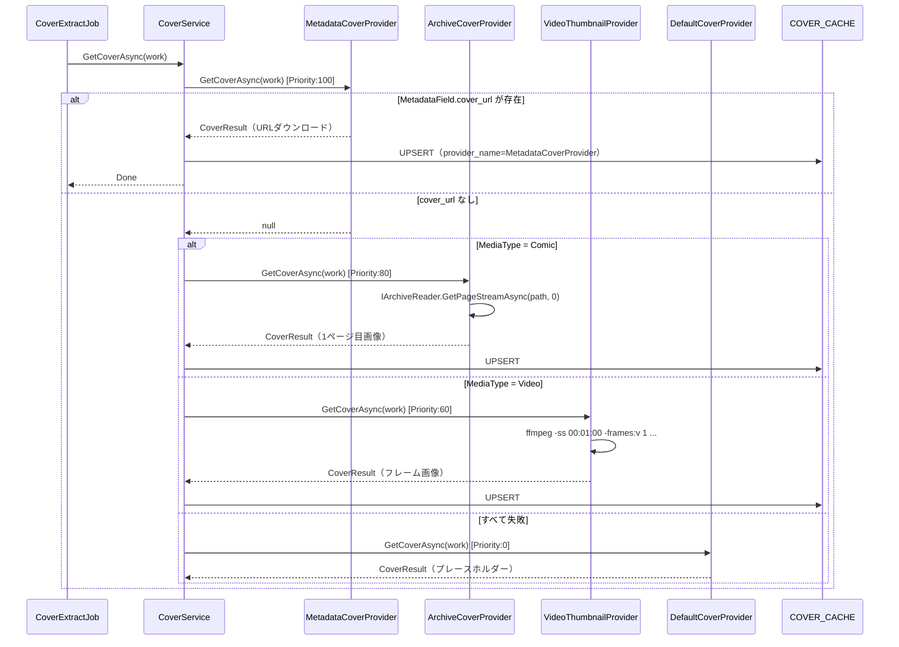
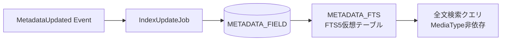
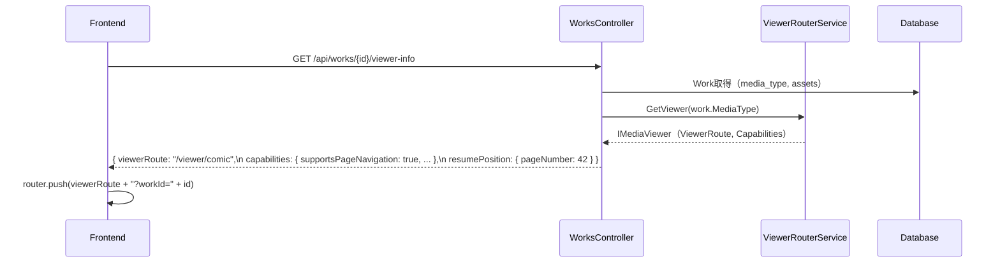
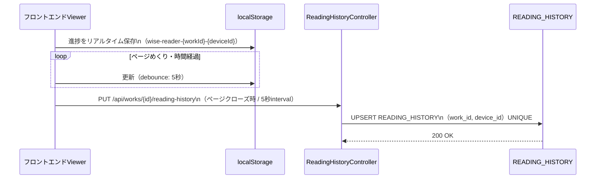
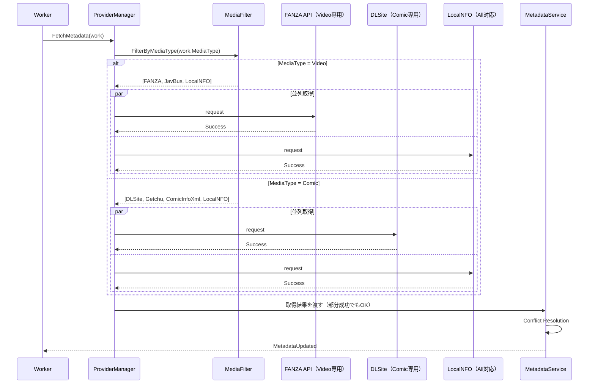
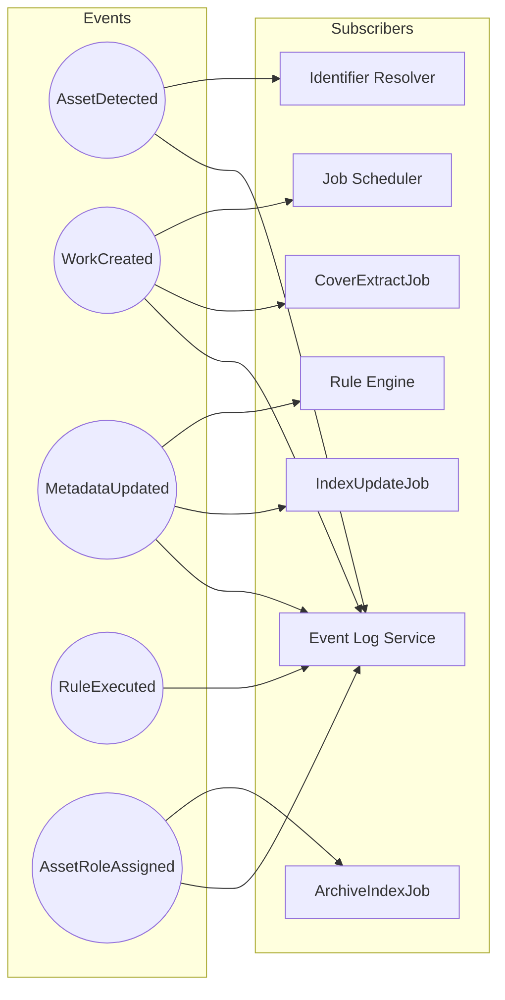

# WISE v2 Pipeline.md (v2.0)

> **本書はv1.0からv2.0への更新である。**  
> 変更の主目的：StorageFormat検出パイプライン追加（FB③）、ICoverProvider統合パイプライン追加（FB④）、ArchiveIndex構築パイプライン追加（Comic対応）、IMediaViewer選択フロー（FB⑧）、FTS5 IndexUpdateJobパイプライン（FB⑦）、ReadingHistory更新フロー（FB②）。

前提資料：**Architecture.md v2.0**、**Domain.md v2.0**、**Database.md v2.0**

---

# 1. Pipelineとは

## 責務と設計思想

Pipelineとは、WISE内で実行される「すべての状態変化の伝播」と「時間のかかる処理（非同期処理）」を安全かつ確実にオーケストレーションする仕組みである。

設計思想の根幹は **「ユーザーの操作（UI）をブロックしないこと」** と **「部分的失敗を許容し、全体を止めないこと」** にある。

## v2での追加コンポーネント

| コンポーネント | 役割 | 関連FB |
|---|---|---|
| StorageFormatDetector | Assetのコンテナ形式を自動検出 | FB③ |
| AssetRoleAssigner | ImportJob内でAssetのRoleを確定 | FB① |
| CoverPipeline | ICoverProviderチェーンでカバー取得 | FB④ |
| ArchiveIndexPipeline | IArchiveReaderでページリスト構築 | FB③ |
| IndexUpdatePipeline | FTS5仮想テーブル更新 | FB⑦ |
| ViewerRouter | IMediaViewerでビューワーを選択 | FB⑧ |
| ReadingHistoryFlush | フロントエンド→DBへのdebounce更新 | FB② |

---

# 2. メインパイプライン（v2更新）

ファイル発見からGallery表示・Viewer選択・FTS5更新に至る完全フロー。



---

# 3. StorageFormat検出パイプライン（v2新規）

ファイル発見時にStorageFormatを自動検出し、ASSETに記録する。



**StorageFormat検出ルール：**

| 優先度 | 判断方法 | 説明 |
|---|---|---|
| 1 | MIMEシグネチャ（バイナリ先頭） | 最も信頼性が高い |
| 2 | 拡張子 | MIMEが不明な場合 |
| 3 | ディレクトリ判定 | パスがディレクトリであれば `Folder` |
| 4 | デフォルト | 判定不能の場合は `SingleFile` |

---

# 4. AssetRole確定パイプライン（v2新規）

AssetがWorkに紐付けられた後、WorkのMediaTypeとAssetの物理属性からRoleを確定する。



**カバー画像のRole確定：**
- ファイル名に `cover`, `poster`, `fanart`, `thumb` を含む画像ファイル → `CoverPortrait` または `CoverLandscape`（アスペクト比で判断）
- アスペクト比 > 1.0（横長）→ `CoverLandscape`
- アスペクト比 <= 1.0（縦長）→ `CoverPortrait`

---

# 5. ICoverProvider パイプライン（v2新規）

CoverExtractJobが実行されると、ICoverProvider Chain of Responsibilityが動作する。



**キャッシュ方針：**
- キャッシュパス：`{AppData}/WISE/covers/{workId}/{provider}.jpg`
- MetadataCoverProviderのキャッシュは `expires_at = null`（無期限）。ただしMetadataが更新されたら再取得をJobに投入
- ArchiveCoverProvider/VideoThumbnailProviderのキャッシュは `expires_at = null`（ファイルが変わらない限り有効）

---

# 6. ArchiveIndex パイプライン（v2新規、Comic/Book専用）

```mermaid
flowchart LR
    Job[ArchiveIndexJob] --> AR{IArchiveReader選択\nstorage_format基準}
    AR -- Archive\n.zip/.cbz/.rar/.cbr --> ZR[ZipArchiveReader\nまたはRarArchiveReader]
    AR -- Pdf --> PR[PdfArchiveReader]
    AR -- Epub --> ER[EpubArchiveReader]
    AR -- Folder --> FR[FolderArchiveReader]
    ZR --> Pages[ArchivePage一覧\n[{index, name, size}]]
    PR --> Pages
    ER --> Pages
    FR --> Pages
    Pages --> Cache[ページリストをJSON形式でキャッシュ]
    Pages --> PCnt[METADATA_FIELD.page_count 更新\nis_primary=true, provider=system]
```

**ArchiveIndexJobの投入タイミング：**
- AssetRole確定時（`role=Archive` と確定された直後）
- アーカイブファイルの置き換えを検出した時（SHA256が変わった時）

**パフォーマンス考慮：**
- ページリストはJSONキャッシュに保存し、ビューワー初回開時のリスト生成をスキップ
- 1ページ目の画像はCoverExtractJobが別途取得（ArchiveIndexJobはページリストのみ、画像バイト列は持たない）

---

# 7. FTS5 IndexUpdate パイプライン（v2新規）



**更新方式：**
```sql
-- コンテンツテーブルモードを使用（rebuild）
INSERT INTO METADATA_FTS(METADATA_FTS) VALUES('rebuild');
-- または差分更新（delete + insert）
INSERT INTO METADATA_FTS(METADATA_FTS, rowid, value)
  VALUES('delete', :oldRowid, :oldValue);
INSERT INTO METADATA_FTS(rowid, work_id, field_name, value)
  VALUES(:rowid, :workId, :fieldName, :value);
```

**設計原則（FB⑦）：**
- MediaType依存のインデックス分割は行わない
- 全てのMetadataField（`is_primary = true`）がFTS5の対象

---

# 8. IMediaViewer選択フロー（v2新規）

ビューワー起動時にViewerRouterServiceがIMediaViewerを選択し、フロントエンドに `ViewerRoute` を返す。



**UIの責務：**
- `viewerRoute` に従ってルーティングするだけ
- `capabilities` を読んでボタン（速度変更・ブックマーク等）の表示/非表示を制御
- if(mediaType === "Video") などのMediaType依存コードを書かない

---

# 9. ReadingHistory更新フロー（v2新規）



**デバイスID生成：**
```javascript
// localStorage初回起動時に生成・保持
const deviceId = localStorage.getItem('wise-device-id')
  ?? crypto.randomUUID();
localStorage.setItem('wise-device-id', deviceId);
```

**フラッシュのタイミング：**
- ページめくり後5秒（debounce）
- ビューワーunmount時（`beforeunload` イベント）
- アプリバックグラウンド遷移時（`visibilitychange` → hidden）

---

# 10. Job System（v2更新）

## JobType一覧（v2追加分）

| JobType | 説明 | 投入トリガー | 新規/既存 |
|---|---|---|---|
| `MetadataFetch` | Metadata取得 | WorkCreated | 既存 |
| `HashCalc` | SHA256計算 | AssetAssociated | 既存 |
| `Thumbnail` | サムネイル生成 | WorkCreated（Video） | 既存 |
| `CoverExtract` | ICoverProvider Chain実行 | WorkCreated / MetadataUpdated | **新規** |
| `ArchiveIndex` | IArchiveReaderでページリスト構築 | AssetRole=Archive確定時 | **新規** |
| `IndexUpdate` | FTS5インデックス更新 | MetadataUpdated | **新規** |
| `MediaInfo` | 動画MediaInfo取得 | AssetAssociated（Video） | 既存 |
| `Duplicate` | 重複検出 | HashCalc完了後 | 既存 |

## 優先度設計

```
100: ユーザーが明示的に指示したJob（手動再取得等）
 80: CoverExtract（Gallery表示に影響）
 70: MetadataFetch
 60: ArchiveIndex（ビューワー起動に影響）
 50: IndexUpdate（検索に影響、少し遅延許容）
 40: HashCalc
 30: Thumbnail
 20: MediaInfo
 10: Duplicate
```

---

# 11. Provider Pipeline（v2更新）

Metadata取得において、WorkのMediaTypeに応じたProviderのみを並列実行する。



---

# 12. Event Pipeline



---

# 13. Error Recovery（v2更新）

| 障害シナリオ | 回復戦略 |
|---|---|
| **ネットワーク障害（Metadata取得）** | Job Retry（Exponential Backoff）。最大リトライ超過でDeadLetter |
| **Providerサイト仕様変更** | Circuit Breaker発動。他Providerにフォールバック |
| **IArchiveReaderが対応外の形式** | ArchiveIndexJob失敗。role=Archive のみ確定し、ページリストなしでGallery表示 |
| **ICoverProvider全滅** | DefaultCoverProviderがプレースホルダーを返す（エラーにしない） |
| **FTS5更新失敗** | IndexUpdateJobを再投入。FTS5は古い状態のまま検索を継続（Eventual Consistency） |
| **Identifier解決失敗** | Orphaned Asset として保留。ユーザーがDiagnostic画面から手動解決 |
| **Jobワーカー強制終了** | `status = 'Running'` でタイムアウトしたJobを監視プロセスが `Failed` に戻してキューに復帰 |

---

# 14. 採用しなかった設計

| 不採用の設計案 | 不採用理由 |
|---|---|
| 完全な同期処理（MetadataまでUIをブロック） | ネットワークが遅いとアプリ全体がフリーズ |
| ComicCoverExtractor（MediaType固有クラス直接呼び出し） | Plugin追加時にコア変更が必要。Strategy化（ICoverProvider）を採用（FB④） |
| MediaType別のJob Pipeline分岐 | `if(mediaType == Comic)` がPipeline層に入るとPlugin化に耐えられない |
| ReadingHistoryのリアルタイムDB更新（毎ページめくりごと） | SQLiteのロック競合リスク。debounce + localStorageで対応（FB②） |

---

*WISE v2 Pipeline.md v2.0 — 2026-06-30*
