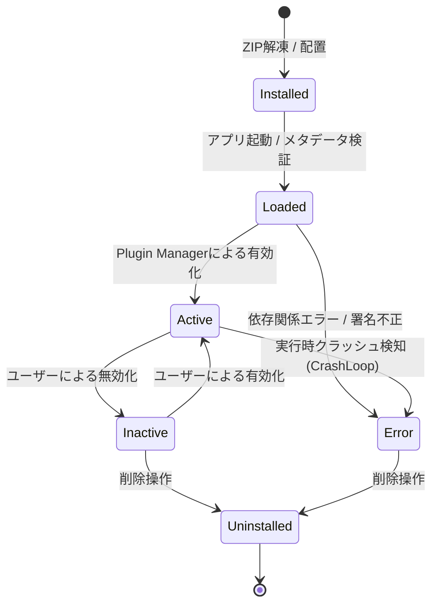
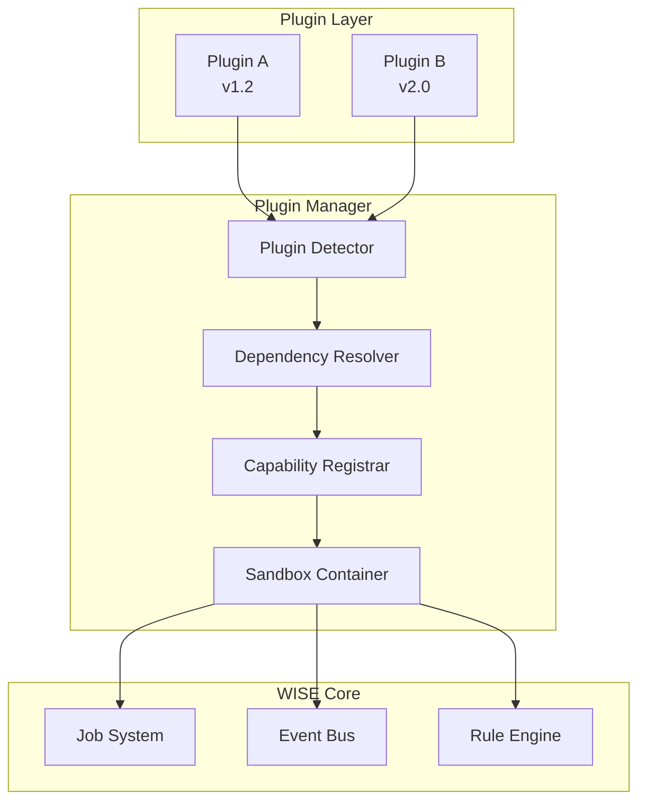
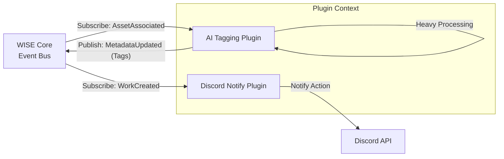
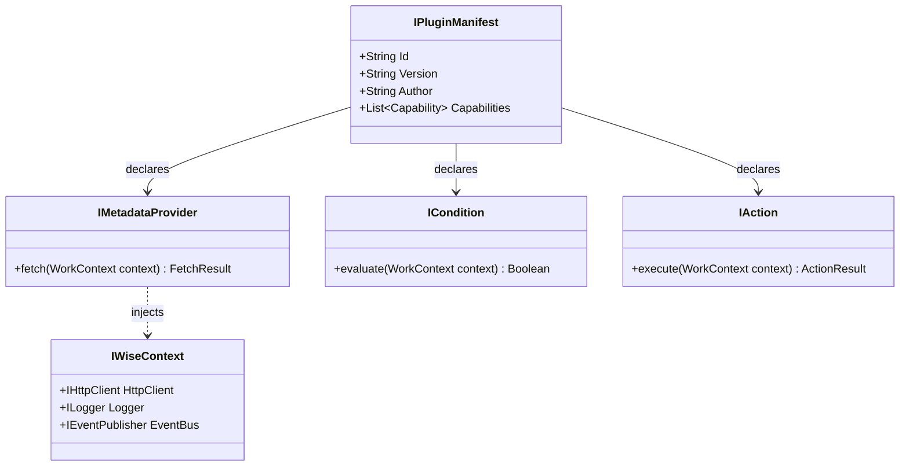

# WISE v2 Plugin.md (v1.0)

## 0. 本書の位置づけ

本書は、メディアライブラリ管理アプリケーション「WISE v2」における **「拡張性」を担保するプラグインシステム** の設計書である。

前提資料として **Architecture.md v1.1**、**Database.md v1.0**、**Work.md v1.0**、**Metadata.md v1.0**、**Identifier.md v1.0**、**Pipeline.md v1.0**、**RuleEngine.md v1.0** を参照し、矛盾しない形で設計を行う。

Plugin設計の最大の目的は、**Open/Closed Principle (OCP: 拡張に対して開いており、修正に対して閉じていること)** の実現である。新しい機能（プロバイダー、ルールアクション、AI処理など）を追加する際に、WISE本体のソースコードを一切変更することなく、安全に組み込めるアーキテクチャを定義する。

---

## 1. Pluginとは

### 責務と設計思想
Pluginとは、WISEのドメインモデルやイベントバスに対して、標準化されたインターフェース（SDK）を通じて機能を提供する「外部モジュール」である。
WISE本体は「コアロジックとオーケストレーション」に専念し、「どこから情報を取得するか」「どうやって通知するか」といった具体的な処理はPluginに委譲する。

### 各コンポーネントとの関係
- **Plugin Managerとの関係:** すべてのPluginはPlugin Managerによって読み込まれ、ライフサイクル（有効化・無効化等）を管理される。
- **Pipelineとの関係:** Pluginは非同期Pipeline（Job Queue）から呼び出され、本体のUIスレッドをブロックすることなく実行される。
- **RuleEngineとの関係:** 独自の判定ロジック（Condition Plugin）や、新しい処理（Action Plugin）をRuleEngineに追加し、自動整理の幅を広げる。

---

## 2. Pluginの種類

WISEでは、単なる「メタデータ取得」にとどまらず、様々なレイヤーに拡張ポイント（Capability）を定義する。

| Pluginの種類 | 役割と責務 |
|---|---|
| **Metadata Provider** | FANZA、MGS、Wiki、Local NFOなどから作品情報（Text）を取得する。 |
| **Identifier Provider** | 正規化されたファイル名やハッシュを基に、品番やWorkの候補（Evidence）を提供する。 |
| **Artwork Provider** | 高画質なパッケージ画像、カバーアートなどの画像アセット専用取得プロバイダー。 |
| **Preview Provider** | サンプル動画のURL抽出、またはローカルでのプレビュー動画生成を行う。 |
| **Import Provider** | 他の管理ソフトのDB（XML/JSON/CSV）からWISEのスキーマへデータを変換・インポートする。 |
| **Export Provider** | WISEのWork情報を外部形式（Kodi用NFO、HTMLカタログ等）に出力する。 |
| **Rule Condition Plugin** | RuleEngineに対して、新しい条件式（例: 「画像が顔認識で3人以上なら」）を提供する。 |
| **Rule Action Plugin** | RuleEngineに対して、新しい実行内容（例: 「Google Driveへバックアップする」）を提供する。 |
| **AI Plugin** | ローカル推論（ONNX等）や外部APIを用いて、AIタグ付け・顔認識・シーン解析を行う。 |
| **Notification Plugin** | Discord、Telegram、メールなどへ、システムイベント（処理完了等）を通知する。 |

---

## 3. Plugin Lifecycle

Pluginは、安全にシステムへ組み込まれるために厳格なライフサイクルを持つ。

### Mermaid Plugin Lifecycle

- **Loaded:** DLLやスクリプトがメモリ上にロードされた状態だが、まだイベント購読は行っていない。
- **障害発生 (Error):** Plugin内でハンドリングされない例外が連続して発生した場合、Managerは該当Pluginを自動的に隔離（Errorステータス）し、メインパイプラインへの悪影響を遮断する。

---

## 4. Plugin Manager

Plugin Managerは、WISE本体とPluginの間に立つ「仲介者」であり「関所」である。

### Mermaid Plugin Manager

- **Plugin検出とバージョン管理:** `plugins/` フォルダ内のマニフェスト（`plugin.json`）を読み取り、対応するSDKバージョンをチェックする。
- **依存関係 (Dependency):** 「Plugin B は Plugin A v1.0 以上を要求する」といった依存解決を行う。
- **Capability判定:** Pluginが `IMetadataProvider` を実装しているのか、`IRuleAction` を実装しているのかを判定し、Coreの適切な箇所へ登録する。
- **署名 (Signature):** 将来的に公式マーケットプレイスを導入する際、悪意あるコードを防ぐためのデジタル署名検証を行う。

---

## 5. Event連携

Pluginは、WISEの内部状態をEventBusを通じて監視し、また結果をEventとして発行できる。

### Mermaid Event連携

- **購読できるイベント:** `WorkCreated`, `AssetDetected`, `MetadataUpdated`, `RuleExecuted`, `JobFailed` など。
- **発行できるイベント:** Pluginは主に `MetadataUpdated`（情報追加時）を発行する。また、独自のカスタムイベントを発行し、他のPlugin同士で通信することも可能。
- **Pipelineとの関係:** イベント購読のハンドラー内では直接重い処理を行わず、WISE本体に用意された Job Scheduler を通じて非同期Jobとして実行することが推奨される。

---

## 6. RuleEngine連携

RuleEngine.md で定義されたワークフローに、Pluginが介入する仕組み。

- **Condition Plugin:** 
  WISE本体が知らない新しい判定基準を追加する。例えば、「動画のビットレートが基準値以下か」を判定する `IBitrateCondition` を提供し、ユーザーがUIのルール作成画面でそれを選択できるようにする。
- **Action Plugin:** 
  ルールに合致した際の新しい挙動を追加する。例えば、「動画をH.265に再エンコードする」という `TranscodeAction` を提供し、アクションリストに追加する。

---

## 7. Security (セキュリティと分離)

サードパーティ製コードを安全に実行するための保護機構。

| 保護対象 | セキュリティ・隔離戦略 |
|---|---|
| **Sandbox** | プラグインをメインAppDomain（または別プロセス/コンテナ）から隔離し、クラッシュが本体を道連れにしないようにする。 |
| **Timeout** | すべてのPluginメソッド呼び出しに厳格なタイムアウト（例: HTTP通信は10秒）を設定し、パイプラインのフリーズを防ぐ。 |
| **例外 (Exception)** | Plugin内で発生したすべての例外は Plugin Manager レベルでキャッチ（Try-Catch）され、本体には `PluginExecutionFailed` イベントとして安全に伝達される。 |
| **ファイルアクセス** | Pluginがアクセスできるディレクトリを制限する（AppArmor等のOS機能、またはSDK側での仮想ファイルシステム提供）。システム領域への無断書き込みを防止する。 |
| **ネットワークアクセス** | 提供される `IHttpClient`（SDK内包）を介してのみ通信を許可し、Manager側でリクエスト先ドメインのログ取得や、Rate Limit（レート制限）の制御を行う。 |

---

## 8. 将来拡張

1. **Marketplace:** 
   - アプリ内から「Community Plugin」を検索・ワンクリックインストールできる仕組み。
2. **AI Pluginの標準化:** 
   - LLMや画像生成APIを利用するPluginが増えることを見越し、プロンプト管理やAPIキー管理をWISE本体（SDK）側で一元管理できる仕組み。
3. **Cloud Plugin:** 
   - オンプレミス（ローカル）だけでなく、特定の処理をクラウドのLambda / Cloud RunにオフロードするPlugin。

---

## 9. 採用しなかった設計

| 不採用の設計案 | メリット | デメリット | 不採用理由 |
|---|---|---|---|
| **DLL直読みのみ（Sandboxなし）** | 実装が極めて容易で高速。 | 1つのPluginのメモリリークや無限ループがアプリ全体を強制終了させる。 | WISEの「安定性・UIをブロックしない」思想に反するため却下。 |
| **本体ソースコードの直接改造（Fork運用）** | あらゆる機能が自由に追加可能。 | バージョンアップ時のマージが困難になり、コミュニティのエコシステムが育たない。 | OCP（開閉原則）に違反するため却下。 |
| **Provider固定（プラグイン機構を持たない）** | 開発スコープが小さく、初期リリースが早い。 | サイトの仕様変更（FANZA等のスクレイピング対策）のたびに本体のアップデートが必要になる。 | 頻繁な仕様変更が予測されるドメインにおいては保守性が著しく低いため却下。 |

---

## 10. SDK構成とアーキテクチャ

### Mermaid SDK構成

Plugin開発者には `Wise.Sdk.dll` （またはnpmパッケージ等）のみを提供し、`IWiseContext` を通じてHTTP通信やログ出力を行わせることで、本体側で制御をフックできるようにする。

---

## 11. 設計の弱点とフィードバック

### この設計の弱点
- **プロセス間通信（IPC）のオーバーヘッド:** セキュリティ（Sandbox）を重視して別プロセスや厳密なAppDomain分離を行うと、数百メガバイトのメタデータ（巨大なJSON等）をやり取りする際のシリアライズコストがボトルネックになる。
  - *対策:* Pluginとの通信ペイロードは「参照（ID）」や「差分」のみとし、重いデータ実体は共有メモリやSDKの抽象化レイヤーで扱う工夫が必要。
- **デバッグの困難さ:** イベント駆動＋プラグイン構成は、処理のフローが分散するため「なぜこのメタデータが設定されたのか」の開発者体験（DX）が悪化しやすい。
  - *対策:* Plugin Managerのログを「Diagnostic」機能に直結させ、Plugin内の例外もUIから追跡できるようにする。

### Architecture へのフィードバック
- **SDK層の定義:** Architecture.md 3章のレイヤー構成において、Plugin層とDomain層の間にある「SDK層（公開インターフェース）」の存在を明示し、PluginがDomainオブジェクト（Workなど）に直接依存せず、DTO（データ転送オブジェクト）やインターフェースに依存することを強調すべき。

### Database へのフィードバック
- **プラグイン固有設定の保存:** Pluginが独自の設定（例: APIキー、スクレイピングの待機秒数）を保存するための `PLUGIN_SETTING` テーブル（Key-Value Store）の追加が必要。

### Pipeline / RuleEngine へのフィードバック
- **タイムアウト時の停止保護:** RuleEngineのActionがPluginによって提供された場合、そのPluginが応答不能（ハングアップ）になっても、Pipeline全体が停止しないように、RuleEngineの呼び出し元（Job Worker側）にも強力なCancellation Tokenを渡す設計が必要である。

---

*WISE v2 Plugin.md v1.0 — 設計完了*
