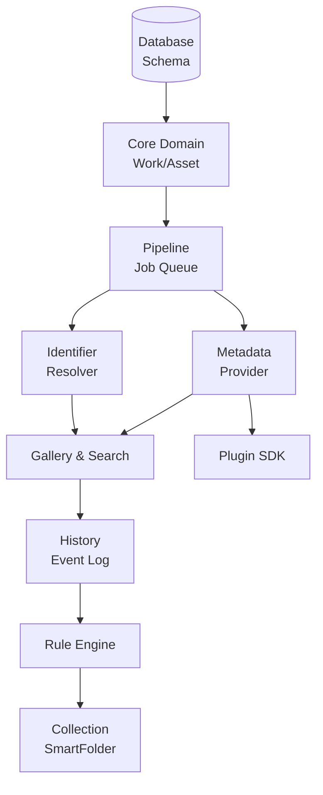
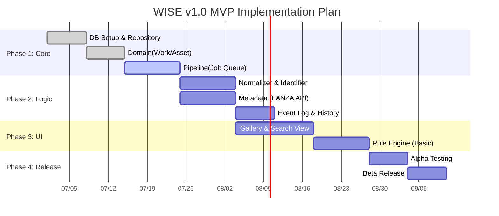
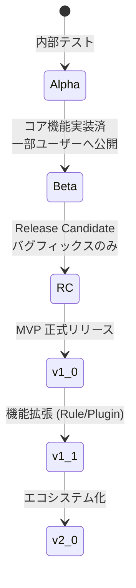

# WISE v2 Roadmap.md (v1.0)

## 0. 本書の位置づけ

本書は、メディアライブラリ管理アプリケーション「WISE v2」の全設計書（Architecture, Database, Work, Metadata, Identifier, Pipeline, RuleEngine, Plugin, History）の内容を実現するための **開発ロードマップ（実行計画書）** である。

本書の目的は「重要だから先に作る」というビジネス目線の願望を排除し、「何が存在しなければ次を作れないか」という **技術的依存関係** と **リスク（不確実性）** に基づいて実装順序を定義することにある。

---

## 1. 開発方針

ロードマップ全体を貫く基本的な開発方針を定義する。

- **MVP First:** 最小限の「動く」価値を最速で構築し、複雑な機能は後回しにする。
- **Source of Truth:** データベース（DB）をすべての状態の正と見なす。UIやファイルシステムはDBの投影として実装する。
- **Work First:** すべての機能はWorkエンティティに依存するため、ドメイン層のWorkライフサイクル実装を最優先する。
- **Incremental Development:** 一つの巨大なリリースを目指さず、PipelineやPluginといった基盤を段階的に拡張していく。
- **Testability:** 自動テスト（特にドメインロジックのUnitテスト）が記述しやすいよう、インフラ層を切り離した設計を維持する。

---

## 2. v1.0 (MVP) スコープ

WISEのコア機能が動作し、ユーザーが「検索と管理」という基本価値を享受できる最小リリース。

- **DB初期化:** SQLiteベースのスキーマ構築、Repository層の実装。
- **Core Domain:** Work、Assetエンティティの生成とライフサイクル管理。
- **Pipeline (Basic):** Job Queue（DBベース）とシンプルなWorker実装。
- **Identifier (Basic):** 正規化ルールの適用と、ファイル名/ハッシュベースの基礎的なスコアリング。
- **Metadata (Basic):** FANZA Provider（単一）からのメタデータ取得と競合解決。
- **Gallery & Search:** 取得したメタデータに基づく一覧表示と単純検索。
- **History (Basic):** Event Logの保存と、タイムラインとしての表示。

---

## 3. v1.1 スコープ (拡張基盤の確立)

MVPリリース後、ライブラリ管理を自動化・高度化する機能を投入する。

- **Collection:** 手動のプレイリストやお気に入り機能の実装。
- **SmartFolder:** RuleEngineのCondition評価を流用した動的コレクション。
- **RuleEngine (拡張):** リネーム、移動、タグ付けの自動化ルールのUI提供。
- **Plugin SDK:** サードパーティがProviderを開発・追加できるSDKとManagerの提供。
- **Rich Media:** Artwork（高画質パッケージ）、Preview（サンプル動画）の取得Provider。

---

## 4. v1.5 スコープ (AIとインテリジェンス)

外部APIやローカルAIモデルを活用し、メタデータ取得の精度と速度を劇的に向上させる。

- **AI Tag:** ローカルLLM/ONNXを利用した画像解析と自動タグ付け。
- **OCR:** パッケージ画像からの文字抽出と、Identifier判定へのEvidence追加。
- **AI Identifier:** Embeddingを用いた類似度計算ベースの作品同定。
- **Cloud Backup:** 設定ファイルやメタデータDBのクラウドバックアップ（スナップショット）。

---

## 5. v2.0 スコープ (スケーラビリティとエコシステム)

WISEを個人ツールからプラットフォームへと進化させる。

- **Marketplace:** UI上からワンクリックでPluginをインストールできる機能。
- **Cloud Sync:** 複数デバイス間でEvent Logを同期し、シームレスにライブラリを共有。
- **Multi User:** 家族間等でのユーザープロファイル切り替え、閲覧制限。
- **AI Workflow:** RuleEngineの条件やアクションを自然言語で指示できるAIアシスタント。
- **Mobile Companion:** スマホブラウザからギャラリーを閲覧できる軽量Webサーバーモード。

---

## 6. 実装順序

### Mermaid Dependency (技術的依存関係)

### Mermaid Gantt (実装スケジュールイメージ)

---

## 7. 技術的負債と設計上の妥協

プロジェクトを前進させるため、v1.0時点であえて抱える「負債」とリスクを定義する。

- **後回しにするもの:** 
  - メタデータの完全な型付け（EAVモデルのTEXT型をそのままUIで解釈させる）。
  - DBへのSQLiteロック競合の抜本的解決（まずはWALモードの有効化とポーリング間隔調整で妥協）。
- **設計上の妥協:** 
  - `History` における実ファイル操作のUndo不可。
  - IdentifierのConfidence閾値（80点等）をヒューリスティックな固定値としてハードコードする。
- **リスク:** 
  - FANZA等プロバイダーのスクレイピング対策による突然の機能停止（Plugin化で対応速度を上げることで軽減）。

---

## 8. テスト戦略

- **Unit Test (最優先):** 
  - Domain層の `IdentifierResolver` のスコア計算、`RuleEngine` の条件評価ロジックを徹底的にモックしてテストする。
- **Integration Test:** 
  - `Database` Repository層を通じたCRUD操作、および `Pipeline`（Job Queueへの投入からWorkerでの取得まで）の結合をテストする。
- **Provider Test:** 
  - 外部サイトの構造変更を検知するため、定期実行されるE2E（End-to-End）テストをPluginに対して用意する。

---

## 9. リリース戦略

### Mermaid Release Flow

- **Alpha:** 開発者自身がドッグフーディングし、DBスキーマやPipelineの致命的欠陥を潰す。
- **Beta:** UIが整い、数十個〜数百個のファイルを取り込んでIdentifierの精度を検証するフェーズ。
- **RC (Release Candidate):** 機能追加を凍結し、エラーハンドリング（タイムアウト等）の強化に集中する。

---

## 10. 将来構想 (3〜5年後)

WISEは最終的に「単なるデスクトップアプリ」から脱却し、**「分散型のパーソナルメディア・ハブ」** を目指す。

- ファイル本体はNASやクラウドストレージに分散させ、WISEはメタデータと検索インデックスのみを高速に提供する。
- Pluginエコシステムが自律的に発展し、ユーザーコミュニティが作成したニッチなメタデータProviderやAI整理ルールが共有される。
- LLMによる対話型インターフェースが標準化され、「最近買ったVRの作品を古い順にプレイリストにして」といった自然言語での操作が可能になる。

---

## 11. まとめ・総括

### 実装最大リスク
- **非同期PipelineとUIの同期ズレ:** Jobがバックグラウンドで走っている最中に、ユーザーがUIから同ファイルの情報を更新してしまう状態不整合（Race Condition）。

### MVPで絶対削ってはいけないもの
- **IdentifierのEvidence永続化:** ここを削り「判定結果」だけを保存すると、ブラックボックス化し、誤判定発生時にユーザーの信頼を永久に失う。
- **Event Log（History）の記録:** これがないと、RuleEngineやMetadata更新が暴走した際にシステムをデバッグできない。

### v2まで延期すべきもの
- **Work Merge (作品の手動/自動統合):** スキーマ影響とUIの複雑性が高すぎるため、v1.x系では「別々の作品」として諦めて表示させ、v2での目玉機能に据える。
- **Plugin Sandbox（厳格なプロセス分離）:** v1ではDllImportやAppDomain等の簡易な分離に留め、完全なSandboxプロセス通信は複雑化を避けるため後回しにする。

---

*WISE v2 Roadmap.md v1.0 — 設計完了*
