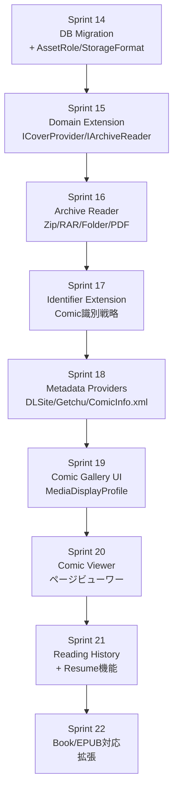
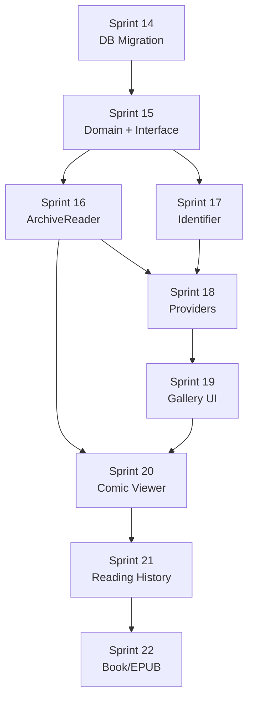
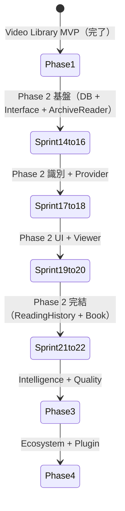

# WISE v2 Roadmap.md (v2.0)

> **本書はv1.0からv2.0への更新である。**  
> 変更の主目的：Phase 2（Comic/Doujin Library Extension）スプリント計画の追加。フィードバック10項目（FB①〜⑩）を実装順に組み込んだ。スプリント14〜22の具体的な実装計画を含む。

前提資料：**Architecture.md v2.0**、**Domain.md v2.0**、**Database.md v2.0**

---

# 1. 開発方針

ロードマップ全体を貫く基本的な開発方針。

- **MVP First:** 最小限の「動く」価値を最速で構築し、複雑な機能は後回しにする
- **Source of Truth:** DBをすべての状態の正とみなす。UIやファイルシステムはDBの投影
- **Work First:** すべての機能はWorkエンティティに依存するため、Domain層のWorkライフサイクルを最優先
- **Incremental Development:** Pipeline・Plugin等の基盤を段階的に拡張する
- **Testability:** 自動テストが書きやすいよう、インフラ層を切り離した設計を維持
- **Product Constitution最優先:** 引き算の美学、MediaType if/else禁止、Plugin-ready構造を常に維持

---

# 2. Phase 1: Video Library（MVP → Current）

## v1.0 MVP（完了）

- DB初期化（SQLite + EF Core + Repository層）
- Core Domain（Work / Asset / MetadataField / Evidence / Provider）
- Pipeline Basic（Job Queue DB永続化 + Worker）
- Identifier（証拠積み上げ式スコアリング、60点閾値）
- Metadata Basic（FANZA Provider単一）
- Gallery & Search（一覧表示・基本検索）
- History（Event Log + タイムライン）

## v1.x Sprint 1〜13（完了 / Sprint 13まで）

- Sprint 1-3: Gallery UI / WorkCard / Virtual Scroll
- Sprint 4-6: Detail Page / VideoPlayer / History Timeline
- Sprint 7-9: Identifier Resolution Pipeline強化
- Sprint 10-11: Metadata Provider追加（JavBus / FC2 / AvWiki）
- Sprint 12: Organize Page最適化（Progressive Fetch / Virtual Scroll）
- Sprint 13: Evidence-Based Identifier Resolution Pipeline（Tier1/Tier2並列）

---

# 3. Phase 2: Comic / Doujin Library Extension

## 実装順序の設計思想

Comic拡張は「基盤→アーカイブ→識別→プロバイダー→UI」の順に進める。UIの前に基盤（IArchiveReader / ICoverProvider）を確立し、UIが安定したインターフェースに依存できるようにする。



---

## Sprint 14: DB Migration — AssetRole / StorageFormat / ReadingHistory

**目標：** v2の新テーブル・カラムをDBに追加し、既存データを移行する。

**実装内容：**

1. EF Core Migration作成
   - `ASSET` テーブルに `role` カラム追加（デフォルト: `video` for Video MediaType）
   - `ASSET` テーブルに `storage_format` カラム追加（既存 `container` から変換）
   - `READING_HISTORY` テーブル新規作成
   - `COVER_CACHE` テーブル新規作成
   - `DISPLAY_PROFILE` / `DISPLAY_PROFILE_FIELD` テーブル新規作成
   - `WORK.media_type` を TEXT → INTEGER に移行（1=Video デフォルト）

2. 既存データの移行スクリプト
   - `ASSET.container = 'MP4'` → `storage_format = 'single_file'`, `role = 'video'`
   - `ASSET.container = 'ZIP'` → `storage_format = 'archive'`, `role = 'archive'`
   - `WORK.media_type = 'av'` → `media_type = 1`

3. FTS5仮想テーブル作成
   ```sql
   CREATE VIRTUAL TABLE IF NOT EXISTS METADATA_FTS USING fts5(
     work_id UNINDEXED, field_name UNINDEXED, value,
     content='METADATA_FIELD', content_rowid='rowid'
   );
   ```

4. DisplayProfileのデフォルトデータ投入（Video/Comic/Book）

5. RepositoryとEntityの更新
   - `AssetEntity.Role` / `AssetEntity.StorageFormat` プロパティ追加
   - `ReadingHistoryRepository` 新規作成
   - `CoverCacheRepository` 新規作成
   - `DisplayProfileRepository` 新規作成

**テスト：**
- Migration実行前後でデータ整合性チェック
- Orphaned Asset（work_id=NULL）が migration後も保持されることを確認

---

## Sprint 15: Domain Extension — ICoverProvider / IArchiveReader / IMediaViewer

**目標：** v2のコアインターフェースをDomain層に定義し、DIコンテナに登録する。

**実装内容：**

1. Domain層インターフェース定義
   ```csharp
   // WISE.Domain/Interfaces/
   ICoverProvider.cs
   IArchiveReader.cs
   IMediaViewer.cs
   ```

2. Application層サービス実装
   ```csharp
   // WISE.Application/Services/
   CoverService.cs           // Chain of Responsibility
   ViewerRouterService.cs    // IMediaViewer DI選択
   ```

3. Infrastructure層 — デフォルト実装（Video用）
   ```csharp
   // WISE.Infrastructure/Cover/
   MetadataCoverProvider.cs  // Priority: 100
   VideoThumbnailProvider.cs // Priority: 60（ffmpeg必要）
   DefaultCoverProvider.cs   // Priority: 0

   // WISE.Infrastructure/Viewers/
   VideoViewer.cs            // MediaType.Video → /viewer/video
   ```

4. MediaDisplayProfile初期化サービス
   ```csharp
   DisplayProfileInitializer.cs  // DBにデフォルトProfile投入
   ```

5. DIコンテナへの登録（Program.cs）
   ```csharp
   builder.Services.AddTransient<ICoverProvider, MetadataCoverProvider>();
   builder.Services.AddTransient<ICoverProvider, VideoThumbnailProvider>();
   builder.Services.AddTransient<ICoverProvider, DefaultCoverProvider>();
   builder.Services.AddTransient<IMediaViewer, VideoViewer>();
   builder.Services.AddScoped<CoverService>();
   builder.Services.AddScoped<ViewerRouterService>();
   ```

6. API エンドポイント追加
   - `GET /api/works/{id}/cover` — CoverService経由で画像返却
   - `GET /api/works/{id}/viewer-info` — ViewerRouterService経由

**テスト：**
- CoverServiceのChain動作確認（MetadataCoverProvider → Default順）
- ViewerRouterServiceのMediaType別Viewer選択確認

---

## Sprint 16: Archive Reader — ZIP/CBZ/RAR/Folder/PDF

**目標：** IArchiveReaderの実装を完成させ、アーカイブのページストリーミングを可能にする。

**実装内容：**

1. NuGetパッケージ追加
   ```xml
   <PackageReference Include="SharpCompress" Version="..." />
   <!-- PDF処理: PDFiumSharp または PdfPig -->
   <PackageReference Include="PdfPig" Version="..." />
   ```

2. IArchiveReader実装
   ```csharp
   // WISE.Infrastructure/Readers/
   ZipArchiveReader.cs     // ZIP, CBZ
   RarArchiveReader.cs     // RAR, CBR（SharpCompress使用）
   PdfArchiveReader.cs     // PDF（PdfPig使用）
   FolderArchiveReader.cs  // 画像フォルダ
   ```

3. StorageFormatDetector実装
   ```csharp
   // WISE.Application/Services/
   StorageFormatDetector.cs  // MIME署名 → StorageFormat
   ```

4. ArchiveCoverProvider実装（ICoverProvider）
   ```csharp
   // WISE.Infrastructure/Cover/
   ArchiveCoverProvider.cs  // Priority: 80
   ```

5. ArchiveIndexJob実装
   ```csharp
   // WISE.Application/Jobs/
   ArchiveIndexJobHandler.cs
   // → IArchiveReader.GetPageListAsync() → ページリストJSON保存
   ```

6. Reader API実装
   - `GET /api/works/{id}/reader/pages` — ページリスト返却
   - `GET /api/works/{id}/reader/pages/{index}` — ページ画像ストリーミング

**テスト：**
- 各ArchiveReaderでのページ数取得・ページ画像取得
- CBZ（ZIP内のJPG）でのE2Eテスト
- 破損アーカイブでのエラーハンドリング確認

---

## Sprint 17: Identifier Extension — Comic識別戦略

**目標：** Comic/DoujinのPrimary Identifier解決ロジックを実装する。

**実装内容：**

1. DLSite識別戦略
   ```csharp
   // WISE.Infrastructure/Identifiers/
   DLSiteIdentifierStrategy.cs
   // パターン: RJ123456, RE123456, BJ123456
   // Evidence: +40点
   ```

2. ComicFolderNameIdentifierStrategy
   ```csharp
   // フォルダ名パターン: [Circle名] Title (RJ123456)
   // サークル名抽出: [] 内の文字列
   // Evidence: +20〜30点
   ```

3. ComicInfo.xml解析（MetadataProvider連携前のIdentifier補完）
   ```csharp
   ComicInfoXmlParser.cs
   // ComicInfo.xml から Series, Title, Author を抽出してEvidence追加
   ```

4. フォールバック識別子生成
   ```csharp
   // DLSite番号が見つからない場合
   // circle名 + title のSHA256[:8]をIdentifierとして使用
   // 例: circle-title-a3f7b2c1
   ```

5. ImportJobでのMediaType判定強化
   ```csharp
   // 拡張子・StorageFormatからMediaTypeを推測
   // .cbz / .cbr / 画像フォルダ → Comic
   // .epub / ISBN含むPDF → Book
   // .mp4 / .mkv → Video
   ```

**テスト：**
- DLSite番号抽出のパターンテスト（各種ファイル名形式）
- フォールバック識別子の一意性確認（同一circle+titleで同一hash生成）

---

## Sprint 18: Comic Metadata Providers — DLSite / Getchu / ComicInfo.xml

**目標：** Comic向けMetadataProviderを実装する。

**実装内容：**

1. DLSiteMetadataProvider
   ```csharp
   // WISE.Infrastructure/Providers/
   DLSiteMetadataProvider.cs
   // SupportedMediaTypes: [Comic, Book, PhotoBook, Audio]
   // Priority: 80
   // 取得フィールド: title, circle, author, genre, page_count, release_date, cover_url, tags
   ```

2. GetchuMetadataProvider（同人誌カバー）
   ```csharp
   GetchuMetadataProvider.cs
   // SupportedMediaTypes: [Comic, Book]
   // Priority: 70
   ```

3. ComicInfoXmlMetadataProvider
   ```csharp
   ComicInfoXmlMetadataProvider.cs
   // SupportedMediaTypes: [Comic, Book]
   // Priority: 45
   // ComicInfo.xml（Kavita/Komga互換形式）を解析
   ```

4. ProviderManagerのSupportedMediaTypesフィルタリング
   ```csharp
   // WorkのMediaTypeに基づいてProvider一覧をフィルタリング
   // Comic Work → DLSite, Getchu, ComicInfoXml, LocalNFO のみ問い合わせ
   ```

5. Collection自動生成（Author/Circle）
   ```csharp
   // MetadataUpdatedイベント後:
   // MetadataField 'circle' → Collection type=Circle を自動生成・紐付け
   // MetadataField 'author' → Collection type=Author を自動生成・紐付け
   ```

**テスト：**
- DLSiteスクレイパーのユニットテスト（モックHTML）
- ComicInfo.xml解析のユニットテスト
- ProviderManagerのMediaTypeフィルタリング確認

---

## Sprint 19: Comic Gallery UI — MediaDisplayProfile実装

**目標：** GalleryがMediaDisplayProfileを参照し、if/elseなしでComicとVideoを適切に表示する。

**実装内容：**

1. `GET /api/settings/display-profiles/{mediaType}` API実装

2. フロントエンドでMediaDisplayProfile取得
   ```typescript
   // src/hooks/useDisplayProfile.ts
   const { profile } = useDisplayProfile(mediaType);
   ```

3. WorkCard コンポーネントをMediaDisplayProfile対応に更新
   ```typescript
   // WorkCard: profile.galleryFields に基づいてフィールドを動的レンダリング
   // cover_orientation に基づいてアスペクト比を変更
   // if(work.mediaType === 'video') は一切書かない
   ```

4. Gallery ページへのMediaTypeフィルタ追加
   ```typescript
   // フィルタバー: All / Video / Comic / Book
   // 各フィルタクリック時に対応するMediaDisplayProfileをロード
   ```

5. Settings ページへのDisplayProfile設定UI追加
   ```typescript
   // /settings/display → MediaType選択 → フィールドON/OFFのドラッグ並び替えUI
   ```

6. CoverUrlの統一（`/api/works/{id}/cover` をWorkCardで使用）

**テスト：**
- Video Work と Comic Work が同一GalleryコンポーネントでProfileに応じて正しく表示されることを確認
- Settings でフィールドをOFFにした後、Gallery反映を確認

---

## Sprint 20: Comic Viewer — ページビューワー

**目標：** ComicViewerコンポーネントを実装する。見開き・ズーム・キーボード操作対応。

**実装内容：**

1. `src/app/viewer/comic/page.tsx` 新規作成
   ```typescript
   // ?workId=xxx のクエリから作品をロード
   // GET /api/works/{id}/reader/pages でページリスト取得
   // GET /api/works/{id}/reader/pages/{index} でページ画像ストリーミング
   ```

2. ComicViewerコンポーネント
   ```typescript
   // 機能:
   // - 単ページ / 見開き（DoublePage）表示切り替え
   // - ページめくり（←→キー / タップ / ドラッグ）
   // - 先読み（前後2ページをprefetch）
   // - ズーム（pinch / ctrl+scroll）
   // - ページジャンプUI（スライダー / 入力フィールド）
   ```

3. `GET /api/works/{id}/viewer-info` でIMediaViewerのCapabilitiesを取得
   - `supportsDoublePage: true` → 見開きボタン表示
   - `supportsBookmark: true` → しおりボタン表示

4. ページキャッシュ戦略
   ```typescript
   const PREFETCH_PAGES = 2; // 前後2ページを先読み
   // IntersectionObserver で次ページを事前ロード
   ```

**テスト：**
- 各StorageFormat（ZIP/CBZ/フォルダ/PDF）でのページ表示確認
- 見開きモードでの偶数/奇数ページ並びの確認
- 大容量CBZ（500ページ）での先読みパフォーマンス確認

---

## Sprint 21: Reading History — Resume機能 + API

**目標：** ReadingHistoryを実装し、ビューワーの途中再開を可能にする。

**実装内容：**

1. `GET/PUT/DELETE /api/works/{id}/reading-history` API実装
   - `ReadingHistoryController.cs`
   - `ReadingHistoryRepository.cs`

2. ComicViewer のReading History連携
   ```typescript
   // ビューワー起動時: GET /api/works/{id}/viewer-info の resumePosition を確認
   // → ページ42で中断していた場合: 「42ページから再開しますか?」ダイアログ
   
   // ページめくり時: debounce(5秒) で localStorage を更新
   // unload/blur 時: PUT /api/works/{id}/reading-history に flush
   ```

3. VideoPlayer の既存resume機能をAPI連携に移行
   ```typescript
   // 現行: localStorage のみ（`wise-video-pos-{assetId}`）
   // v2: API経由で READING_HISTORY テーブルに保存（localStorageはキャッシュとして並存）
   ```

4. Gallery での最終閲覧順ソート
   ```typescript
   // sort=last_read_at&order=desc
   // → READING_HISTORY.last_read_at のデバイス横断MAX値でソート
   ```

5. 進捗インジケーターをWorkCardに追加
   ```typescript
   // position_percent に基づいてプログレスバーを表示
   // （DisplayProfileで ON/OFF 可能）
   ```

**テスト：**
- 進捗保存→ビューワー再起動→再開の E2E テスト
- デバイスID重複なし確認（同一ブラウザは同一deviceId）

---

## Sprint 22: Book / EPUB 対応拡張

**目標：** Book（EPUB/PDF テキスト主体）対応を追加し、Phase 2を完結させる。

**実装内容：**

1. EpubArchiveReader実装
   ```csharp
   // NuGet: EpubCore または VersOne.Epub
   EpubArchiveReader.cs
   // EPUB の spine に基づいてページリストを構築
   // HTMLページのレンダリングはフロントエンドに委ねる
   ```

2. EpubViewer フロントエンド
   ```typescript
   // src/app/viewer/epub/page.tsx
   // EPUB HTMLをiframeまたはshadow DOMでレンダリング
   // CFI（Canonical Fragment Identifier）で進捗を管理
   ```

3. NDL（国立国会図書館）MetadataProvider
   ```csharp
   NdlMetadataProvider.cs
   // ISBNから書籍情報を取得
   // SupportedMediaTypes: [Book]
   // Priority: 70
   ```

4. DisplayProfile の Book 設定確定・UI反映

5. Phase 2 完成チェックリスト
   - [ ] Video / Comic / Book の3MediaTypeが同一Galleryで共存
   - [ ] if(mediaType) がUI層に存在しない
   - [ ] ICoverProvider Chain が全MediaTypeで動作
   - [ ] IArchiveReader が全StorageFormatで動作
   - [ ] FTS5検索がMediaType横断で動作
   - [ ] ReadingHistoryがVideo/Comic/Bookで動作

---

# 4. Phase 3: Intelligence & Quality（v1.5相当）

Phase 2完了後に着手。外部AI・OCRを活用してMetadata取得の精度を向上させる。

- **AI Tag:** ローカルLLM/ONNX を利用した画像解析と自動タグ付け
- **OCR:** パッケージ画像からの文字抽出とIdentifier Evidenceへの追加
- **AI Identifier:** Embeddingを用いた類似度計算ベースの作品同定
- **Cloud Backup:** 設定ファイルとMetadata DBのクラウドスナップショット

---

# 5. Phase 4: Ecosystem（v2.0相当）

WISEを個人ツールからプラットフォームへ進化させる。

- **Plugin SDK:** サードパーティがIMetadataProvider / ICoverProvider / IMediaViewerを追加できるSDK
- **Plugin Marketplace:** UI上からワンクリックでPluginをインストール
- **Cloud Sync:** 複数デバイス間でEvent Logを同期し、ReadingHistoryをクラウド解決
- **Multi User:** ユーザープロファイル切り替え・閲覧制限
- **Mobile Companion:** スマホブラウザからGalleryを閲覧できる軽量Webサーバーモード

---

# 6. 依存関係図（Phase 2詳細）



---

# 7. 技術的負債と設計上の妥協（v2更新）

## Phase 2で抱える意図的な負債

- **RARアーカイブ対応の不完全さ：** SharpCompressのRAR5サポートは限定的。RAR5形式のCBRは Phase 3 以降で対応
- **EpubビューワーのCSS対応：** 複雑なEPUB（固定レイアウト型）はPhase 3以降
- **ComicViewer のアニメーション：** ページめくりアニメーションはPhase 3以降（パフォーマンス優先）
- **ReadingHistory のCloud Sync：** Phase 4（MultiDevice対応）で実装

## Phase 2から持ち越す設計

- **Work Merge（作品統合）：** 複数ファイルが同一作品として登録された場合のMerge UIはPhase 3
- **SmartFolderの動的評価キャッシュ：** Phase 2では毎回クエリ実行で対応
- **Plugin Sandbox：** Phase 4で本格実装。Phase 2はDLL直接ロードで対応

---

# 8. テスト戦略（v2更新）

## Phase 2 テスト優先順位

1. **Unit Test（最優先）：**
   - `IArchiveReader` 各実装のページ数取得・ページストリーミング
   - `ICoverProvider` Chain of Responsibilityの動作（MetadataCoverProvider優先確認）
   - `ViewerRouterService` のMediaType別Viewer選択
   - `StorageFormatDetector` のファイル種別判定

2. **Integration Test：**
   - Comic Work作成 → ArchiveIndexJob → ComicViewer でページ表示の E2E
   - ReadingHistory UPSERT の同時書き込み競合テスト

3. **Provider Test：**
   - DLSiteスクレイパーのモックHTMLテスト（サイト変更検知用）

---

# 9. リリース戦略（v2更新）



---

# 10. MVPで絶対削ってはいけないもの（v2更新）

- **IdentifierのEvidence永続化：** ここを削ると誤判定発生時にシステムをデバッグできない
- **Event Log（History）の記録：** RuleEngineやMetadata更新が暴走した際の追跡不可
- **ICoverProviderのChain構造：** MediaType固有の `if(mediaType)` に退行すると将来のPlugin化が不可能
- **ReadingHistoryの独立テーブル：** Workテーブルに読書進捗を入れると将来のマルチデバイス対応が不可能
- **FTS5インデックス：** MediaType別に分割すると将来の横断検索が困難

---

*WISE v2 Roadmap.md v2.0 — 2026-06-30*
