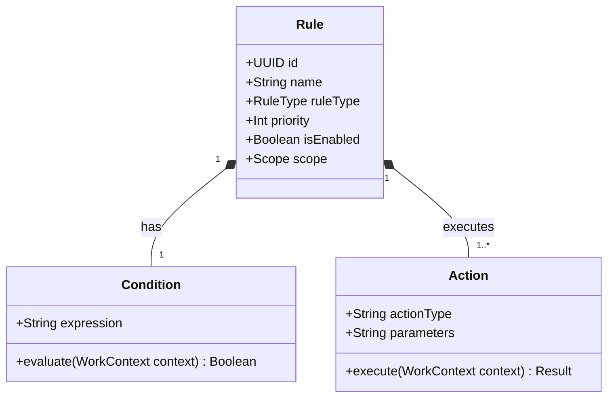
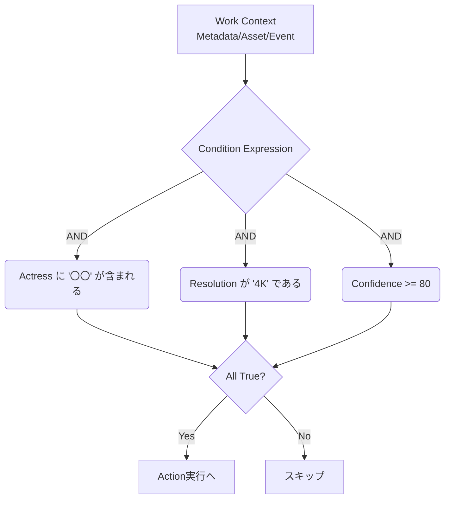
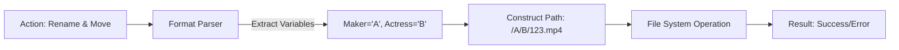
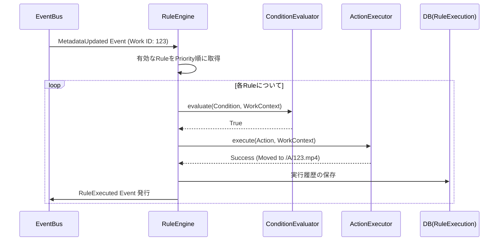
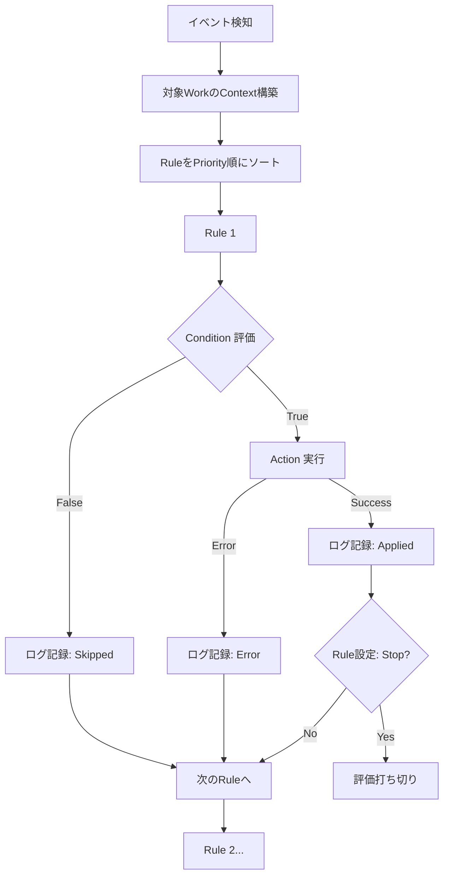

# WISE v2 RuleEngine.md (v1.0)

## 0. 本書の位置づけ

本書は、メディアライブラリ管理アプリケーション「WISE v2」における **自動化と整理の要となる「Rule Engine」** の設計書である。

前提資料として **Architecture.md v1.1**、**Database.md v1.0**、**Work.md v1.0**、**Metadata.md v1.0**、**Identifier.md v1.0**、**Pipeline.md v1.0** を参照し、矛盾しない形で設計を行う。

RuleEngineは単なる「ファイルリネームツール」ではなく、ドメインイベント（状態変化）をトリガーとして、ドメインロジックに基づく自動処理（ConditionとActionの評価・実行）を行う統合的なワークフローエンジンとして定義する。

---

## 1. RuleEngineとは

### 責務と設計思想
RuleEngineの責務は **「システム内で発生した状態変化を監視し、ユーザーが定義したルール（Condition）に合致した場合に、事前定義された操作（Action）を自動実行すること」** である。

設計思想の根幹は **「Condition（条件）」と「Action（実行）」の明確な分離** と、**「説明可能性（Diagnostic）」** にある。ルールが複雑化しても「なぜそのファイルが移動したのか」を後から確実に追跡できる仕組みを提供する。

### 各コンポーネントとの関係
- **Pipeline / Eventとの関係:** RuleEngineは非同期Pipelineの一部として動作する。`MetadataUpdated` や `AssetAssociated` などのドメインイベントを購読し、それをトリガーとしてルール評価を開始する。
- **Collectionとの関係:** SmartFolder（動的Collection）の抽出条件（rule_definition）は、RuleEngineのCondition評価ロジックを共通基盤として再利用する。

---

## 2. Ruleモデル

Ruleは、以下の要素で構成されるドメインオブジェクトである。

- **RuleType:** `Naming` (命名規則), `Folder` (フォルダ整理), `Tagging` (自動タグ付け) など、ルールの目的。
- **Priority (優先度):** 同種ルールが複数マッチした場合の評価順序（後述のRule Conflictで利用）。
- **Enabled (有効化フラグ):** 一時的にルールを無効にするためのフラグ。
- **Scope (スコープ):** 「新しく追加されたWorkのみ」か「ライブラリ全体の再評価時も含むか」などの適用範囲。

---

## 3. Condition (条件)

Ruleを起動するかどうかを判定するための条件式。

### Conditionで扱える情報（Context）
Rule評価時には、対象のWorkに紐づく豊富なContextが提供され、これらを組み合わせて複雑な条件を定義できる。

| カテゴリ | 判定可能な項目の例 |
|---|---|
| **Metadata** | `Title`, `Actress`, `Maker`, `Genre`, `ReleaseDate` 等の存在有無・特定文字列マッチ |
| **Identifier** | `Confidence` が80以上か、`PrimaryIdentifier` に特定のプレフィックスがあるか |
| **Asset** | `FileSize` (例: 4GB以上), `Resolution` (例: 4K), `Codec`, `Duration` |
| **Collection** | 既に特定のお気に入りやプレイリストに入っているか |
| **Other** | `Provider` (特定のProviderから取得したか), `Manual Flag` (手動編集されたか) |

### Mermaid Condition評価

---

## 4. Action (実行)

ConditionがTrueと評価された場合に実行される処理。副作用（状態の変更）を伴う。

### 実行可能なActionの例
- **ファイル操作系:**
  - `Rename`: 指定フォーマット（例: `{Maker}/{Actress}/{PrimaryIdentifier}.mp4`）へのファイル名変更。
  - `Move`: 指定フォルダへのアセット移動（NASへのアーカイブ等）。
- **メタデータ・整理系:**
  - `Add Tag` / `Remove Tag`: 自動的なタグ付け・除外。
  - `Add Collection` / `Remove Collection`: プレイリストやシリーズへの自動追加。
- **システム系:**
  - `Notify`: UI通知やWebhook呼び出し。
  - `Skip`: 以降のルールの評価を停止する（除外ルール用）。
  - `Execute Plugin`: ユーザー定義のカスタムスクリプト・プラグインの実行。

### Mermaid Action Flow

---

## 5. Rule PipelineとEvent連携

イベント発生からRule適用、そして結果のEvent発行までの一連の流れ。

### Mermaid Event連携 & Rule実行Sequence

RuleEngine自身も `RuleExecuted` イベントを発行するため、履歴（EventLog）への記録や、UIへの即時フィードバックが保証される。

---

## 6. Rule Conflict (競合と解決)

複数のRuleが同時にTrueとなった場合の振る舞い。

- **Priority (優先順位):** Priorityの値が高いRuleから順に評価・実行される。
- **Stop (停止) / Continue (継続):** 各Ruleには「実行後に次のルールの評価を継続するか（Continue）」または「ここで打ち切るか（Stop）」のフラグを持たせる。
  - 例：`Move` 系のアクションは、一度移動したら他の移動ルールを適用させないため「Stop」が基本。
  - 例：`Tagging` アクションは、複数タグを付けるために「Continue」が基本。
- **Override (上書き保護):** Manual（ユーザーの手動操作）で変更された属性（例：手動リネーム済みのファイル）は、Ruleによる自動上書きを拒否するロックフラグを持つ。

---

## 7. Rule Diagnostic (説明可能性)

ルールエンジンは「勝手にファイルが移動した」という不信感を生みやすい。そのため、「なぜそれが実行されたか（またはされなかったか）」を証明する機構（Diagnostic）が必須である。

### Diagnostic（実行履歴）の構成
`RULE_EXECUTION` テーブルに以下の情報を記録し、UIから閲覧可能にする。

- **Target:** どのWork / Assetに対して実行されたか。
- **Trigger:** どのイベント（MetadataUpdated等）がきっかけか。
- **Rule ID / Name:** どのRuleが評価されたか。
- **Result:** `Applied` (実行成功) / `Skipped` (条件不一致またはStopによる除外) / `Error` (ファイル使用中などの実行エラー)。
- **Detail:** 
  - 条件一致理由（「Actressが〇〇だったため」）
  - Action詳細（「A.mp4 を B.mp4 へリネームした」）

### Mermaid Rule Flow (全体俯瞰)

---

## 8. 将来拡張

RuleEngineは高い拡張性を持つように設計されており、将来的に以下の機能追加が可能である。

- **Plugin Rule / JavaScript Rule:** 
  - 固定のCondition/Actionだけでなく、ユーザーがJavaScriptやPython等で記述したカスタムスクリプトを安全なサンドボックス内で実行（Execute Plugin）させる。
- **Webhook Action:** 
  - 条件に合致した作品が追加されたら、Discordや外部APIへPOSTリクエストを送信する。
- **AI Rule (LLM活用):** 
  - Condition評価にローカルLLMを挟み、「Descriptionを読んで、悲しい結末ならタグ付けする」といった意味ベースの推論ルールを定義する。

---

## 9. 採用しなかった設計

| 不採用の設計案 | メリット | デメリット | 不採用理由 |
|---|---|---|---|
| **スクリプト直書きのみ（設定ファイルへのコード記述）** | 究極の柔軟性がある。 | 一般ユーザーには敷居が高すぎる。DBでの履歴追跡やDiagnostic画面（なぜ適用されたか）の構築が困難。 | UIベースでのルール作成と説明可能性を両立できないため却下。 |
| **同期処理（Work登録時にUIをブロックして即時実行）** | ユーザーが「ルール適用後の結果」を待つため、状態の不整合が起きにくい。 | リネームや移動などI/Oを伴う処理がUIをフリーズさせる。大量登録時にシステムが停止する。 | Pipeline.mdの「UIをブロックしない」思想に反するため却下。 |
| **Rule同士の直接呼び出し（Rule AがRule Bを呼ぶ）** | 複雑なフロー制御（If-Else）が記述できる。 | ルール間の依存関係がスパゲティ化し、無限ループのリスクが高まる。 | 設計の複雑化を防ぐため、RuleはフラットにPriority順で評価されるモデルを採用。 |

---

## 10. 設計の弱点とフィードバック

### この設計の弱点
- **Actionの副作用によるループ:** RuleのAction（例：メタデータの変更）が再び `MetadataUpdated` イベントを発行し、それが同じRuleをトリガーしてしまう無限ループのリスクがある。
  - *対策:* RuleEngineが発行するイベントには「Ruleによる自動変更である」というコンテキスト（Actor='RuleEngine'）を含め、RuleEngine自身がそれをトリガーとしない（Ignoreする）制御が必要。
- **ファイル移動時の競合:** RuleEngineが `Move` アクションでファイルを移動している最中に、ユーザーがUIから動画を再生しようとするなど、物理ファイル操作とUI操作の競合が発生する。

### Architecture へのフィードバック
- **Rule Engineの位置づけの昇格:** Architecture.md においてRule EngineはPipelineの一部として軽く触れられているが、メタデータ・アセット・イベントを横断する極めて重要な「ドメインサービス」として明記・昇格すべきである。

### Database へのフィードバック
- **RuleExecutionの肥大化:** `RULE_EXECUTION` テーブルに「Skipped（スキップされた）」履歴まで記録するとデータ量が膨大になる。Diagnostic画面での説明責任を果たすためには必要だが、定期的なパージ処理（例：成功・スキップログは30日で削除）の設計が必須。

### Work / Metadata / Identifier へのフィードバック
- **Lock機構（手動上書き保護）の要求:** RuleEngineの自動適用から手動編集内容を守るため、WorkやMetadataに `is_locked` または `is_manually_edited` といった明示的な保護フラグを設ける必要がある（Metadata.mdのManual Provider最優先ルールをさらに補強する概念）。

### Pipeline へのフィードバック
- **Ruleの非同期実行キュー:** メタデータ取得Jobと同等に、Rule評価も「時間のかかるI/O処理（移動・コピー等）」を含むため、イベントを直接処理するのではなく、専用の `RuleExecutionJob` としてJob Systemに統合するフローが安全である。

---

*WISE v2 RuleEngine.md v1.0 — 設計完了*
