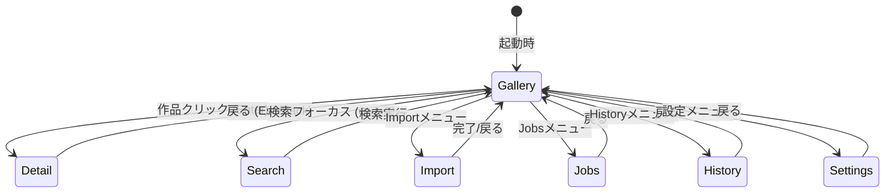
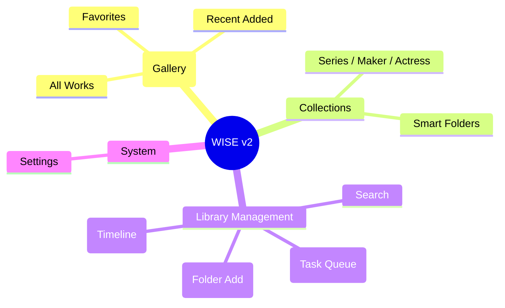
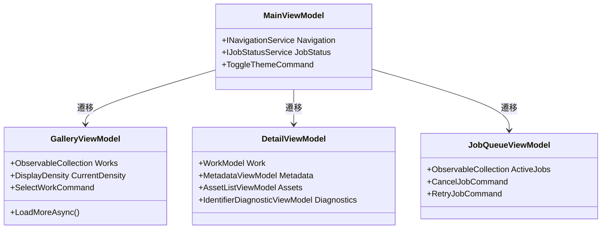
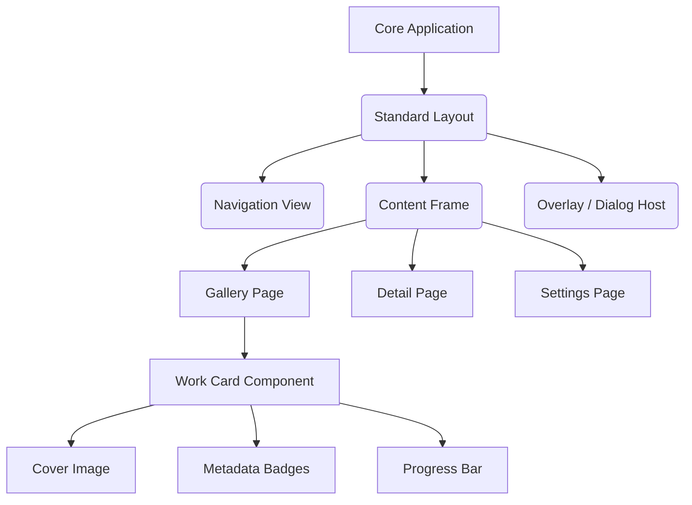

# WISE v2 UI.md (UI/UX Architecture & Design)

## 0. 最重要思想

**WISEは「管理画面」ではありません。ライブラリを眺めること自体が楽しいソフトウェアです。**

WISE v2のUIは、ユーザーが毎日起動したくなるような、シンプルで美しく、長時間使っても疲れないデザインを目指します。スクレイピングソフト特有の無骨なデータグリッドや過密な情報表示を排し、「作品（Work）」そのものを主役とした体験を提供します。

---

## 1. デザインコンセプト

* **シンプル・高速・飽きない:** 無駄な装飾を削ぎ落とし、コンテンツへの没入感を最大化します（NetflixやMissAVの持つ優れた余白・情報密度・一覧性のバランスを参考にします）。
* **Windows 11 Native & Fluent Design:** Windowsのネイティブな操作感、Mica効果（半透明バックドロップ）、角丸（Rounded Corners）、スムーズなトランジションを取り入れます。
* **Minimal Design & 余白の活用:** 情報量は多いものの、圧迫感を与えないように余白（Padding/Margin）を贅沢に使い、視線を自然に誘導します。
* **テーマ対応:** Dark Mode（デフォルト）とLight Modeを完備し、即時切替を可能とします。アクセントカラーはシステム追従をベースとしつつ、将来的にカスタム変更可能な設計とします。
* **操作性:** マウスでの快適な回遊はもちろん、キーボード（矢印キー、Enter、Esc、ショートカット）のみでも主要な操作が完結するアクセシビリティを確保します。アニメーションは視線誘導を助ける最小限のマイクロインタラクション（Hover時のわずかなスケールアップ等）に留めます。

---

## 2. アーキテクチャ構成

### 2.1 画面遷移図



### 2.2 Navigation構成



### 2.3 ViewModel構成 (MVVM)



### 2.4 UI Component構成



---

## 3. 画面設計とワイヤーフレーム

### 3.1 Main Window
アプリケーションの土台となるメインウィンドウは、左側にコンパクトなナビゲーション、上部にグローバル検索、右下にバックグラウンドのJobステータスを配置します。

```text
+-------------------------------------------------------------------------+
| [≡]   🔍 Search works, actors, tags... (Ctrl+F)          [-] [□] [X] |
+---+---------------------------------------------------------------------+
| 🏠|                                                                     |
| 📁|                                                                     |
| 🔍|                                                                     |
|   |                       (Content Frame)                               |
| 📥|                                                                     |
| ⚙ |                                                                     |
|   |                                                                     |
|   |                                                                     |
|   |                                                                     |
+---+---------------------------------------------------------------------+
|   | [Status] Background Scan: 45% ...                       [⚙ Jobs] |
+---+---------------------------------------------------------------------+
```

### 3.2 Gallery (Home)
WISEの顔となる画面です。余計な文字情報を排し、美しいCover画像が並ぶレイアウトです。表示密度はLarge/Medium/Compactで切り替えられます。

**Gallery UX要件:**
* **無限スクロール & UI仮想化:** 10万件のデータでもメモリを消費せず滑らかにスクロール可能。
* **Cover遅延読込:** 画面に入る直前に非同期で画像をロード・キャッシュ。
* **キーボード移動:** 十字キーでシームレスにカード間を移動。
* **操作:** 複数選択 (Shift/Ctrl + Click)、コンテキストメニュー (右クリック)、Drag & Drop (外部への書き出し等)。

```text
[ View: Medium ▼ ]  [ Sort: Date Added ▼ ]                 [ Filters ▽ ]
+-------------------+ +-------------------+ +-------------------+ +-------
|                   | |                   | |                   | |
|                   | |                   | |                   | |
|     Cover         | |     Cover         | |     Cover         | |
|    (Image)        | |    (Image)        | |    (Image)        | |
|                   | |                   | |                   | |
|                   | |                   | |                   | |
| [♥]      [HD] [JP]| | [Missing]         | | [Conflict]        | |
+-------------------+ +-------------------+ +-------------------+ +-------
| Title of Work A   | | Title of Work B   | | Title of Work C   | |
| ABC-001           | | XYZ-012           | | DEF-999           | |
+-------------------+ +-------------------+ +-------------------+ +-------
```

### 3.3 Detail (作品詳細)
作品のすべてを把握する画面。スクロールを前提とした縦長のレイアウトで、上部にヒーローバナー的にCoverを配置し、下部へ行くほど技術的な詳細（AssetやIdentifier根拠）を表示します。

**Detail UX要件:**
* 上部の重要なMetadataとArtworkは視界に即座に入るようにする。
* Asset一覧やDiagnostic（Confidenceの推論過程）は必要時に展開（Expander/Tab）する形とし、初期状態の情報過多を防ぐ。

```text
[← Back]                                                 [♡ Favorite] [⋮]
+-------------------------------------------------------------------------+
| +-------------------------+  [ Title of the Work Goes Here ]            |
| |                         |  [ ABC-001 ]  [★ 4.5]  [1080p]  [Scraped]   |
| |                         |                                             |
| |       Cover Image       |  Studio : Studio Name                       |
| |       (Hero Size)       |  Actors : Actor A, Actor B                  |
| |                         |  Tags   : Tag1, Tag2, Tag3                  |
| |                         |                                             |
| +-------------------------+  Description:                               |
|                              This is a synopsis of the work...          |
+-------------------------------------------------------------------------+
| [ Artwork ] (Gallery of thumbnails...)                                  |
+-------------------------------------------------------------------------+
| ∨ Assets (2 files)                                                      |
|   - ABC-001_A.mp4 (4.2GB) [Play]                                        |
|   - ABC-001_B.mp4 (4.5GB) [Play]                                        |
+-------------------------------------------------------------------------+
| > Diagnostics (Identifier: 95% Confidence, Evidence: FANZA, Regex...)   |
+-------------------------------------------------------------------------+
| > History (Timeline of changes)                                         |
+-------------------------------------------------------------------------+
```

### 3.4 Search (高速検索)
* Googleライクなワンボックス検索を基本とします。
* 検索ボックス入力中、即座にドロップダウン（Flyout）で検索候補やサジェストを表示します。
* 複雑な条件は「Smart Folder（保存検索）」として保存し、左Navigationから一発で呼び出せるようにします。

### 3.5 Import (フォルダ追加)
* 新規フォルダをライブラリに登録するダイアログ/ページ。
* 登録後はジョブキューに入り、プログレスリングと「状態（Scanning... / Metadata Fetching...）」がリアルタイムに表示されます。
* エラー時は明確な理由（Read Permission Denied等）をインラインで表示します。

### 3.6 Jobs & History
* **Jobs:** 現在動作中、待機中、失敗、キャンセルの状態をリスト表示。個別に「Retry」や「Cancel」ボタンを配置します。
* **History:** Workごとに何が起きたか（EventLog）を美しい縦型Timeline（時系列）で表示します。

---

## 4. 状態表示 (State Representation)

文字情報に頼らず、直感的なアイコンとバッジ（Color/Shape）で状態を表現します。

* **Metadata取得中:** Cover部にスケルトンローディング（Skeleton UI）または微細なSpinnerアイコン。
* **Unknown (解決失敗):** Coverプレースホルダーに「？」アイコン。グレースケールのバッジ。
* **Conflict (競合発生):** 警告アイコン（⚠️）と黄色のアクセントボーダー。
* **Missing File (リンク切れ):** Coverが半透明（Opacity 50%）になり、赤色の断線アイコン。
* **Duplicate (重複候補):** カード右上に重なりを示すアイコン（🔗）。

---

## 5. UIコンポーネント標準化

Fluent Design System に則り、以下のコンポーネントを標準化します。
独自の実装は避け、OS標準のルック＆フィール（WinUI 3 相当）を模倣・採用します。

* **Card:** Workを表現する基本単位。Hover時の浮き上がり（Elevation）と微細なスケールアップ。
* **Dialog & Flyout:** 破壊的操作（削除等）は中央Dialog、軽微な情報表示やコンテキスト操作は要素に紐付くFlyout。
* **Toast (In-App Notification):** ジョブ完了やエラー通知は画面右下に一時表示し、自動で消える。
* **ProgressBar / ProgressRing:** Jobの進行状態を表現。
* **Tag / Chip:** 女優名やジャンルなど、クリック可能なフィルタリング要素。角丸のカプセル形状。
* **Badge:** 解像度（HD, 4K）や情報ソース（Local, FANZA）などの読み取り専用メタデータを小さく表示。

---

## 6. 多言語対応 (Language Policy)

WISEは「完全日本語化」や「完全英語化」ではなく、英語の持つ簡潔な美しさと、母国語の分かりやすさを両立する **Hybrid UI** を標準とします。

### 6.1 基本ポリシー (Hybrid UI)
* **英語を維持するもの:** ブランド名（WISE, Work, Metadataなど）、一般的なUI名称（Settings, Import, Galleryなど）、開発者向け・技術的用語（Diagnostic, Confidenceなど）。
* **翻訳するもの:** ユーザーへの長文の説明文、エラーメッセージ、状態の詳細表示、設定項目の説明など。

### 6.2 Settings (言語設定)
設定画面から以下の項目を**再起動なしで即時切替可能**とします。

* **Language (表示言語):**
  * 日本語 (Japanese)
  * English
* **UI Language Mode (UI言語モード):**
  * **Hybrid (Default):** 上記の「基本ポリシー」に従い、タイトルや見出しは英語、説明は選択言語で表示するモード。
  * **Full Japanese:** UIの隅々まで強制的に日本語化するモード（例: Settings → 設定）。
  * **English:** 完全英語モード。

### 6.3 アーキテクチャ (リソース管理)
将来的にサードパーティ製のPluginやProviderが追加されても多言語化が容易に行えるよう、UI文字列はハードコードせず、リソースベース（`.resx` ファイルや多言語辞書サービス）で一元管理する前提で設計します。

---

## 7. レスポンス性能への徹底

10万件以上のWorkを抱えるヘビーユーザーでも、起動から1秒以内でGalleryが表示され、一切の引っ掛かりなくスクロールできることを保証します。

1. **UI仮想化 (Virtualization):** 画面に見えている要素（+前後マージン）のUIコントロールのみをメモリ上にインスタンス化します。
2. **非同期ロード & 画像キャッシュ:** サムネイル画像はDBから直接Base64で引くのではなく、最適化されたローカルキャッシュパスから非同期ストリームで読み込みます。
3. **インクリメンタル検索:** 検索文字列の入力ごとにDebounce（遅延実行）をかけ、メインスレッドをブロックせずに検索結果をUIへ反映させます。

---

## 7. 採用しなかったUI設計

過去のプロジェクトや一般的な管理ツールで散見される以下のUIは、**「眺める楽しさ」を阻害するため明確に却下**します。

| 却下したUI | 却下理由 | 代替案 |
|---|---|---|
| **Explorer風ツリービュー** | 物理フォルダの階層を見せることは、「DBが唯一の真実」という思想に反する。 | CollectionとSmart Folderによる論理的なグループ化。 |
| **Excel風データグリッド** | 情報の圧迫感が強く、作品の魅力（CoverやArtwork）が伝わらない。 | 画像メインのCard UIによるGallery表示。List表示時もサムネイルを併用。 |
| **多重タブ構成** | ブラウザのようにタブが増殖すると状態管理が破綻し、認知負荷が上がる。 | Navigation + 単一Content Frame。戻る(Back)操作によるスタック管理。 |
| **保存ボタン(Save)** | ユーザーに「保存する」というシステム的な行為を意識させるべきではない。 | 変更即時反映（Auto-Save）とバックグラウンドでのEvent送信。 |

---

## 8. 将来拡張への対応 (Future Readiness)

UIは現在の機能要件だけでなく、Roadmapに記載された将来の拡張を前提に余白を残します。

* **AI機能:** 検索バーに「AI Chat」アイコンを将来追加し、自然言語検索（Semantic Search）をシームレスに統合できる余地を残す。
* **Plugin / Marketplace:** Settings内に「Extensions」メニューを追加し、カード型でサードパーティプラグインを管理・インストールできる画面設計を考慮。
* **Multi-Window:** Detail画面などをポップアウト（別ウィンドウ化）できるよう、ViewModelをウィンドウ依存させない設計とする。
* **Compare (比較):** Duplicate解決時に、2つのWork Cardを左右に並べて差分をハイライトする専用の「Compare View」を導入可能にする。
