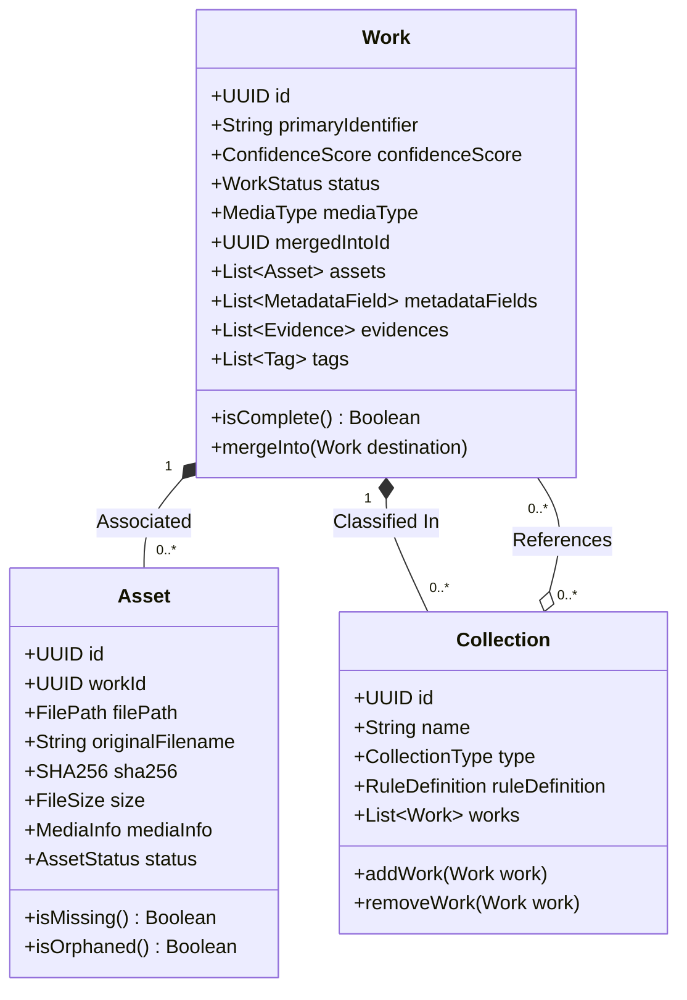
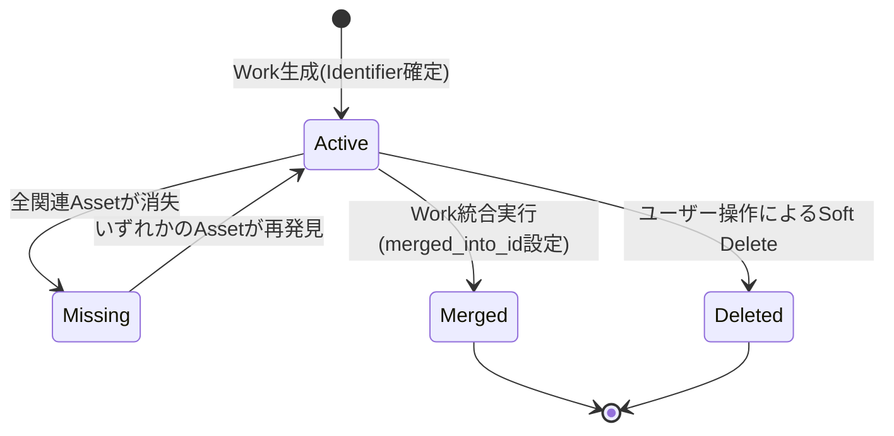
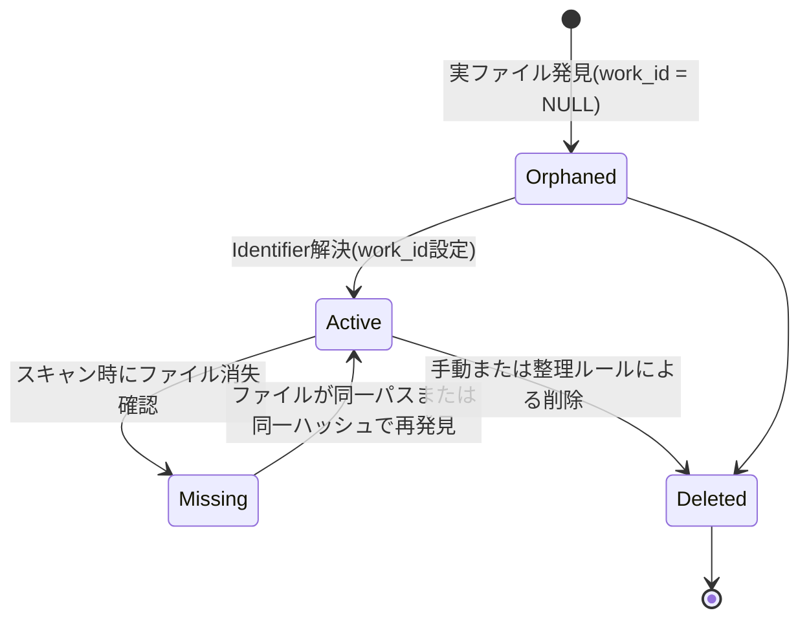

# WISE v2 Work.md (v1.0)

## 0. 本書の位置づけ

本書は、メディアライブラリ管理アプリケーション「WISE v2」における核心ドメインモデル（**Work**、**Asset**、**Collection**）の定義と設計をまとめたドメインモデル設計書である。

前提資料として **Architecture.md v1.1** および **Database.md v1.0** を参照し、そこで定義された設計思想・データベーススキーマと完全に矛盾しない形でドメインモデルの境界・不変条件（Invariants）・ライフサイクルを定義する。

---

# 1. 核心ドメイン概念とユビキタス言語

WISEにおけるドメインモデルを正確に把握するため、以下の通りユビキタス言語を定義する。

## 1.1 Work（作品）

**定義：**
概念上の「作品」そのものを表現するドメインの最上位境界（ルートエンティティ）。実体ファイル（Asset）の有無やメタデータの有無に関わらず、WISEの宇宙において独立してアイデンティティ（一意な識別子）を持つもの。

- **役割：**
  - 作品の「同一性」を保証する。
  - すべてのメタデータ、エビデンス、ユーザーによる整理、ログ、非同期ジョブを束ねる「重力の中心」として機能する。
- **ドメインルール：**
  - メタデータが一切存在しない状態であっても、Workは成立し、存在し続ける。
  - 同一の `primary_identifier`（正規化された主識別子）を持つWorkは、システム内に同時に1つしか存在できない。

## 1.2 Asset（物理ファイルのDB表現）

**定義：**
ローカルまたはネットワーク上のストレージに存在する「実ファイル（PhysicalFile）」を、ドメイン内で管理可能にするためのドメインエンティティ。

- **役割：**
  - ファイルのパス、サイズ、ハッシュ値（SHA256）、メディア情報（再生時間、解像度、コーデック等）といった「物理的な属性」を安全にカプセル化する。
- **ドメインルール：**
  - ファイルシステム上の実ファイルが一時的・恒久的に消失した場合でも、Assetオブジェクトは破棄されない（`missing` ステータスとしてDB上に表現され続ける）。
  - AssetはWorkの「子」としてライフサイクルが始まるのではなく、**「実ファイルの検出」とともに独立して生成される。**
  - 生成時点ではWorkとの関連を持たない（`work_id` が NULL の Orphaned 状態）。Identifier Resolverによる分析を経て初めてWorkに関連付けられる。

## 1.3 Collection（作品のグルーピング）

**定義：**
複数のWorkを特定の文脈や目的において束ねるドメイン概念。お気に入り、シリーズ、特定の女優、特定のメーカー、プレイリスト、スマートフォルダといった、あらゆる「分類・整理」の概念を抽象化したものである。

- **役割：**
  - ユーザーの意図、あるいは定義された自動抽出ルールに基づき、Workの集合を提供する。
- **ドメインルール：**
  - Collectionの生成・変更・削除は、所属するWork自体の状態や属性に一切の副作用を及ぼさない。
  - CollectionとWorkは多対多（N:M）の関係を持つ。
  - 動的な条件でWorkを抽出する「スマートフォルダ」型のCollectionは、Workとの静的な関連を持たず、評価時にドメインルール（DSL）に基づいて所属Workを算出する。

---

# 2. ドメインモデルの境界と不変条件（Invariants）

ドメインモデルが常に正しい状態で存在するための制約（不変条件）と、それぞれの境界を明記する。

## 2.1 Workの不変条件と境界

1. **識別子の排他性**
   - 正規化された `primary_identifier` は空であってはならず、システム内で一意でなければならない。
2. **Confidence（確信度）スコアの範囲**
   - `confidence_score` は常に `0` 以上 `100` 以下の整数値を取る。
3. **メディアタイプの固定**
   - Work生成時に設定された `media_type`（商業AV、同人誌など）は、ライフサイクル途中で変更することはできない（他メディアへの誤った誤紐付けを防ぐため）。
4. **統合（Merge）時の一方向性**
   - 他のWorkに統合されたWork（`status = 'merged'`）は、さらに別のWorkを自身に統合することはできない（多重の統合連鎖による推論の破綻を防ぐため）。

## 2.2 Assetの不変条件と境界

1. **実属性の不変性**
   - ファイルサイズ、SHA256ハッシュ値、メディア属性などの物理的情報は、一度確定した後は（ファイル自体が変更されない限り）不変である。
2. **状態とファイルパスの整合性**
   - `status = 'missing'` の場合、`file_path` は NULL になるか、または無効なパスとしてマークされるが、検出時の `original_filename` は過去の追跡のために必ず保持されなければならない。
3. **一意ハッシュによる排他**
   - `sha256` が確定したAssetは、システム内で重複判定（DuplicateCandidate）の評価対象になり得るが、Assetそのものが自動的にマージされたり消滅したりすることはない。重複の解決は常にユーザー確認、または明示的なポリシーに基づく。

## 2.3 Collectionの不変条件と境界

1. **定義と関連の排他**
   - スマートフォルダ（`type = 'SmartFolder'`）である場合、`rule_definition`（DSL/JSON）は必須であり、静的な紐付け情報（COLLECTION_WORKの物理行）を生成・追加することはできない。
   - 逆に手動プレイリストやシリーズなどの静的コレクションは、`rule_definition` を持ってはならない。

---

# 3. ライフサイクルと状態遷移

各モデルのライフサイクル、およびドメインイベントの発生タイミングを詳述する。

## 3.1 Workのライフサイクル

- **生成（Active）：**
  - 新規の識別子が検出され、Identifier Resolverが「新規Workである」と判断した瞬間、またはユーザーが手動でWorkを作成した瞬間に生成される。
  - ドメインイベント `WorkCreated` を発行する。
- **全アセット消失（Missing）：**
  - 紐付いている全てのAssetのステータスが `missing`（リンク切れ）になった場合、自動的にWorkも `missing` 状態へと遷移する。ただし、作品レコードそのものは削除されない。
  - ドメインイベント `WorkMissing` を発行する。
- **統合（Merged）：**
  - 重複して登録されたWorkが発見された場合、あるいはユーザー指示によりWorkが他のWorkへマージされると、ステータスは `merged` となり、以降は読み取り専用となる。
  - ドメインイベント `WorkMerged` を発行する。

## 3.2 Assetのライフサイクル

- **検出・生成（Orphaned）：**
  - ファイルスキャナーが新しい物理ファイルを発見した時点で、`work_id = NULL` の状態で生成される。
  - ドメインイベント `AssetDetected` を発行する。
- **紐付け（Active）：**
  - Identifier Resolverが対応するWorkを確定（新規生成含む）させ、`work_id` が代入された状態。
  - ドメインイベント `AssetAssociated` を発行する。
- **消失（Missing）：**
  - ディスクスキャン時にファイルが存在しなくなっていた場合に遷移する。
  - ドメインイベント `AssetMissing` を発行する。

---

# 4. メディアタイプごとの抽象化と拡張性

WISEは、多様なメディアタイプ（商業AV、同人AV、FC2、同人誌、書籍など）を共通のインターフェースで管理できるよう、ドメイン層で高度な抽象化を行う。

## 4.1 識別ルール（Identifier Strategy）の抽象化

メディアタイプごとに識別子の構造や抽出ルールが異なるため、Domain層に `IIdentifierStrategy` インターフェースを定義し、Plugin層にて具体的な戦略を実装する。

- **商業AV (AV)：**
  - 品番（例：`ABP-123`）を正規表記とし、メーカー・レーベル情報を手がかりにする。
- **FC2コンテンツ (FC2)：**
  - `FC2-PPV-[数字]` の形式を主識別子とし、販売サイトのメタデータを優先する。
- **同人誌・書籍 (Book)：**
  - サークル名、作家名、イベント名、および作品タイトルの組み合わせから一意なハッシュ値またはキーを生成して `primary_identifier` とする。

## 4.2 将来拡張性へのドメインルール

1. **Work Merge（作品統合）時のドメイン整合性ルール**
   - Work A が Work B に統合される（A $\rightarrow$ B）場合：
     - A に属していたすべての Asset は、`work_id` が B のIDに更新される。
     - A に属していた MetadataField は、B に移行される。競合が発生した場合は、B の持つ優先度（confidence_scoreやProvider優先度）に従い再評価される。
     - A の `merged_into_id` は B のIDを指し、A のステータスは `merged`（不活性）となる。
2. **メタデータ競合解決（Conflict Resolution）**
   - 複数のProviderから同一フィールド（例：`title`）の情報が届いた場合、ドメインルールに基づき以下の評価式で `is_primary` を決定する。
     $$\text{Confidence Score} = \text{Provider Priority} \times \text{Accuracy Weight}$$
   - ユーザーが手動で編集したメタデータ（Manual Provider）は、常に最優先（Score = 100）として扱われ、他の自動取得データで上書きされることはない。

---

# 5. 設計上の検討・懸念点と解決策

## 5.1 Asset主導のWork生成における不変条件の保護
- **懸念：** Assetが先に作られ、後からWorkに紐付くため、一時的に「所属不明なAsset（Orphaned Asset）」がシステムに溢れる可能性がある。
- **解決策：** Orphaned状態のAssetは「整理待ち状態（Inbox）」としてドメイン上定義し、ギャラリーのメインストリームからは除外するものの、「未解決アセット一覧」としてユーザーが手動で整理・識別可能なUI境界（ユースケース）を明確に設ける。

## 5.2 大規模ライブラリにおけるスマートフォルダ（動的Collection）の評価パフォーマンス
- **懸念：** 数万件のWorkが存在する中で、複雑なDSLルールを持つスマートフォルダを毎回評価すると、UI描画が著しく遅延する。
- **解決策：** スマートフォルダの評価結果（Work IDのリスト）はアプリケーション層でキャッシュし、Workの生成・更新イベント（`WorkCreated`、`MetadataUpdated` 等）をトリガーとして非同期でキャッシュを更新する（部分的イベント駆動の活用）。

---

*WISE v2 Work.md v1.0 — 設計完了*
